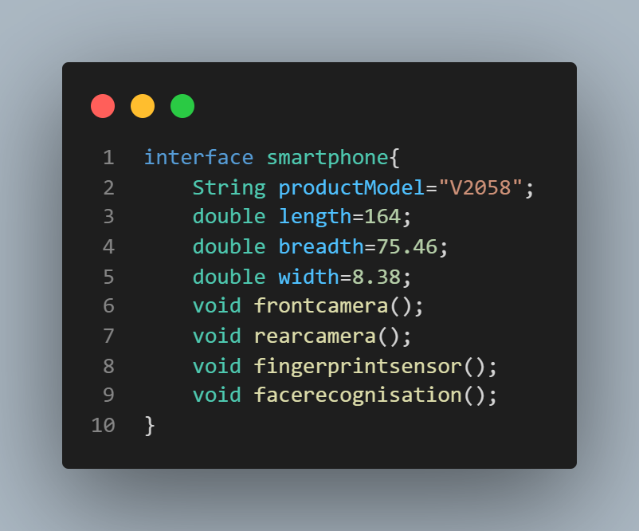
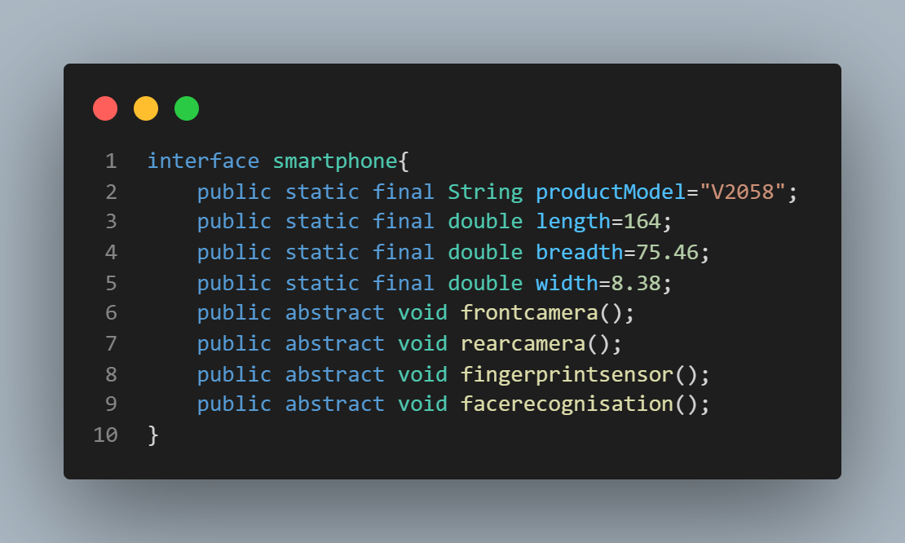
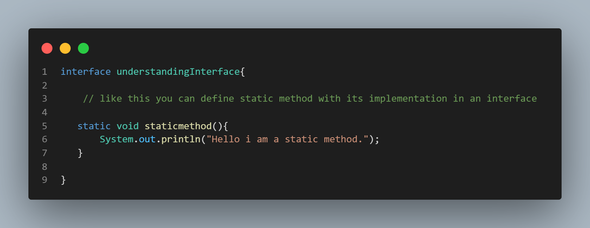
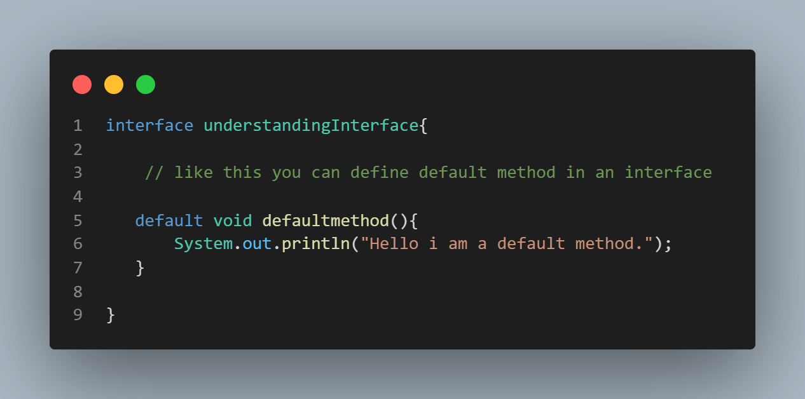
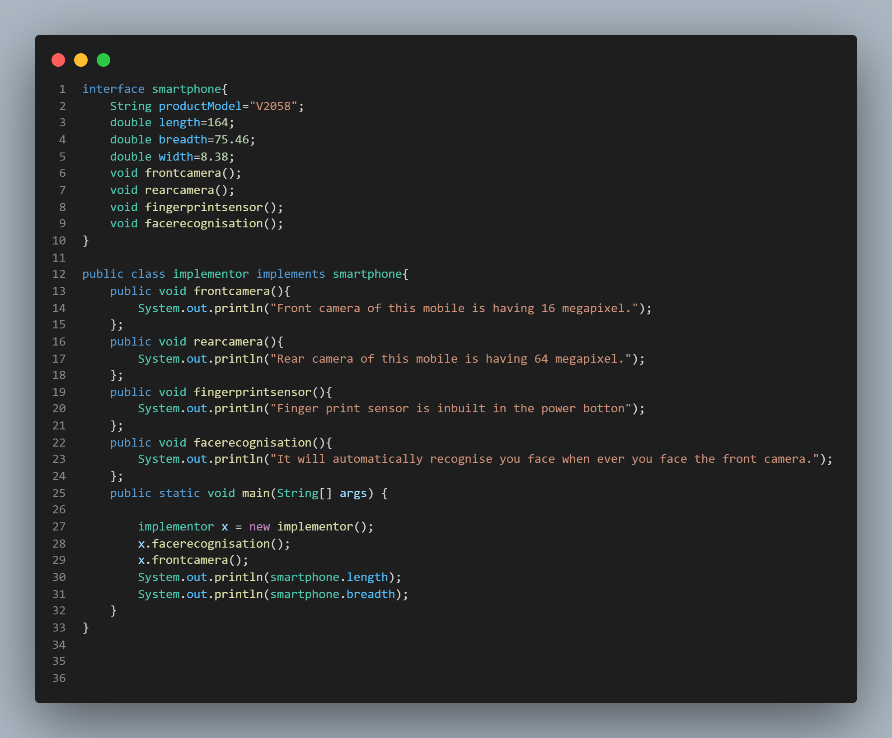
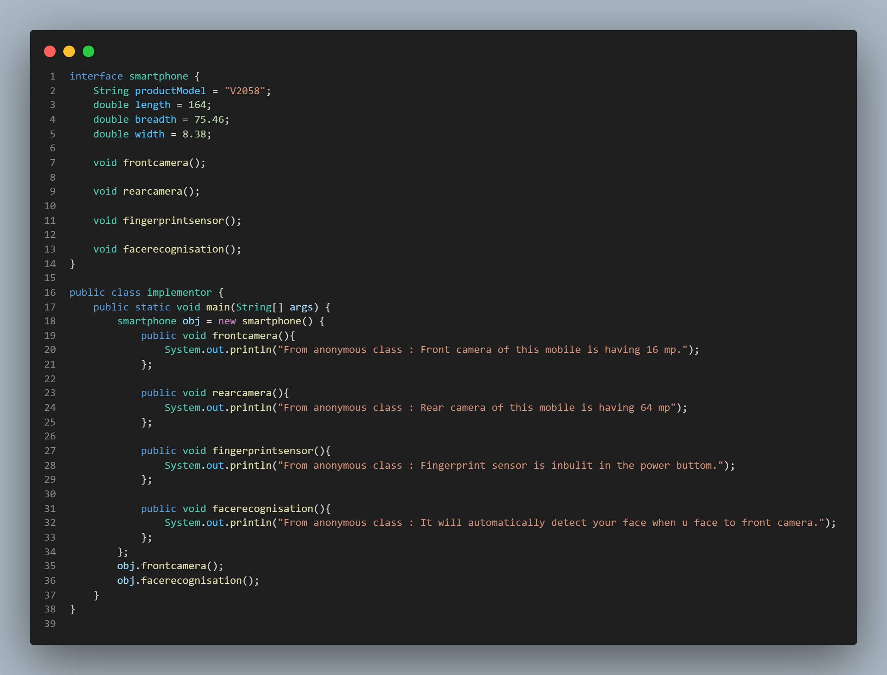

# Defining Interface and its Implementation 
---------
## What is an Interface?
An interface is quite similar to some other classes, but it has got some methods that have no body or in other words no implementation and some of the constant values. So in general interface is just a blueprint of a class that has static constants and abstract methods.

----------
## What is the use of Interface?
- It's used to achieve **100% abstraction**.
- Interface is used for **multiple inheritance**.
- And it's also used for **loose coupling**.

**NOTE:** **Loose coupling** in Java means classes that are independent of each other.

-----------
## Declaration of Interface 
**SYNTAX** for declaring an interface 
<!-- insert an image -->


here *smartphone* is the interface's name and *frontcamera*,*rearcamera*, etc are the methods without the implementation  (without body).

------------
## Methods and Variables in Interface 
- All the **methods** that are declared in the interface are **public and abstract** by default.
**FOR EXAMPLE**
```Java
void frontcamera();

// Then under the hood it will be interpreted as the statement given below

public abstract void frontcamera();
```
- All the **variables** in Interface are **Public ,Static and final** by default.
**FOR EXAMPLE**
```Java
double length=164;

// It will be interpreted as the statement given below

public static final double length=164;
```
for better understanding look at the code snippet below :
<!-- image 2 -->

This is how it works under the hood.

But in **JDK8** a feature was added. We can define default, static and private methods in an interface. 

Defining a static method in interface: 
<!-- static method in interface code snippet-->



<!-- private method in interface code snippet -->
Defining a private method in interface: 


<!-- default method in interface code snippet -->
Defining a default method in interface: 


------------
## How to use Interface?
For example if we write 
```java
smartphone obj = new smartphone(); // THROWS AN ERROR
```
if we try to instantiate (creating object) of the interface then we will be getting an error. Because interface can't be instantiated or in simple words, we can't create an object of the interface. 
So, we can do only 2 things with an interface :
1. (**Way #1**) Declare a separate class that will implement the interface and then we create an object of the class.
2. (**Way #2**) We can create an anonymous class. 

## Way #1
### Class that Implement an Interface (Implementation of Interface)
<!-- and write about it -->
To implement the interface we have to create another class that can be instantiated. With the help of the keyword **implements** we can implement the interface in that class. This is how we can declare a class that implements an interface : 
<!-- insert the image  -->

Here implementor is the class that implements the interface smartphone and it defines all the methods inside of it.

## Way #2
### Creating an Anonymous Class

<!-- insert image  -->

<!-- and write about it -->
Here we have created an anonymous class and inside of it, we have defined all the methods.


