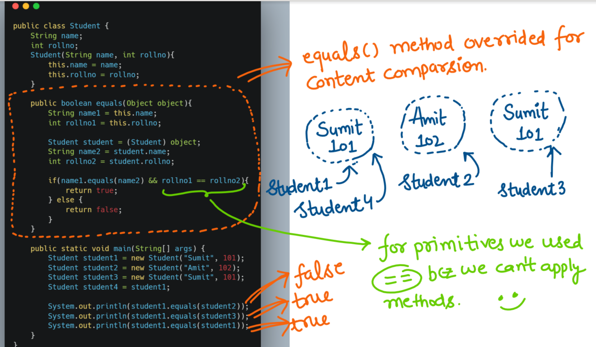

- [Object Class](#object-class)
  * [Introduction to java.lang package](#introduction-to-javalang-package)
  * [Why Object class acts as a root for all the java classes -](#why-object-class-acts-as-a-root-for-all-the-java-classes--)
  * [Some Other Important Points -](#some-other-important-points--)
  * [Object Class Methods -](#object-class-methods--)
    + [Java Code  - To get above function list](#java-code----to-get-above-function-list)
  * [Object Class Methods Insight -](#object-class-methods-insight--)
    + [1. **toString()**](#1---tostring----)
    + [2. **hashCode()**](#2---hashcode----)
      - [So, **What is hashcode ?**](#so----what-is-hashcode----)
      - [**What exactly is the need of this unique number for every object ?**](#--what-exactly-is-the-need-of-this-unique-number-for-every-object----)
      - [Syntax of hashCode() method -](#syntax-of-hashcode---method--)
      - [What is the proper way of overriding hashcode method ?](#what-is-the-proper-way-of-overriding-hashcode-method--)
      - [**`toString()`** VS **`hashCode()`**](#---tostring------vs----hashcode-----)
      - [Examples -](#examples--)
    + [3. **equals(Object o)**](#3---equals-object-o---)
      - [What is the proper way of overriding equals() method ?](#what-is-the-proper-way-of-overriding-equals---method--)
      - [So while overriding equals() method we have to take care of three points ->](#so-while-overriding-equals---method-we-have-to-take-care-of-three-points---)
    + [4. **clone()**](#4---clone----)
      - [What is Cloning ?](#what-is-cloning--)
      - [What is the purpose of cloning ?](#what-is-the-purpose-of-cloning--)
      - [How we can perform cloning ?](#how-we-can-perform-cloning--)
      - [Important Points to take care while using clone() method -](#important-points-to-take-care-while-using-clone---method--)
      - [**Shallow Cloning** and **Deep Cloning**](#--shallow-cloning---and---deep-cloning--)
      - [Which cloning is the Best ?](#which-cloning-is-the-best--)
    + [5. **finalize()**](#5---finalize----)
      - [Signature of finalize() method -](#signature-of-finalize---method--)
      - [Example - 1 :-](#example---1---)
    + [6. **getClass()**](#6---getclass----)
      - [Example - 1 :-](#example---1----1)
      - [Example - 2 :-](#example---2---)
      - [NOTES -](#notes--)
    + [7. **wait()**](#7---wait----)
    + [8. **wait(long ms)**](#8---wait-long-ms---)
    + [9. **wait(long ms, int ns)**](#9---wait-long-ms--int-ns---)
    + [10. **notify()**](#10---notify----)
    + [11. **notifyAll()**](#11---notifyall----)


# Object Class
Before starting directly with **Object** Class, we will have a quick look about the package to which Object class belongs to.

## Introduction to java.lang package
**Object** class belongs to java.lang package. Some important points about java.lang package are as follows -

 1. Among all the packages available in Java, java.lang package is the most important package and the most valuable topic to learn about because it is a Java Language Package without which we cannot write any Java Program.
 2. For writing any Java program, whether a simple program or complex program, the most commonly required classes and interfaces are grouped into a separate package which is java.lang package.
 3. If you have observed while writing a Java program that we are not required to import java.lang package explicitly because all the classes and interfaces present in java.lang package are by default available to every java program.
 
 By now you must have observed the importance of java.lang package. Now let's carry forward our discussion to Object class or java.lang.Object.

First we will learn a fact about Object class - is that **Every class in java is child class of Object either directly or indirectly**, which simply means that Object class acts as a root for all java classes.

## Why Object class acts as a root for all the java classes -
The most commonly required methods for every java class (whether it is pre-defined class or customized class) are defined in a separate class which is nothing but Object class, so that Object class methods by default available to every java class.

That is why **Object class is the parent class of all the classes in java by default.**
OR
**Every class in java is child class of Object either directly or indirectly**


Hence, Object class considered as root of all java classes.

## Some Other Important Points -
1. If out class does not extent any other class then only out class is the direct child class of Object class as explained below with the help of an example -


2. If our class extends any other class then our class is indirect child class of Object class as shown below -


By above two points we tried to expmain that **Either directly or indorectly java won't support for multiple inheritance with respect to classes**. Now lets learn about the methods which Object class defines.

## Object Class Methods -
Object class defines the following 11 methods :-
1. `public String toString()`
2. `public native int hashCode()`
3. `public boolean equals(Object o)`
4. `protected native Object clone() throws CloneNotSupportedException`
5. `protected void finalize() throws Throwable`
6. `public final class getClass()`
7. `public final void wait() throws InterruptedException`
8. `public final native void wait(long ms) throws InterruptedException`
9. `public final void wait (long ms, int ns) throws InterruptedException`
10. `public native final void notify()`
11. `public native final void notifyAll()`
12. `public static native void registerNatives()`
> Object class contains 12 methods, the extra method is registerNatives(). This method is internally required for Object class and not available to the child classes hence we are not required to conside this method.


### Java Code  - To get above function list
```java
class ObjectClassMethods
{
	public static void main(String[] args)
	{
		int count=0;
		Class class = Class.forName("java.lang.Object");
		Method[] method = class.getDeclaredMethods();

		for(Method m : method)
		{
			count++;
			System.out.println(count + ". " + m.getName());
		}
		System.out.println("Total Methods of Object Class are :- "+count);
	}
}
```

** Output -**    
```
1. registerNatives
2. getClass
3. hashCode
4. equals
5. clone
6. toString
7. notify
8. notifyAll
9. wait
10. wait
11. wait
12. finalize
Total Methods of Object Class are :- 12
```


## Object Class Methods Insight -
Now we are going to look on each method which are defined in Object class -
### 1. **toString()**    

The **`toString()`** method is used to get the String representation of an object.
Whenever we are trying to print any object reference, internally JVM will convert this object to String representation and print the String representation of that object.
If our class does not contain **`toString()`** method then object class **`toString()`** method will be executed, as shown in below example, where **`toString()`** method of Object class is called.


Let's have a look on source code of **`toString()`** method of Objct class -


But based on our requirement we can override **`toString()`** method to provide our own String representation as shown in below example where we modified previoud example and overrided **`toString()`** method. We had to override `toString` method as follows whenever we are trying to print Student Object reference to print his name and rollno 


**But then why we have meaningful representation for below objects ?**


In all Wrapper classes, in all Collection classes, String class, StringBuffer class, StringBuilder class **`toString()`** method is overridden for meaningful String representation. Hence it is highly recommended to override **`toString()`** method in user defined class also.

---

### 2. **hashCode()**   

Before going dip down inside the topic, we will start with some basic questions about **`hashCode()`** and the most commonly beginner answers -    

**Que-1** :- What is hashCode of an object ?   
**Ans** :- hashcode of an object is address of an object.

This is most common understanding of beginners about hashcode of an object. To get the correct answer, second question we have is -

**Que-2** :- Is it possible to override the hashCode() method ?   
**Ans** :- Ans is YES, we can override.

Now the last question is -

**Que-3** :- Is it possible to override the address of an object ?   
**Ans** :- Ans is NO, we can't. Which is contradicting our answer to first question, which indicates that hashcode is not related to address of an object.


#### So, **What is hashcode ?**   
For every object a unique number is generated by JVM which is nothing but hashcode. hashcode does not represent address of an object.

#### **What exactly is the need of this unique number for every object ?**   
JVM uses hashcode while saving objects into hashing related DS like hashtable, hashmap, hashset. The main advantage of saving objects based on hashcode is search operation will become easy (The most powerful search algorithm is hashing).

#### Syntax of hashCode() method -   
public native int hashCode()

If we are giving the chance to object class hashCode() method, it will generate hashcode based on address of the object. It does not mean hashcode represents address of the object. Based on our requirement we can override hashcode method in our class to generate our own hashcode.

#### What is the proper way of overriding hashcode method ?   
For every object if you generate a unique number as hashcode, such type of overriding a hashcode method is said to  be proper way of overriding hashcode method. Below example displays the proper and improper way of overriding hashcode method -   


#### **`toString()`** VS **`hashCode()`**   
* If we are giving the chance to Object class **`toString()`** method, it will internally calls **`hashCode()`** method.   
* If we are overriding **`toString()`** method then our **`toString()`** method may not call **`hashCode()`** method.   


Now we are going to take some examples to understand above points -   

#### Examples -    


---

### 3. **equals(Object o)**   
* We can use **`equals()`** method to check equality of two objects like object1.equals(object2).
* If our class does not contains **`equals()`** method then object class **`equals()`** method will be executed.


Based on our requirement we can override **`equals()`** method for **Content Comparsion** as shown below where **`equals()`** method is overrided for content comparsion -



#### What is the proper way of overriding equals() method ?
* If we try to compare two Heterogenous objects using **`equals()`** method then it will throw ClassCastException, which must be handled.


* If we try to compare any object with numm using **`equals()`** method then it will throw NullPointerException, which must be handled.


So must handle these exceptions using try catch, while overriding **`equals()`** method, as shown below -


More simplication version of **`equals()`** method - 


The first comparsion in above code is to check if both objects are binding the same object, which is checked using below code - To make above equals() method more efficient we have to write the following code at the beginning inside equals method.    
According to this if both references pointing to the same object then without performing any comparsion equals() method returns true directly.   

#### So while overriding equals() method we have to take care of three points ->
1. What is the mkeaning of equality (for example - whether we have to check only names, or only rollno, or both)   
2. If we are passing different type of object then our equals() method should not rise **ClassCastException** but should return false. i.e. we have to handle **ClassCastException** to return false.   
3. If we are passing null argument then our equals() method should not rise **NullPointerException** but should return false.   
```
if (object == this)
	return true;
```

So following is the proper way of overriding equals method for Student class content comparsion - 


One More example related to equals method -   


Explanation is as follows for above example is -   
Default behaviour of equals() method is Reference Comparsion if you want we can override for content comparsion.   
1. In **String** class equals() method is overridden for Content Comparsion. Hence, even though objects are different if content is same then equals() method return true.   
2. In **StringBuffer**, equals() method is not overrideen for content comparsion henec if objects are different equals() method returns false even though content is same.   

---

### 4. **clone()**    
To understand about this method, we will first have a look on few simple questions -    
#### What is Cloning ?    
In very simple words it is exactly zerox copy. In terms on Java, Cloning is a process of creating the exact duplicate object.

#### What is the purpose of cloning ?    
* The main purpose of cloning is **to maintain a back up copy**. In terms of Java, lets suppose we have a very riskier operation to perform on some java object, then we maintain a clone of that object in case something goes wrong during that operation, we can always recover the original object.   
* We also clone an object **to preserve the state of an object** at a particular instance. This is required in scenarios when after making some updates on the object, we may need to compare the updated values with the old values, then in such cases we do cloning to preserve the state of an object.   

#### How we can perform cloning ?   
We can perform cloning by using **`clone()`** method, present in java.lang.Object package. Below is the complete prototype of **`clone()`** method -   
```
protected native Object clone() throws CloneNotSupportedException
```

Even though if in our code we do not implement **Clonable**. If we want to call a **`clone()`** method on any object, compulsory that object should be clonable object. An object is said to be clonable if and only if the corresponding class implements **Clonable** interface. If the corresponding class does not implement **Clonable** but still we are performing cloning then we will get a RunTime Exception **CloneNotSupportedException**.
So to overcome this problem, our class must implements Clonable.    


Clonable interface does not contain any methods, it is a Marker interface.    


#### Important Points to take care while using clone() method -     
* We can perform cloning only for Clonable objects.    
* An object is said to be clonable if and only if the corresponsing class implements Clonable interface.    
* Clonable interface is present in java.lang package and it does not contain any method so it is a marker interface.    
* If we are trying to perfom cloning for non clonable objects then we will get a Run Time Exception saying CloneNotSupportedException.   


#### **Shallow Cloning** and **Deep Cloning**     
Related to cloning we have two concepts which are - **Shallow Cloning** and **Deep Cloning** -    


In the above example shown in image, Dog object contains 1. One Primitive Variable and 2. Reference Variable.   
- And in Shallow cloning, a separate copy of primitive variable is created and the duplicate reference object wont be created, but duplicate reference variable pointing to old object is created.   
- And in Deep Cloning, a complete duplication exists for both primitive variables as well as for reference variables.   


1. **Shallow Cloning** - The process of creating bit wise copy of an object is called shallow cloning.    
If the main object contain primitive variables, then exactly duplicate copies will be created in the cloned object.    
If the main object contain any reference variable, then corresponding object won't be created just duplicate reference variable will be created pointing to old contained object.     
The Object class **`clone()`** method meant for Shallow Cloning.    

**Example of Shallow Cloning -**     


In **`Shallow Cloning`**, by using cloned object reference, if we perform any change to the contained object then those changes will be reflected, to the main object, to overcome this problem we should go for **`Deep Cloning`**.

2. **Deep Cloning** - The process of creating exactly duplicate independent copy including contained object is called Deep Cloning.     
In Deep Cloning, if the main object contain any primitive variables then in the cloned object duplicate copies will be created.     
If the main object contains any reference variable, then the corresponding contained objects also will be created in the cloned copy.    
By default, the Object class **`clone()`** method meant for Shallow Cloning, but we can implement Deep Cloning explicitly by overriding clone() method in our class.     

**Example of Deep Cloning -**     


By using cloned object reference if we perform any change to the contained object then those changes won't be reflected to the main object.

#### Which cloning is the Best ?    
Depending on situation or requirement we have to choose between two.     
Like if object contains only primitive variables, then Shallow cloning is the best choice, as Object class clone() method can perform the required things.    
Like if object contains only reference variables, then Deep Cloning is the best choice.     


---

### 5. **finalize()**   
* Just before destroying an object Garbage Collector calls **`finalize()`** method to perform cleanup activities or resource deallocation activities.   
* Once **`finalize()`** method completes automatically Garbage Collection destroyes that object.   

#### Signature of finalize() method -   
```
protected void finalize() throws Throwable
```

#### Example - 1 :-   


** Output -**
```
460141958
Garbage Collection Activity Completed
Executing Finalize Method
```

---

### 6. **getClass()**   
We can use **`getClass()`** method to get **Runtime Class Definition** of an object. Signature of **`getClass()`** method is as follows -   
```
public final class getClass()
```

* By using this Class class object, we can access class level properties like -   
1. fully qualified name of the class   
2. methods information   
3. Constructor information etc...   

#### Example - 1 :-   


**Output -**    
```
Fully Qualified Name of Class - java.lang.String
Methods Information
1. equals
2. toString
3. hashCode
4. compareTo
5. compareTo
6. indexOf
7. indexOf
8. indexOf
9. indexOf
10. indexOf
11. indexOf
12. valueOf
13. valueOf
14. valueOf
15. valueOf
16. valueOf
17. valueOf
18. valueOf
19. valueOf
20. valueOf
21. charAt
22. checkBounds
23. codePointAt
24. codePointBefore
25. codePointCount
26. compareToIgnoreCase
27. concat
28. contains
29. contentEquals
30. contentEquals
31. copyValueOf
32. copyValueOf
33. endsWith
34. equalsIgnoreCase
35. format
36. format
37. getBytes
38. getBytes
39. getBytes
40. getBytes
41. getChars
42. getChars
43. indexOfSupplementary
44. intern
45. isEmpty
46. join
47. join
48. lastIndexOf
49. lastIndexOf
50. lastIndexOf
51. lastIndexOf
52. lastIndexOf
53. lastIndexOf
54. lastIndexOfSupplementary
55. length
56. matches
57. nonSyncContentEquals
58. offsetByCodePoints
59. regionMatches
60. regionMatches
61. replace
62. replace
63. replaceAll
64. replaceFirst
65. split
66. split
67. startsWith
68. startsWith
69. subSequence
70. substring
71. substring
72. toCharArray
73. toLowerCase
74. toLowerCase
75. toUpperCase
76. toUpperCase
77. trim
The number of methods are - 77
```

#### Example - 2 :-   
To display Database Vendor specific connection interface implemented class name -   
```
Connection connection = DriverManager.getConnection();
Sysout.out.println(connection.getClass().getName());
```

#### NOTES -    
1. After loading every .class file, JVM will create an object of the type java.lang.Class in the heap area.   
2. Programmer can use this class object to get class level information.   
3. We can use getClass() method very frequently in reflection API.   

---

### 7. **wait()**   
This is related to Multi-Threading and are discussed in more depth under Multi-Threading.    
**Prototype -**   
```
public final void wait() throws InterruptedException
```
These methods are used for Inter Thread Communication.     
The thread which is expecting updation, it is responsible to call **`wait()`** method, then immediatly the Thread will enter into waiting state.     
The thread which is responsible to perform updation, after performing updation the thread can call **`notify()`** method, the waiting thread will get that notification and contibue its execution with those updates.     


---

### 8. **wait(long ms)**   
This is related to Multi-Threading and are discussed in more depth under Multi-Threading.    
**Prototype -**   
```
public final void wait (long ms) throws InterruptedException
```


---

### 9. **wait(long ms, int ns)**   
This is related to Multi-Threading and are discussed in more depth under Multi-Threading.    
**Prototype -**   
```
public final void wait (long ms, int ns) throws InterruptedException
```


---

### 10. **notify()**   
This is related to Multi-Threading and are discussed in more depth under Multi-Threading.    
**Prototype -**   
```
public native final void notify()
```


---

### 11. **notifyAll()**   
This is related to Multi-Threading and are discussed in more depth under Multi-Threading.    
**Prototype -**   
```
public native final void notifyAll()
```


**Credits:**
Created by [Sumit Sharma](https://github.com/sumitaccess007)
