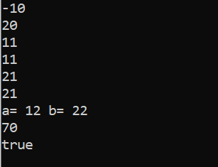

# Arithmetic Operators in JAVA 🖩  
Arithmetic operators in JAVA are used in mathematical expressions in the same way that they are used in algebra.They are used to perform various simple or advance arithmetic operations. Java arithmetic operators can be used for all floating-point and integer numbers.The following table lists the arithmetic operators.  
(Assume integer variable A holds 10 and variable B holds 20)  
| Operator | Description | Example | 
| --- | --- | --- |
| +(Addition) | Adds values on either side of the operator. | A + B will give 30 | 
|-(Subtraction) | Subtracts right-hand operand from left-hand operand. | A - B will give -10 | 
|*(Multiplication) | Multiplies values on either side of the operator. | A * B will give 200 | 
|/(Division) | Divides left-hand operand by right-hand operand. | B / A will give 2 | 
|%(Modulus) | Divides left-hand operand by right-hand operand and returns remainder. | B % A will give 0 | 
|++(Increment) | Increases the value of operand by 1. | B++ gives 21 | 
|--(Decrement) | Decreases the value of operand by 1. | B-- gives 19 | 
<hr>  
<br>  

Program to demonstrate arithmetic operators -   

```
class ArithmeticOperators{
	public static void main(String args[])
	{
		double a = 10.4,b=5.2;
		System.out.println("a="+a+" "+"b="+b);
		System.out.println("a+b= "+(a+b));
		System.out.println("a-b= "+(a-b));
		System.out.println("a*b= "+(a*b));
		System.out.println("a/b= "+(a/b));
		System.out.println("a%b= "+(a%b));
	}
}
```  
## Output  
  

### Shorthand notation-  
Shorthand notation can be used when the operand on both sides of '=' is same. eg-  
- a=a+b can be written as a+=b  
- a=a-b can be written as a-=b  
- a=a*b can be written as a\*=b  
- a=a/b can be written as a/=b  
- a=a%b can be written as a%=b  
## Result data type for Arithmetic Operations -  
Data Type of Result | Data Type of Operands  
--- | ---  
long | Neither operand is a float or a double (integer arithmetic); at least one operand is a long.  
int	| Neither operand is a float or a double (integer arithmetic); neither operand is a long.  
double | At least one operand is a double.  
float | At least one operand is a float; neither operand is a double.

<hr>  

## Unary Operators  

Unary operators are the operators that need only one operand to operate upon.The different types of Unary Operators are:  
- Unary Plus Operator - Indicates Positive value.  
- Unary Minus Opearor - negates an expression.   
- Increment(++) - It is used to increase the value of the operand by 1.   
	- PreIncrement(++a) - here we first increment the operand and then use it.
	- PostIncrement(a++) - here we first use the operand and then increment it.
- Decrement(--) - It is used to decrease the value of the operand by 1.  
	- PreDecrement(--a) - here we first decrement the operand and then use it.  
	- PostDecrement(a--) - here we first use the operand and then decrement it.  
- Logical complement operator(!a) - inverts the value of a boolean.  

Example to test unary operators-  
```
class UnaryOperators{
	public static void main(String args[])
	{
		int a = 10,b=20;
		boolean isBeautiful = false;
		System.out.println(-a);
		System.out.println(+b);
		System.out.println(++a); //a is first incremented and then printed
		System.out.println(a++); //a is first printed and then incremented
		System.out.println(++b); 
		System.out.println(b++);
		System.out.println("a= "+a+" "+"b= "+b);
		System.out.println(a++ + ++b + --a + b--); //12+23+12+23
		System.out.println(!isBeautiful);
	}
}
```  
## Output  
  
## References  
https://www.geeksforgeeks.org/java-arithmetic-operators-with-examples/  
 https://www.iitk.ac.in/esc101/05Aug/tutorial/java/nutsandbolts/arithmetic.html  

 ## Contributed By Arpita Gupta😊


