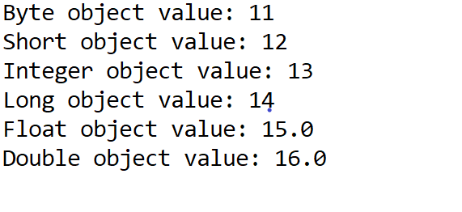

# __Numeric Type Wrappers__

* The abstract class __Number__ defines a superclass that is inherited by the classes that wrap the numeric types __int__, __long__, __byte__, __short__, __float__, and __double__.
* All numneric type wrapper classes inherit the abstract class __"Number"__. 
* __Number__ class has abstract methods that return the value of the object for each primitive data type.
* __Number__ class has 6 subclasses that hold explicit values of each numeric type:- __Double, Float, Byte, Short, Integer,__ & __Long.__

| Primitive Data type   | Wrapper Class | Abstract Method |
| ----------- | ------------- | -------------- |
| int         | Integer       | intValue()     |
| long        | Long          | longValue()    |
| byte        | Byte          | byteValue()    |
| short       | Short         | shortValue()   |
| float       | Float         | floatValue()   |
| double      | Double        | doubleValue()  |

### Integer
```java
Integer int_obj1 = new Integer(10); //using new keyword

int x = 10;
Integer int_obj2 = x; //from "int"

Integer int_obj3 = new Integer("10"); //from string

int value = int_obj.intValue();
```

### Long
```java
Long long_obj1 = new Long(10); //using new keyword

long x = 10;
Long long_obj2 = x; //from "long"

Long long_obj3 = new Long("10");  //from string

long value = long_obj.longValue();
```

### Byte
```java
Byte byte_obj1 = new Byte(10); //using new keyword

byte x = 10;
Byte byte_obj2 = x; //from "byte"

Byte byte_obj3 = new Byte("10");  //from string

byte value = byte_obj.byteValue();
```

### Short
```java
Short short_obj1 = new Short(10); //using new keyword

short x = 10;
Short short_obj2 = x;  //from "short"

Short short_obj3 = new Short("10");  //from string

short value = short_obj.shortValue(); 
```
### Float
```java
Float float_obj1 = new Float(10); //using new keyword

float x = 10;
Float float_obj2 = x; //from "float"

Float float_obj3 = new Float("10");  //from string

float value = float_obj.floatValue();
```
### Double
```java
Double double_obj1 = new Double(10); //using new keyword

double x = 10;
Double double_obj2 = x; //from "double"

Double double_obj3 = new Double("10");  //from string

double value = double_obj.doubleValue();
```

## Program to understand Numeric Type Wrapper: 

```java
public class WrapperClass {
	public static void main(String[] args) {
		
	    //initializing primitive data type
            byte b = 11;  
            short s = 12;  
            int i = 13;  
            long l = 14;  
            float f = 15.0F;  
            double d = 16.0D;  
            
            //initializing wrapper class      
            Byte byte_obj = b;  
            Short short_obj = s;  
            Integer int_obj = i;  
            Long long_obj = l;  
            Float float_obj = f;  
            Double double_obj = d;  
    
            //printing wrapper class object value
            System.out.println("Byte object value: " + byte_obj.byteValue());  
            System.out.println("Short object value: " + short_obj.shortValue());  
            System.out.println("Integer object value: " + int_obj.intValue());  
            System.out.println("Long object value: " + long_obj.longValue());  
            System.out.println("Float object value: " + float_obj.floatValue());  
            System.out.println("Double object value: " + double_obj.doubleValue());  
        
	}
}
```

### Output: <br>




- If the string does not contain a valid numeric value when passed as an argument to the wrapper class for initializing it, then Java throws __"NumericFormatException"__ .
- Also all wrapper classes have overriden __toString()__ methods, which returns readable form of the value stored within the wrapper object.


##
