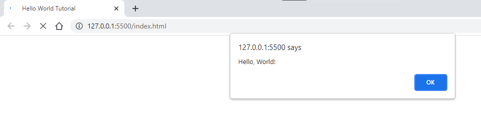
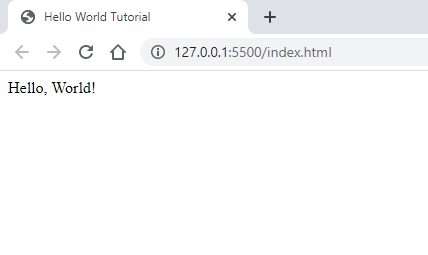

# Hello World Tutorial In JavaScript
In this tutorial you will learn how to print "Hello, World!" in JavaScript in 4 different ways.

# Description
A "Hello, World!" program is a basic program that displays the message "Hello, World!" on the screen. Because it's such a basic program, it's frequently used to teach novices a new programming language.

The Following Ways to print Hello World on the screen are:

## 1. Using console.log()

```console.log()``` is mainly used when we are debugging JavaScript code. 

__Source Code:__
```javascript
console.log('Hello, World!');
```
__Output:__
```
Hello, World!
```
__Explanation:__
This Syntax prints``` Hello, World!```  string to the console.

## 2. Using alert()
The ```alert()``` method displays an alert box over the current tab/window with a specified message.

Also in this you will learn how to add JavaScript in an HTML File and where you can see your output.

__Source Code:__
```html
<!DOCTYPE html>
<html lang="en">
<head>
    <meta charset="UTF-8">
    <meta http-equiv="X-UA-Compatible" content="IE=edge">
    <meta name="viewport" content="width=device-width, initial-scale=1.0">
    <title>Hello World Example</title>
</head>
<body>
  This an example to add JavaScript in an HTML File.  
</body>
<script>
    alert('Hello, World!');
</script>
</html>
```
__Explanation:__

The Output will be generated in an alert box of your browser. 



If we use ```console.log()``` method instead of ```alert()``` method then the output will be generated at console screen. To See the Output go through following steps:
1. Press <kbd>Ctrl</kbd> + <kbd>Shift</kbd> + <kbd>I</kbd> on your HTML page opened in browser. 
2. Click on Console tab and see the output.

## 3. Using Node.js
Follow the steps to Print "Hello, World!" using Node.js:

1. Create a folder like '__MyNodejs__' inside that create a file like '__script.js__'
2. Write the following code in your suitable code editor for e.g- Visual Studio Code.
   
   __Code:__
 ```javascript  
const http = require('http');

const hostname = '127.0.0.1';
const port = 3000;

const server = http.createServer((req, res) => {
  res.statusCode = 200;
  res.setHeader('Content-Type', 'text/plain');
  res.end('Hello, World!');
});

server.listen(port, hostname, () => {
  console.log(`Server running at http://${hostname}:${port}/`);
});
```
3. Then open your command prompt in that folder and type ```node script.js```
   
   You will see:

   ```Server running at http://127.0.0.1:3000/```
4. Click on the above link and your default browser will open up and generate the output.

__Output:__

```Hello, World!```

## 4. Using document.write()

```document.write``` is used when you want the display the content to the HTML document.

__Source Code:__
```javascript
document.write('Hello, World!');
```
__Output:__
```
Hello, World!
```



__Explanation:__

This will display your output on the HTML Page.

## Conclusion
Congratulations! You've Successfully learnt how to print "Hello, World!" in JavaScript.

Keep Exploring JavaScript :wave:

__Contributor:__  [Abhinandan Adhikari](https://github.com/AbhinandanAdhikari) :heart:
