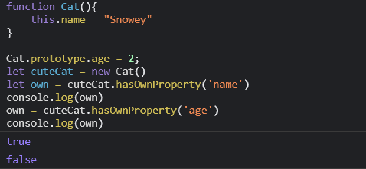
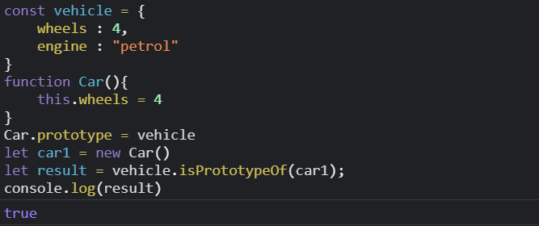

# Inheritence

Inheritence means when one object is based on another object, this is called `inheriting` or `extending`. Let's take an example:

Let's take an constructor function `car()`

```js
function Car(color){
    this.color = color
}
```
We can create as many cars of different colors from this `cars()` constructor function.

```js
let redCar = new Car("red")
let blueCar = new Car("blue")
let greenCar = new Car("green")
```

The objects not only have the same property `color` , but every object in Javascript is linked to a common object called `prototype`. So now we can define a method inside the `prototype`, so now everytime an object is created using the `new` operator it doesn't create similar copies of the method defined within the object itself.

Let's understand it clearly how the common object `prototype` is useful with an example.

```js
function Car(color, brand){
    this.color = color
    this.brand = brand
    this.startCar = function(){
        console.log("Starting engine")
    }
}
```
Everytime an object is instantiated with this constructor function `car()`, a new reference of the function `startcar()` is created. Moreover if you want to make changes to the method, you will have to update all the objects individually. In this situation it makes more sense for all the objects to share a single `startCar` method.  

So to solve this we can define the method in the constructor function's `prototype` property. The prototype is just an object and all the objects created by a constructor function keep a reference to the prototype.

Since now we know that `prototype` property points to a regular object, that object also has a link to its own `prototype`. And that prototype object has reference to its own prototype and so on. This is how a `prototype chain` is formed.

**Now that we have covered the prototype, prototype chain, let's ask a question:**

### How does the Javascript engine know if a method is defined inside the object or in its prototype ?

Let's answer this. When we are invoking a method using the object, javascript interprester will look for the object if it is present, along the prototype chain in a particular order.

1. Javascript engine will look for the method inside the object's own properties, i.e the properties and the methods defined directly in the object itself.
2. If it is not present, it will check in the constructor's `prototype`
3. If its is not present it look up the chain, till the top level parent `Object()` object. If it is not present there then the method is `undefined`.


So as seen earlier, if any property is directly not present inside it, it can still access it if it is present somewhere up the `prototypical chain`.
So now a question may arise where a `property` is coming from?

To check these Javascript has some methods like:

1. `hasOwnProperty()`
2. `isPrototypeOf()`
3. `Object.getPrototypeOf()`
   
### hasOwnProperty()
`hasOwnProperty` allows to find the origin of a particular property. You just need to pass the name of the property as a string, the method will return `boolean` indicating whethere the property belongs to the object itself.  
Let's take an example:
```js
function Cat(){
    this.name = "Snowey"
}

Cat.prototype.age = 2;
```
Let's now create an object and check whether `name` is its own property.
```js
let cuteCat = new Cat()
let own = cuteCat.hasOwnProperty('name')
console.log(own)
own = cuteCat.hasOwnProperty('age')
console.log(own)
```



### isPrototypeOf()

This method checks if an object is present in another object's protoype chain. Using this you can check if an object is prototype of another object.  
Let's take an example:

```js
const vehicle = {
    wheels : 4,
    engine : "petrol"
}
```
Let's make Car() constructor and assign its `prototype` to `vehicle`.
```js
function Car(){
    this.wheels = 4
}
Car.prototype = vehicle
```
Now if we create new objects of `Car()` it's prototype should be `vehicle`

```js
let car1 = new Car()
let result = vehicle.isPrototypeOf(car1);
console.log(result)
```


### Object.getPrototypeOf()

If you want to check what a certain object's prototype is? `Object.getPrototypeOf()` can help us.  
Let's continue with the previous example:
```js
const myPrototype = Object.getPrototypeOf(car1);
console.log(myPrototype);
```


## Summary
Inheritance in JavaScript is when an object is based on another object. Inheritance allows us to reuse existing code, having objects take on properties of other objects. That's it the end of discussion.

__Contributor:__ [Arpan Mondal](https://www.github.com/arp99)