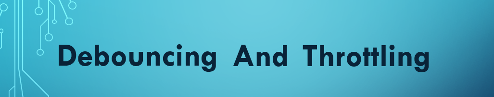
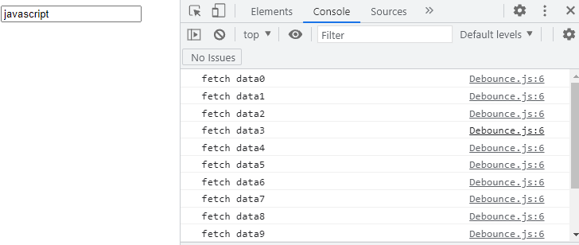
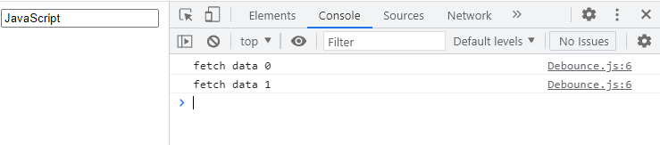
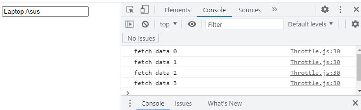

<p align="center">

</p>
<p>&nbsp;</p>

Debouncing and Throttling are two important techniques that will help in enhancing the website 
experience and will also prevent unnecessary API calls.
Before understanding these concepts we should first understand ```the need for these concepts?``` So in certain cases the number of times a function will be executed depends on the user 
and to limit this number we need concepts of debouncing and throttling.


## **What is the need to limit the count of execution of a function?**
Functions that are attached to events like window resize, button click, etc. give full authority to the user to decide when and how many times they can be executed. It might be possible that the action that will lead to the execution of these functions is performed more frequently. In case, the function attached to these events is performing some time-consuming computations then the performance of our website will be affected. So we need to limit the count of execution of these functions.
<p>&nbsp;</p>

# Debouncing

>In debouncing, there should be a time interval between two keystroke events. 

The technique of debouncing can be explained with this simple example-

Suppose a person wants to buy a laptop. Now every time the person types an alphabet in the search bar an API call is made. In such case an API call is made for each keystroke event and this will lead to a number of calls. To reduce the number of calls the developer should develops a functionality that will execute the function only if there is a time gap of 3 seconds between two keystroke events. 
<p>&nbsp;</p>

## How Debouncing works?  
<hr>
<p>&nbsp;</p>


```html
<!DOCTYPE html>
<html lang="en">
<head>
    <meta charset="UTF-8">
    <meta http-equiv="X-UA-Compatible" content="IE=edge">
    <meta name="viewport" content="width=device-width, initial-scale=1.0">
    <link rel="stylesheet" href="./Style.css">
    <title>Debouncing</title>
</head>
<body>
  <input type="text" onkeyup="fetchData()"/>
    <script src="./Debounce.js"></script>
</body>
</html>
```
Here we have an HTML file which contains an input box.This input box contains an onkeyup attribute. This onkeyup attribute will call a method call fetchData. This getData() method gets the data from API or from the server.

First we will see the JavaScript file without the debounce functionality-

**Debounce.js**
```js
var count=0;

const fetchData=()=>{
    // calls an API and gets the data 
 console.log("fetch data"+count++);
}
```

The result will be this-


<p align="center">
</p>

Here we can see that a call has been made for each keystroke event.
<p>&nbsp;</p>

Now we will use the debounce functionality which will decrease the number of calls:=

**Debounce.html**
```html
<!DOCTYPE html>
<html lang="en">
<head>
    <meta charset="UTF-8">
    <meta http-equiv="X-UA-Compatible" content="IE=edge">
    <meta name="viewport" content="width=device-width, initial-scale=1.0">
    <link rel="stylesheet" href="./Style.css">
    <title>Debouncing</title>
</head>
<body>
  <input type="text" onkeyup="debounce()"/>
    <script src="./Debounce.js"></script>
</body>
</html>
```

 In html file the onkeyup attribute will not call the fetchData() method anymore instead it will call the debounce() method.
 <p>&nbsp;</p>

**Debounce.js**

```js
var count=0;

const fetchData=()=>{
    // calls an API and gets the data 
 console.log("fetch data "+count++);
}


const decreaseCall=function(fn,interval){
    let timer;
    return function (){
        let context=this,
        args=arguments;
        clearTimeout(timer);
      timer= setTimeout(()=>{
    fn.apply(context,arguments);
      },interval);
    }
}

const debounce=decreaseCall(fetchData,400)
```

 In the setTimeout() method we are calling the fetchData method and we are waiting for an interval of 400ms (basically the user has to take a pause of 400ms before making a new keystroke event) but if another keypress event takes place before 400ms we should stop calling the fetchData() method and for this we need to clear the setTimeout(). 
 For clearing the setTimeout() we are using the clearTimeout() method. This will eventually decrease the number of calls and the output will be like this:=

<p>&nbsp;</p>
 <p align="center"></p>

 Here the number of calls are made according to the time interval and they are less than the previous calls.

<p>&nbsp;</p>

 # Throttling
 Just like debouncing, throttling is also used to prevent unnecessary API calls.
 >In throttling the first click is executed immediately and all other calls are executed after a particular time interval. All the calls during that time interval are ignored and not executed.

 Suppose the developer sets a time interval of 400ms. Now a user starts searching Dwell laptops. Then a function call will be made when the person presses the key D and for the next 400ms all the calls will be ignored. When this time interval is completed at that instance the person presses the key L for typing laptop. So a function call will made for the word L and similarly for the next 400ms all the calls will be ignored.

 <p>&nbsp;</p>

 ## How Throttling works? 

We have seen earlier that without debounce functionality there were a number of calls, same goes with throttling also.

Files with throttling functionality:=

**Throttle.html**
```html
<!DOCTYPE html>
<html lang="en">
<head>
    <meta charset="UTF-8">
    <meta http-equiv="X-UA-Compatible" content="IE=edge">
    <meta name="viewport" content="width=device-width, initial-scale=1.0">
    <link rel="stylesheet" href="./Style.css">
    <title>Throttling</title>
</head>
<body>
    
  <input type="text" onkeyup="throttle()"/>
    <script src="./Throttle.js"></script>
</body>
</html>
```
Here the onKeyUp attribute is calling the throttle() method.

**Throttle.js**
```js
var count=0;
const fetchData=()=>{
    // calls an API and gets the data 
 console.log("fetch data "+count++);
}

const limitCall=(func,limit)=>{
  let flag=true;
  return function(){
   if(flag){
     func();  
     flag=false;   
     setTimeout(()=>{   
       flag=true; 
 },limit);
   }
  }
}

const throttle=limitCall(fetchData,1000);
```

The fetchData() function is called only if the flag is true. After making the call we set the flag as false again. Then a setTimeout function starts which takes up the limit(here the limit is 1000ms) and no function call will there until the limit expires. After completion of limit the flag becomes true and function call can be made again.

The output will be:=
<p align="center">

</p>

Here we can see that the number of calls is decreased after implementing the throttling functionality.

<p>&nbsp;</p>

## **Difference between Throttling and Debouncing**
The main difference between throttling and debouncing is that **throttling makes a function call after a certain interval of time while debouncing needs a cooling period for execution of function calls.** 

<br />

Contributor: [**Ananya Gupta**](https://github.com/Ananyagupta43)


