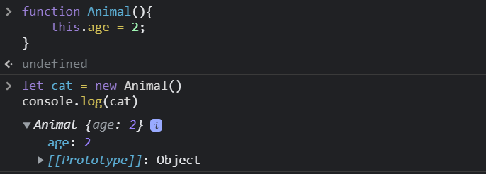

# Constructor Functions

A constructor function is used to make a blueprint of what an object that will be created would look like.

## Structure and Syntax

```js
function Animal(){
    this.age = 2;
}
```
The above syntax might look a bit different than a regular Javascript function, but technically it is a regular function with the following convention:

- The name of a constructor function starts with a capital letter like `Car`, `Person`, `Document` etc.
- Constructor function should be called with a preceding `new` operator to create `objects`.
  
Now let's break down the syntax and understand one by one.  
Rather than declaring local variables, constructor functions stores data with the `this` keyword. The above constructor function will add `age` property to any object that is created from it and assigns a default value of `2`.  
Do not worry about the keyword `this` for now because I will cover it later. For now , just know that the `this` keyword refers to the new object that will be created.

## Create new Object

As discussed earlier a `new` operator must be precede the constructor function to create objects.

```js
let cat = new Animal()
```
Now let's execute `console.log(cat)` and see the output.



## How to create Multiple Objects ?

Now we can create as many objects we want using the constructor function `Animal` and all of them will have the same characteristics.

```js
let dog = new Animal()
let rabbit = new Animal()

console.log(dog)
// Animal { age: 2 }
console.log(rabbit)
// Animal { age: 2 }
```

## Parameterized Constructor Functions

Likeas regular functions Constructor functions can also accept arguments. Now let's modify our constructor function to have 2 properties.

```js
function Animal( age, name ){
    this.age = age;
    this.name = name;
}
```
Now let's create objects using the modified constructor function.

```js
let cat = new Animal( 2, "Snowey")
console.log(cat)
// Animal {age: 2, name: 'Snowey'}
```
In the next section I will continue the discussion with the `this` keyword.

[this keyword](../This_Keyword/README.md)

__Contributor:__ [Arpan Mondal](https://www.github.com/arp99)