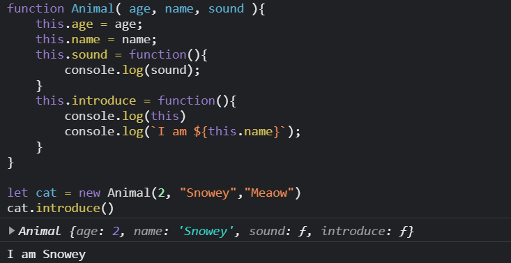

# this keyword

From the previous section you must have a doubt regarding the `this` keyword in the constructor function.
```js
function Animal( age, name, sound ){
    this.age = age;
    this.name = name;
    this.sound = function(){
        console.log(sound);
    }
    this.introduce = function(){
        console.log(`I am ${this.name}`);
    }
}
```
What exactly does this `this` refers to?  
When invoking a constructor function with the `new` operator, `this` gets set to the *newly-created object!*  

In the above code snippet the `this` is accessed inside a method. So the method `introduce` can use `this` to access the `name` property of the object through which the method is called. This might sound confusing, let's take an example.

```js
let cat = new Animal( 2, "Snowey", "Meaow")
cat.introduce() // I am Snowey
// here cat object is used to invoke the method, 
// so 'this' will refer to the cat object

let dog = new Animal( 3, "Pug","Bark")
dog.introduce() // I am Pug
// here dog object is used to invoke the method,
// so 'this' will refer to the dog object
```
Let's prove it by logging the value of `this`



## When is this assigned ?

The value of `this` is not assigned until an  object invokes a method where `this` is used. In other words as previously seen, the value assigned to `this` is based on the object that invokes the method.  
Let's see an example

```js
const cat = {
    meaow : function(){
        console.log("Meaow")
    },
    meaowTwice : function(){
        this.meaow()
        this.meaow()
    }
}
```

Now if we invoke both the methods
```js
cat.meaow()
// Meaow

cat.meaowTwice()
// Meaow
// Meaow
```

When we invoke the `cat.meaow()` or `cat.meaowTwice()` , `this` gets assigned a value. As learnt `this` refers to the object that was called on, `meaowTwice` can access the `meaow` method of the `cat` object through `this`.

## this gets set differently

Uptil now we have seen `this` inside different context, i.e inside constructor functions or within a method etc.

**The value of this gets set in the way functions are called:**

1. When we call a constructor function with the `new` keyword, `this` gets set to the newly created object
2. Invoking a method which belongs to an Object, sets the `this` to the Object itself ( Refer previous examples )
3. When we call any regular function `this` will get set the `global object` i.e `window`  
```js
function regularFunction(){
    console.log(this) // logs the window object
}

regularFunction()
```
4. We can set the value of `this` ourselves! Don't worry I will discuss about it shortly
   
## Setting this ourselves

Let's reveal how we can set the value of `this` ourselves. There are several ways to invoke a function that we have seen earlier, but Javascript provides 2 other ways to invoke a function:
1. call()
2. apply()
   
### call()

The call() method calls a function with a given this value and arguments provided individually.

**Syntax**

>call()  
>call(this)  
>call(this, arg1)  
>call(this, arg1, ... , argN)

Let's see an example:
```js
function add( a, b ){
    return a + b;
}
```
Let's call this function
```js
add(20, 5)
// 25
```
Now let's use the `call()` method to invoke the function
```js
add.call(window, 20, 5)
//25
```
We get the same result ! But how ?  
Remember when regular functions are called the `this` is assigned to the global object i.e `window` object. Here also when the `add` function was invoked with the `call` method the value of `this` was assigned to the `window` object and the rest arguments went as parameters to the `add` function.

Now let's try invoking methods bound to some object. This is where the `call()` method is most useful.

```js
    const car = {
        brand : "Suzuki",
        describe : function(){
            console.log(`It's brand is ${this.brand}`)
        }
    }

    const bike = {
        brand : "Honda"
    }
```
Here I have taken 2 objects car & bike. `car` Object has a method `describe` but the `bike` object doesn't. But how can we then describe the `bike` ? Is there any way to **"Borrow"** the method of `car` and use ?  
The answer is **YES!**

```js
car.describe();
//It's brand is Suzuki
```
To describe the `bike` we can use
```js
car.describe.call(bike)
//It's brand is Honda
```
So How does this happend?  
Firstly the `call()` method is invoked on the `car.describe` then the value of `this` is passed to the `call()` method : `bike`  
Since inside the `describe` method it access `this.brand`, we need to access the `brand` property of the object that the `this` is referring to. But we have changed the value of `this` to refer to `bike` , so now the `this.brand` will be accessed from the `bike` object.

### apply()

The `apply()` method is very similar to the `call()` method except the difference lies in the way the arguments are passed. In case of `call()` the arguments are passed comma separated, `apply()` takes the arguments in the form of an ***array*** .

Let's invoke the previous `add` function using the `apply()` method.

```js
add.apply(window, [20, 5])
// 25
```
>NOTE: The first argument passed in both call() and apply() are the same that is the this argument

## So when to use call() or apply()

`call()` may be used when you don't know ahead of time how many arguments a function needs. In this case `apply()` would be a better option, since it takes an array of arguments and unpacks them to pass to the function.

In the next section I will discuss most usable feature of Object Oriented Programming: `Inheritence`

[Inheritence](../Inheritence/README.md)
