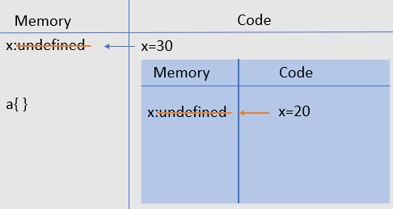

<p align="center">

</p>
<p>&nbsp;</p>

# What are Closures?
 >If we go by definition, then closure is the combination of a function bundled together with its lexical environment.
<p>&nbsp;</p>

 ## **Understanding Lexical Environment And Execution Context**
 
Lexical Environment is basically a data structure that holds identifier-variable mapping. In simple words, lexical environment is the local memory along with the lexical environment of its parent. For understanding Lexical Environment we need to first understand ```Execution Context```.
<p>&nbsp;</p>

### **Execution Context**
Execution context is an abstract space where the JavaScript code is evaluated and executed.
It is created in 2 phases:- 
```Memory Creation Phase```  and ```Code Execution Phase```

Let us understand this by using a simple example

```
var x=30;
a();

console.log(x);
 function a(){
     var x=20;
     console.log(x);
 }

```
The JS code will start its execution in the default execution context which is known as the Global Execution Context. In ```Memory Creation Phase``` the JS Engine will allocate memory to variables. Initially the value that is stored for variables is undefined and for functions the entire code will be stored that is present inside the function.

<p align="center">

</p>
<p>&nbsp;</p>

In code execution phase the code will run again from top to bottom and variables will be initialized with their actual values. In our case the undefined value will be replaced by 30.
And for the function another execution context will be created which is known as ```local execution context```. 

For the code inside the function the 2 phases of memory creation and code execution will be repeated.

<p align="center">

</p>

### **Lexical Environment**
As we discussed earlier that lexical environment is the local memory along with the lexical environment of its parent.Actually, when global execution context is created it contains the variables , functions and lexical environment of the parent.

```
function p(){
    var q=10;
    function r(){
        console.log(q);
    }
}

p();

```
Here the scope of variable q is inside the function p, so q can be accessed by any function inside function p, function r is lexically inside function p and p is the parent of r.


So for the console statement the JS Engine will search the value of q inside the local memory of r but if q is not present inside r then the JS Engine will search the value in the lexical environment of its parent (here the parent is p). This chain of searching variables is called `Scope Chain`.

<p>&nbsp;</p>

## Working of Closures

We have two functions c and a :=
```
function c(){
    var w=10;
    function a(){
    console.log(w);
    }
    return a;
}
c();
```
`Here a is bundled with the variables of c, and it forms a closure.`
   
- Working of closures does not depend on sequence.
- Even if we use let or const ,closures will work in the same way.
- Nesting has no effect on the working of closures.
- Working of closures does not depend on parameters.They will work in the same way, even if you pass parameters.
 
 Example
```
function girlscript(b){
    function JavaScript(){
        console.log(a,b);
    }
    let a="Working of";
    return JavaScript();
}

var contribution= girlscript("Closures");
```
```
 Output: Working of Closures
 ```


<p>&nbsp;</p>

# Advantages Of Closures


- Maintaining state in async world.
- Used in setTimeout function.
- Function like once(it is a function which can run only once) uses closures.
- Concept of closures in used in module design pattern.
  

# Disadvantages Of Closures
- Over consumption of memory as the variables are not garbage collected properly.
- Closures can cause memory leaks if they are handled properly .


 Contributor : [Ananya Gupta](https://github.com/Ananyagupta43)


  


