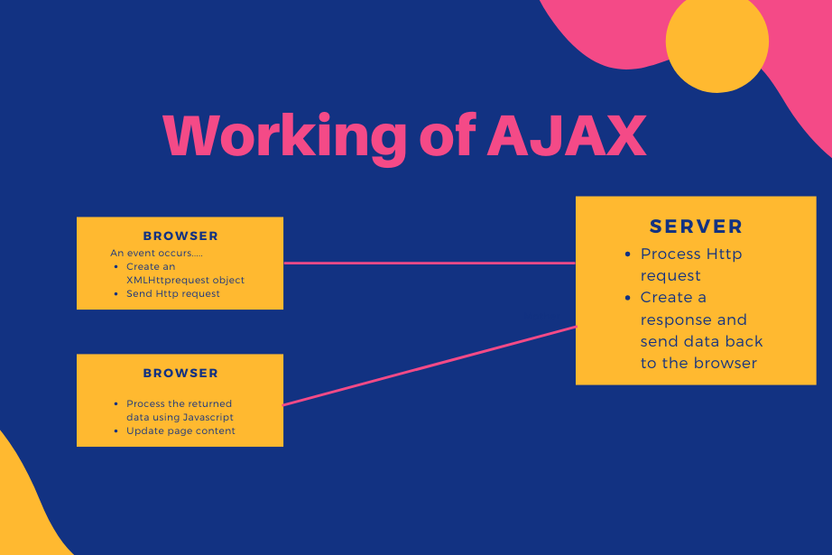

# AJAX in JavaScript
---

## What is AJAX?
---

AJAX stands for **Asynchronous JavaScript And XML**. In a nutshell, it is the use of the XMLHttpRequest object to communicate with servers. It can send and receive information in various formats, including JSON, XML, HTML, and text files. AJAX’s most appealing characteristic is its "asynchronous" nature, which means it can communicate with the server, exchange data, and update the page without having to refresh the page.

The two major features of AJAX allow you to do the following:

- Make requests to the server without reloading the page
- Receive and work with data from the server

*Note- AJAX is a misleading name. Although X in Ajax stands for XML, JSON is preferred over XML nowadays because of its many advantages such as being a part of JavaScript, thus being lighter in size. Both JSON and XML are used for packaging information in the Ajax model.*

## How AJAX works?
---

When an event occurs in a web page (the page is loaded, a button is clicked), an XMLHttpRequest object is created by JavaScript. The XMLHttpRequest object sends a request to a web server. The server processes the request then sends a response back to the web page. The response is then read by JavaScript and a proper action (like page update) is performed by JavaScript.



## AJAX - The XMLHttpRequest Object
---

All modern browsers support the XMLHttpRequest object. The XMLHttpRequest object can be used to exchange data with a web server behind the scenes. This means that it is possible to update parts of a web page, without reloading the whole page.

### Creating an XMLHttpRequest Object
---

All modern browsers (Chrome, Firefox, IE, Edge, Safari, Opera) have a built-in XMLHttpRequest object.

Syntax for creating an XMLHttpRequest object:

```js
variable = new XMLHttpRequest();
```

### Defining a Callback Function
---

A callback function is a function passed as a parameter to another function.In this case, the callback function should contain the code to execute when the response is ready.

```js
xhttp.onload = function() {
  // What do do when the response is ready
}
```

### Sending a Request
---

To send a request to a server, you can use the open() and send() methods of the XMLHttpRequest object:

```js
xhttp.open("GET", "ajax_info.txt");
xhttp.send();
```

Example:

```js
function reqListener () {
  console.log(this.responseText);
}

var oReq = new XMLHttpRequest();
oReq.addEventListener("load", reqListener);
oReq.open("GET", "http://www.something.org/example.txt");
oReq.send();
```

*Note: XMLHttpRequest is old/orginal way of sending requests via javascript. It Does not support promises, so a lot of callbacks are used while making such a request*

## Fetch API
---

The Fetch API is a modern interface that allows you to make HTTP requests to servers from web browsers.If you have worked with XMLHttpRequest (XHR) object, the Fetch API can perform all the tasks as the XHR object does. In addition, the Fetch API is much simpler and cleaner. It uses the Promise to deliver more flexible features to make requests to servers from the web browsers.The fetch() method is available in the global scope that instructs the web browsers to send a request to a URL.

### Sending a Request
---

The fetch() requires only one parameter which is the URL of the resource that you want to fetch:

```js
let response = fetch(url);

```

The fetch() method returns a Promise so you can use the then() and catch() methods to handle it:

```js
fetch(url)
    .then(response => {
        // handle the response
    })
    .catch(error => {
        // handle the error
    });
```

When the request completes, the resource is available. At this time, the promise will resolve into a Response object. The Response object is the API wrapper for the fetched resource. The Response object has a number of useful properties and methods to inspect the response.

*Note : Fetch is the newer way of making requests via JS that Supports promises however it is not supported in Internet Explorer*

### Reading Response
---

If the contents of the response are in the raw text format, you can use the text() method. The text() method returns a Promise that resolves with the complete contents of the fetched resource:

```js
fetch('/readme.txt')
    .then(response => response.text())
    .then(data => console.log(data));
```

In practice, you often use the async/await with the fetch() method like this:

```js
async function fetchText() {
    let response = await fetch('/readme.txt');
    let data = await response.text();
    console.log(data);
}
```

### Sending a POST request
---

The post request is widely used to submit forms to the server. Fetch also supports the POST method call. To do a POST request we need to specify additional parameters with the request such as method, headers, etc. 

In this example, we’ll do a POST request on the JSONPlaceholder and add a post in the posts. It’ll then return the same post content with an ID.

```js
// POST request using fetch()
fetch("https://jsonplaceholder.typicode.com/posts", {
	
	// Adding method type
	method: "POST",
	
	// Adding body or contents to send
	body: JSON.stringify({
		title: "foo",
		body: "bar",
		userId: 1
	}),
	
	// Adding headers to the request
	headers: {
		"Content-type": "application/json; charset=UTF-8"
	}
})

// Converting to JSON
.then(response => response.json())

// Displaying results to console
.then(json => console.log(json));
```
## Cross Domain AJAX Request
---
A common problem for developers is a browser to refuse access to a remote resource. Usually, this happens when you execute AJAX cross domain request using jQuery Ajax interface, Fetch API, or plain XMLHttpRequest. As result is that the AJAX request is not performed and data are not retrieved.


### Same Origin Policy
---

This is a security policy which defines the rules of how a web page can access an external resource (e.g. fonts, AJAX requests). Under the same-origin policy, web browsers do not permit a web page to access resources who origin differ than that of the current page. The origin is considered to be different when the scheme, hostname or port of the resource do not match that of the page. Overcoming the limitations of same-origin security policy is possible using a technique called Cross-origin resource sharing or simply CORS.

### Cross-Origin Resource Sharing (CORS)
---

CORS is a mechanism that defines a procedure in which the browser and the web server interact to determine whether to allow a web page to access a resource from different origin.


When you do a cross-origin request, the browser sends ```Origin``` header with the current domain value.

```
Origin: http://example.com
```

When the server receives the request, check whether the origin header is within the allowed list, and sends a response with ```Access-Control-Allow-Origin```

```
Access-Control-Allow-Origin: http://example.com
```

If you want to allow access for all, use a wildcard '*'

```
Access-Control-Allow-Origin: *
```
<br> 

__Contributor :__ [Aniket Pathak](https://github.com/aniketpathak028)
