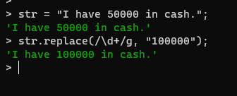

# Regular Expressions in JavaScript

Regular expressions are useful for determining the pattern in a string. It also aids in the discovery of the pattern and manipulation of the material, such as the replacement of the pattern.

The syntax of the regular expression in JavaScript is enclosed between two slashes (`/<regular_expression>/`). <br>
For example, <br>

``` JS
let regExp = /x+/;
```

Where `+` has its own meaning which will be covered in the next section.

Regular expressions can also be represented using `RegExp()` function.

<b>Syntax: </b> `RegExp(regularExp, "modifier")`

For example, 

``` JS
let reg = RegExp("x+", "g");
```

There are many functions in JavaScript which helps to check the validity of the regular expression, such as `match()`, `replace()`, etc.

<br>

# Conventions in Regular Expressions

There are several conventions which can be used to find out the pattern of a string.

## Modifiers

Modifiers take care of global searches, case-insensitive, etc. <br>
The following table explains the types of modifiers

| Expressions | Description |
|-----------|-----------|
| `g` | Global search |
| `i` | Case-insensitive search |
| `m` | Multiline search |

## Occurences

The following table explains the type of occurences used in the regular expression.

| Expressions | Description | Example | 
|-----------|-----------| ----------- |
|`/x*/`| Zero or more occurences of "x" | 
| `/x+/` | One or more occurences of "x" | 
| `/x{a}/` | String having "a" times of "x" |  |
| `/x{a, b}/` | String having "a" to "b" times of x |  |
| `/^x/` | String beginning with "x" |  |
| `/n$/` | String ending with "x" |  |

## Range of characters 

The range of characters is expressed using the square brackets (`[]`).

The following table explains the usage of ranges in regular expressions.

| Expressions | Description | Example |
|-----------| ----------- | ----------- |
| `[pqrs]` | String having "p", "q", "r" and "s" |  |
| `[a-z]` | String having only lowercase English characters |  |
| `[^a-z]` | String having any characters **except** lowercase English characters |  |
| `(a\|b)` | String having either "a" or "b" |  |

## Assertions

Assertions are used to check whether a character is either ahead/behind of the other character. There are 4 types of assertions:
1. Positive Lookahead
2. Negative Lookahead
3. Positive Lookbehind
4. Negative Lookbehind

The following table demonstrates those four types of assertions.

| Name | Syntax | Description | Example |
|-----------| ----------- |-----------| ----------- |
| Positive Lookahead Assertion | `a(?= b)` | Whether "a" is followed by "b" |  |
| Negative Lookahead Assertion | `a(?! b)` | Whether "a" is not followed by "b" |  |
| Positive Lookbehind Assertion | `(?<= b)a` | Whether "b" comes before "a" |  |
| Negative Lookbehind Assertion | `(?<! b)a` | Whether "b" doesn't come before "a" |  |


## Escape Sequences

Escape sequences are the special characters which has a special meaning.

The following table explains the different types of escape sequences.

| Expressions | Description |
|-----------| ----------- |
| `\n` | Newline character |
| `\t` | Newtab character |
| `\v` | Vertical character |
| `\0` | Null character |
| `\f` | Form feed character |
| `\r` | Carriage return character |
| `\s` | Whitespace character |
| `\S` | Non-whitespace character |
| `\d` | Digit |
| `\D` | Non-Digit |

<br>

# Functions used for the regular expressions

## 1. `match()` function

This function helps to find out the appropriate match as per the regular expressions given in the argument, otherwise it gives NULL as output.

<b>Syntax: </b> `string.match(regularExp)`

For example, 


## 2. `search()` function

This function searches for the appropriate match of the regular expression. <br>
It returns an index as the output. If the match is not found, it will return -1.

<b>Syntax: </b> `string.search(regularExp)`

For example,


## 3. `replace()` function

This function replaces the word/character(can be in the form of RegEx too) with a new word/character.

<b>Syntax: </b> `string.replace(regularExp)`

For example,



## 4. `split()` function

This function breaks the string as per the argument given and returns the output in the form of an array.

<b>Syntax: </b> `string.split(regularExp)`

For example, 


## 5. `matchAll()` function

This function returns all possible ways of matched substring and returns in the iterable form.

<b>Syntax: </b> `string.matchAll(regularExp)`

For example,


## 6. `replaceAll()` function

This functions looks for the match in the string as per the regular expression given in the argument and replaces with the new character passed.

<b>Syntax: </b> `string.replaceAll(regularExp, newExp)`

For example,


<br>

# References
1. https://developer.mozilla.org/en-US/docs/Web/JavaScript/Guide/Regular_Expressions
2. https://www.w3schools.com/jsref/jsref_obj_regexp.asp
3. https://2ality.com/2017/05/regexp-lookbehind-assertions.html#:~:text=The%20proposal%20%E2%80%9CRegExp%20Lookbehind%20Assertions,Ehrenberg%20is%20part%20of%20ES2018.&text=A%20lookaround%20assertion%20is%20a,but%20has%20no%20other%20effect.
4. https://javascript.info/regexp-lookahead-lookbehind

<br>

<b>Contributors: </b> [Subhendu Dash](https://github.com/subhendudash02)