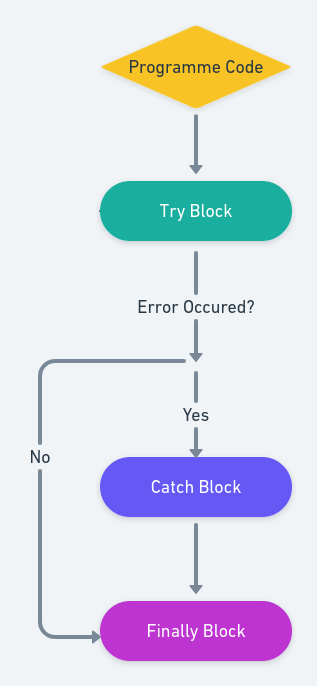

## Error Handling in Javascript

No matter how much good you do in coding, you can make mistakes in your code. In Javascript, to cope with erroneous behaivour of application, we can use error handling.

### Types of Errors

There are three types of errors in Javascript:

1. Syntax Error
   Syntax errors are errors that occur when the pre-defined syntax of the code is incorrect. It is detecteed while compiling or executing the code.

2. Runitme Error
   A runtime error is an error that occurs when the code is running and it is not able to execute properly. It is detected by the Javascript engine while executing the code.

3. Logical Error
   Logical error is the most difficult type of error to track. These errors will not be shown in the console. It is a mistake in your program that may give you unexpected results.

### What is Error Handling?

Error handling is the process of dealing with errors in our codebase.

#### Try and Catch

<p align="center">

</p>

<br/>
<br/>


There is a syntax of `try...catch` in Javascript that is used to catch the error, and instead of throwing the error, it does something else.
In other words, the `try` block tries to execute the cod in the block, if it fails to execute then the `catch` block will handle the problem. If there is no error, the catch block will not be executed. There is a `finally` block that is executed after the try and catch block. It is optional and can be used to give a final message to the user.

<br/>
<br/>

```javascript
try {
  // code that may throw error
} catch (error) {
  // code that can handle the error
}
```
</div>
</div>

##### Errorless Code
  Try block will be executed because there is no error.

```javascript
try {
  alert("Hello, I am from try block");
} catch (error) {
  alert("Hello, I am from catch block");
}
```

```javascript
function getMonthNum() {
  const obj = new Date();
  const monthNumber = obj.getMonth();
  return monthNumber;
}
// If the try block fails to call the getMonthNum function, then the catch block will be executed.
try {
  monthName = getMonthNum();
  alert(monthName);
} catch (error) {
  alert(error);
}
```

##### Errorful Code
  Try block will not be executed because there is an error.

```javascript
try {
    alert("Hello, I am from try block");
    fsadlskdscvsda{{{{}}}}c; // this line will throw an error
}
catch (error) {
    console.log(error); // You can use console.log to see the error
    alert("Hello, I am from catch block");
}
```

```javascript
try {
  getValue(); // function is not defined
} catch {
  alert("Error"); // Catch block will be executed
}
```

#### `Finally` block

This block will be executed in any situation.

```javascript
try {
  console.log("I'm from try block");
} catch {
  console.log("I'm from catch block");
} finally {
  console.log("I'm from finally block");
}

// Expected output
// I'm from try block
// I'm from finally block
```

```javascript
try {
  let a = 5;
  if (a == 5) {
    alert("Message from try block");
  }
} catch (error) {
  alert(error);
} finally {
  document.write("The value is 5");
}
// Expected output
// Message from try block
// The value is 5
```

##### Contributed by [Rwitesh Bera](https://github.com/rwiteshbera)
