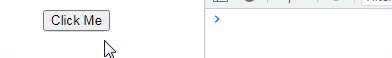
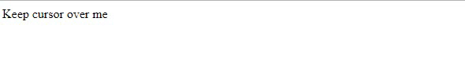
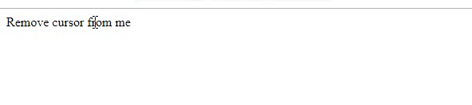
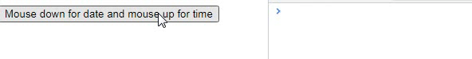
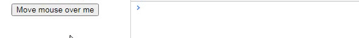
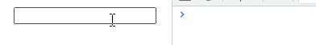

# Javascript Events

This article covers all the fundamental and advanced topic of **Javascript Events** from scratch

## What is an Event?

The change in the state of an object is known as an **Event**. In simple words, events are the thing that happens to an HTML element and performed by some Javascript code.

## Event Handling

When Javascript code is included in HTML, JS reacts over the events and allow the execution. This process of reacting over the events is known as **Event Handling**.

## Event Handlers

Javascript handles the HTML events via **Event Handlers**. Event handlers are directly used in HTML elements to execute the event.

## Event Listeners

Event can be applied in HTML elements directly by using addEventListener function in Javascript.
Every event handlers have an event that can be used in <code>addEventListener()</code>.

**Syntax**

```js
element.addEventListener("event", "callback function");
```

**Note**: _onclick_ is used by HTML elements directly to perform the events but **click** is used by addEventListener in JS to perform the events.

## Event handlers with <code>events</code> being performed by them

**Mouse Events**

| Event Handler | Event     |
| ------------- | --------- |
| onclick       | click     |
| onmouseover   | mouseover |
| onmouseout    | mouseout  |
| onmousedown   | mousedown |
| onmouseup     | mouseup   |
| onmousemove   | mousemove |

**Keyboard Events**

| Event Handler | Event   |
| ------------- | ------- |
| onkeydown     | keydown |
| onkeyup       | keyup   |

**Form Events**

| Event Handler | Event  |
| ------------- | ------ |
| onfocus       | focus  |
| onsubmit      | submit |
| onblur        | blur   |
| onchange      | change |

**Window / Document Events**

| Event Handler | Event  |
| ------------- | ------ |
| onload        | load   |
| onunload      | unload |
| onresize      | resize |

## Example of event execution

1. Performed directly in HTML element

```html
<html>
  <body>
    <button onclick="clickEvent()">Click Me</button>

    <script>
      function clickEvent() {
        document.write("Click event performed by HTML onclick event handler");
      }
    </script>
  </body>
</html>
```

Output


2. Performed in javascript

```html
<html>
  <body>
    <button>Click Me</button>

    <script>
      const button = document.querySelector("button");
      button.addEventListener("click", () => {
        document.write("Click event performed by Javascript eventListener");
      });
    </script>
  </body>
</html>
```

Output


## Events with brief description and code

### Mouse Events

1. Click Event - When Mouse click on an element, click event fires.
   **Code**

   ```html
   <html>
     <body>
       <button onclick= "clickEvent()"> Click Me</button>

       <script>
         function clickEvent() {
           console.log("You clicked me!");
         }
       </script>
     </body>
   </html>
   ```

   **Output**

   

2. Mouseover Event - When the cursor of the mouse comes over the element, mouseOver event fires.
   **Code**

   ```html
   <html>
     <body>
       <span onmouseover="mouseOver()">Keep cursor over me</span>

       <script>
         function mouseOver() {
           alert("MouseOver event fired!");
         }
       </script>
     </body>
   </html>
   ```

   **Output**

   

3. Mouseout Event - When the cursor of the mouse leaves an element, mouseOut event fires.
   **Code**

   ```html
   <html>
     <body>
       <span onmouseout="mouseOut()">Remove cursor from me</span>

       <script>
         function mouseOut() {
           alert("Mouseout event fired!");
         }
       </script>
     </body>
   </html>
   ```

   **Output**

   

4. Mousedown and Mouseup Event - When the mouse button is pressed and released respectively, mouseDown and MouseUp event fires.
   **Code**

   ```html
   <html>
     <body>
       <button onmousedown="mouseDown()" onmouseup="mouseUp()">
         Mouse down for date and mouse up for time
       </button>

       <script>
         const date = new Date();
         function mouseDown() {
           console.log(`Mouse down with date => ${date.getUTCDate()}`);
         }
         function mouseUp() {
           console.log(`Mouse up with year => ${date.getUTCFullYear()}`);
         }
       </script>
     </body>
   </html>
   ```

   **Output**

   

5. MouseMove Event - When the mouse movement takes place, mousemove event fires.
   **Code**

   ```html
   <html>
     <body>
       <button onmousemove="mouseMove()">Move mouse over me</button>

       <script>
         function mouseMove() {
           console.log(`<== You moved mouse this many times`);
         }
       </script>
     </body>
   </html>
   ```

   **Output**

   

### Keyboard Events

1.  KeyDown and keyUp event - When user press and release the key, keydown and keyup event fires.
    **Code**

    ```html
        <html>
        <body>
            <input type="text" id="input" onkeydown="keyDown()" onkeyup = "keyUp()">

        <script>
            function keyDown(){
                console.log("Key Pressed");
            }
            function keyUp(){
            console.log("Key Released");
            }
        </script>  
        </body>
        </html>
    ```
    **Output**

    


####<p align="center">__Written with :heart: by__ [its-me-Harsh-Anand](https://github.com/its-me-Harsh-Anand)</p>