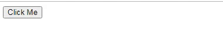
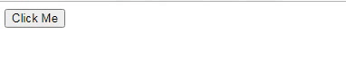

# Javascript Events

This article covers all the fundamental and advanced topic of **Javascript Events** from scratch

## What is an Event?

The change in the state of an object is known as an **Event**. In simple words, events are the thing that happens to an HTML element and performed by some Javascript code.

## Event Handling

When Javascript code is included in HTML, JS reacts over the events and allow the execution. This process of reacting over the events is known as **Event Handling**.

## Event Handlers

Javascript handles the HTML events via **Event Handlers**. Event handlers are directly used in HTML elements to execute the event. 

## Event Listeners

Event can be applied in HTML elements directly by using addEventListener function in Javascript.
Every event handlers have an event that can be used in <code>addEventListener()</code>.

**Syntax**
```js 
element.addEventListener('event', 'callback function')
``` 

**Note**: *onclick* is used by HTML elements directly to perform the events but **click** is used by addEventListener in JS to perform the events.

## Event handlers with <code>events</code> being performed by them

**Mouse Events**

Event Handler | Event
--- | ---
onclick | click 
onmouseover | mouseover 
onmouseout | mouseout
onmousedown | mousedown
onmouseup | mouseup 
onmousemove | mousemove


**Keyboard Events**

Event Handler | Event
--- | ---
onkeydown | keydown 
onkeyup | keyup 


**Form Events**

Event Handler | Event
--- | ---
onfocus | focus 
onsubmit | submit 
onblur | blur
onchange | change

**Window / Document Events**

Event Handler | Event
--- | ---
onload | load 
onunload | unload 
onresize | resize


## Example of event execution 
1. Performed directly in HTML element

```html
    <html>
    <body>
        <button onclick="clickEvent()">Click Me</button>

    <script>  
        function clickEvent(){
            document.write("Click event performed by HTML onclick event handler");
        }  
    </script>  
    </body>
    </html>
```

Output



2. Performed in javascript

```html
    <html>
    <body>
        <button>Click Me</button>

    <script> 
        const button = document.querySelector("button");
        button.addEventListener('click',()=>{
            document.write("Click event performed by Javascript eventListener");
        }) 
    </script>  
    </body>
    </html>
```
Output


