# Local Storage and Session Storage
If your web application wants to handle some data, it's not always relevant to store it on databases on the server side. You can locally store data in your client side browser's storage. There are two ways to use browser storage: **localStorage** and **sessionStorage**. But as the data is stored on the browser itself and not on the server, the size of data that we can store is limited to around 5MB to 10MB and the size varies from browser to browser.

In case you are building any static website, Local Storage/Session Storage can be helpful for storing some user preferences (e.g: light/dark theme for you website). Or while building dynamic website, it can be useful for optimizing the performance of the web apps by minimizing requests to the server, hence reducing the load on the server. You can also auto-save feature using Local Storage and restore form data if user closes the tab.

For Chrome Browser, open Developer Tools by simply pressing **F12**. Move to the **Application** Tab and in the menu on the left under the Storage tab, you'll find Local Storage and Session Storage.

<p align="center"> 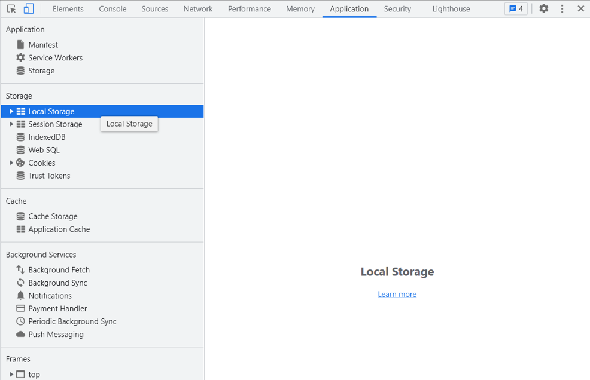 </p>

# Local Storage
In **Local Storage**, data is stored using key-value pair.  The data stored in local storage will not be deleted when the browser is closed. The data does not have any expiration date/time. When you re-open the web page on a new browser, you can access the Local Storage data as it was when you closed the previous tab.

<p align="center"> 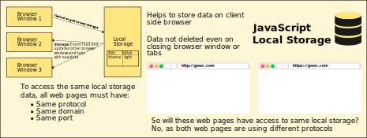 </p>

Local Storage object provides the following methods and properties:
- To save a data item in a key-value pair: setItem(key, value) method is used:  
```localStorage.setItem("GWOC","GirlScript Winter of Contributing");```  
```localStorage.setItem("GSSOC", "GirlScript Summer of Code");```  
<p align="center"> 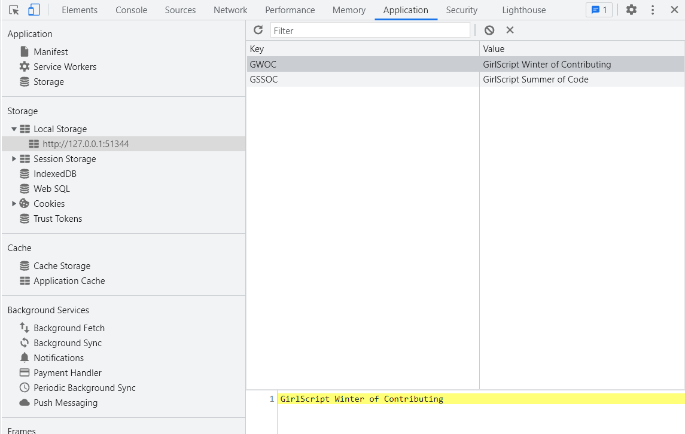 </p>

- To retrieve a data item: getItem(key) method is used:  
```localStorage.getItem("GWOC");```  
```localStorage.getItem("GSSOC");```  
<p align="center"> 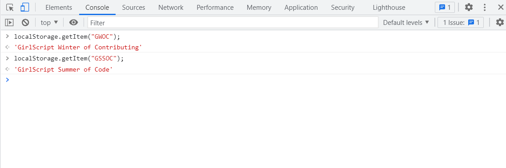 </p>

- To get the name of the given index position: key(index) method is used:  
```localStorage.key(0);```  
<p align="center"> 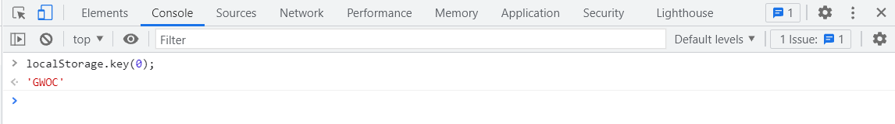 </p>

- To get the total number of items stored: length property is used:  
```localStorage.length;```  
<p align="center"> 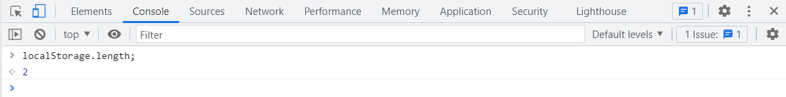 </p>

- To remove a data item from local storage: removeItem(key) method is used:  
```localStorage.removeItem("GWOC");```  
<p align="center"> 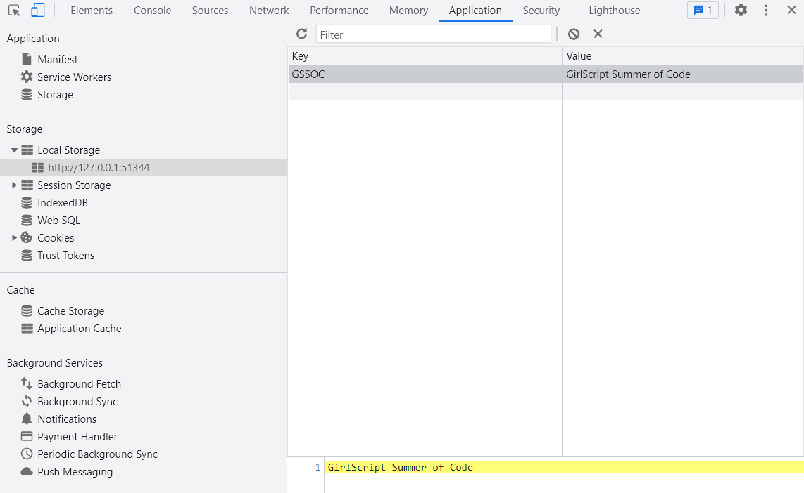 </p>

- To clear or delete entire local storage records: clear() method is used:  
```localStorage.clear();```  
Even if a user clears the browser cache of that browser, then the local storage also gets cleared.  
<p align="center"> 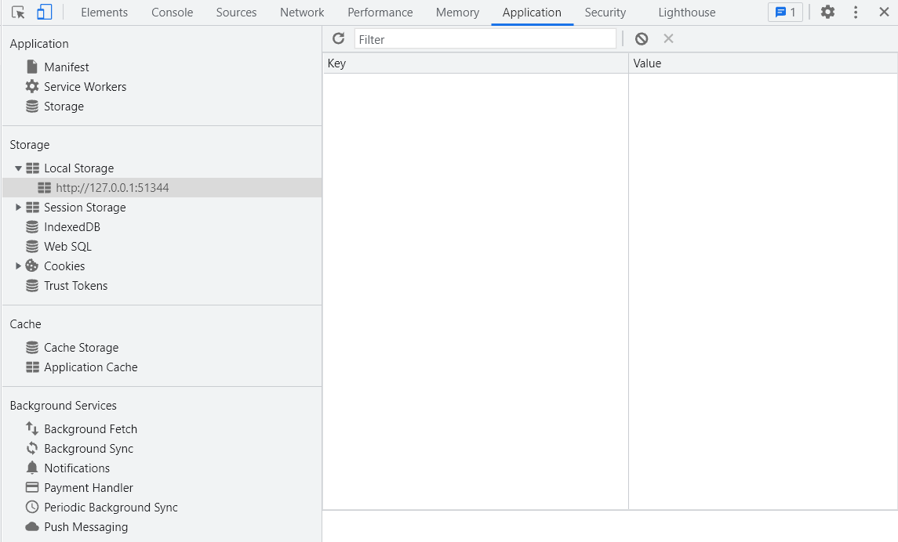 </p>

> When you run these methods and properties through your JS file or script of your HTML file, remember to use console.log in case you need to display the values in the console.

# Session Storage
In **Session Storage**, data items stored exists only within the current browser tab. Different tabs will have different Session Storage. Session Storage object is independent of other browser tabs or windows. If two or more tabs are open running the same web page and any one updates the Session Storage, other tabs will not get affected by the update. The data is lost once the tab is closed.

<p align="center"> 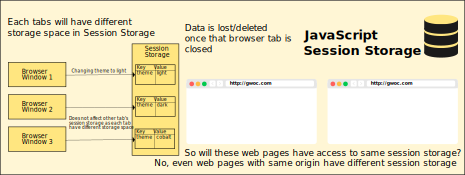 </p>

Methods and properties of Session Storage are same as that provided by Local Storage:
- To save a data item in a key-value pair: setItem(key, value) method is used:  
```sessionStorage.setItem("GWOC","GirlScript Winter of Contributing");```  
```sessionStorage.setItem("GSSOC", "GirlScript Summer of Code");```  
<p align="center"> 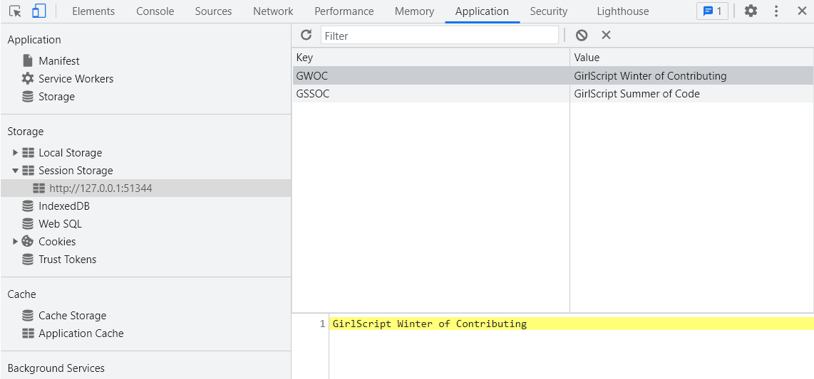 </p>

- To retrieve a data item: getItem(key) method is used:  
```sessionStorage.getItem("GWOC");```  
```sessionStorage.getItem("GSSOC");```  
<p align="center"> 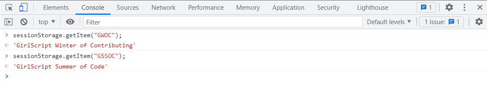 </p>

- To get the name of the given index position: key(index) method is used:  
```sessionStorage.key(1);```  
<p align="center"> 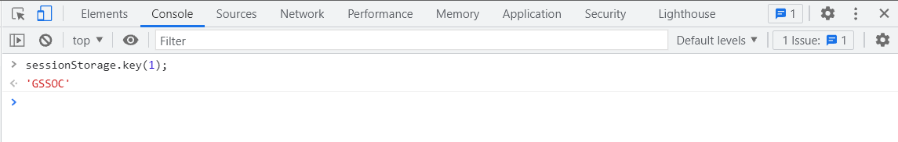 </p>

- To get the total number of items stored: length property is used:  
```sessionStorage.length;```  
<p align="center"> 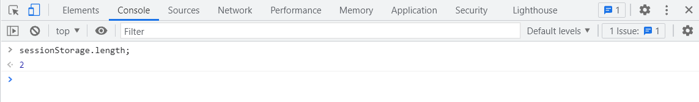 </p>

- To remove a data item from session storage: removeItem(key) method is used:  
```sessionStorage.removeItem("GWOC");```  
<p align="center"> 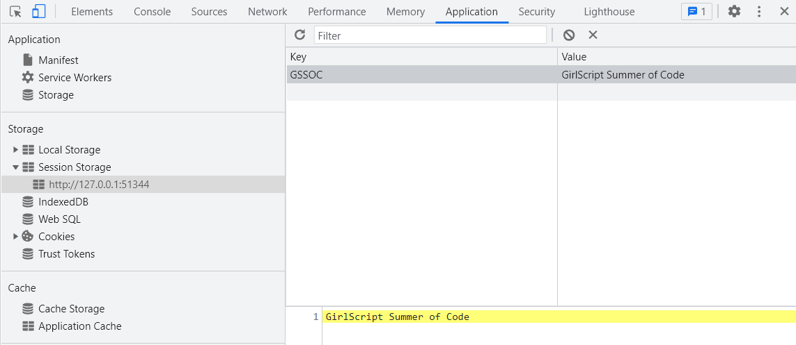 </p>

- To clear or delete entire session storage records: clear() method is used:  
```sessionStorage.clear();```  
Even if a user closes the tab of that browser, then the Session Storage also gets cleared.  
<p align="center"> 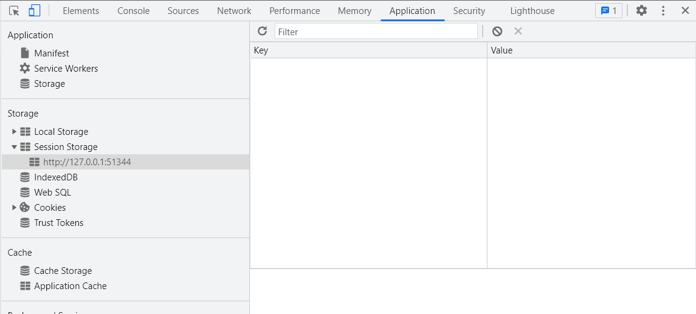 </p>

> One thing to note here is that Local Storage and Session Storage are **read only**. We can add data, delete data or read data. To modify the data item, we need to overwrite the previous value with the same key.

# Summary
- We can store data in our browser storage in key-value pair using **Local Storage** and **Session Storage**.
- Session Storage gets cleared once that tab is closed and has separate storage space for multiple tabs and windows running same web page while Local Storage has no expiration date/time on the data and can be shared between multiple tabs and windows running the same web page.
- Both Local Storage and Session Storage provide the same methods and properties.
- Local Storage and Session Storage are not secure enough as there is no data protection and it can be accessed easily, so sensitive information like passwords, API keys, JWT Tokens, etc should not be stored there.

#### Contributor: [Keval Dhanani](https://github.com/OptimalLearner)
