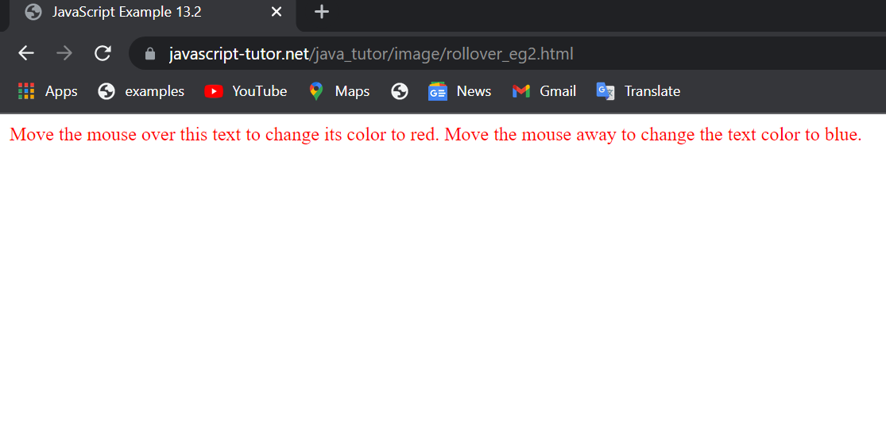
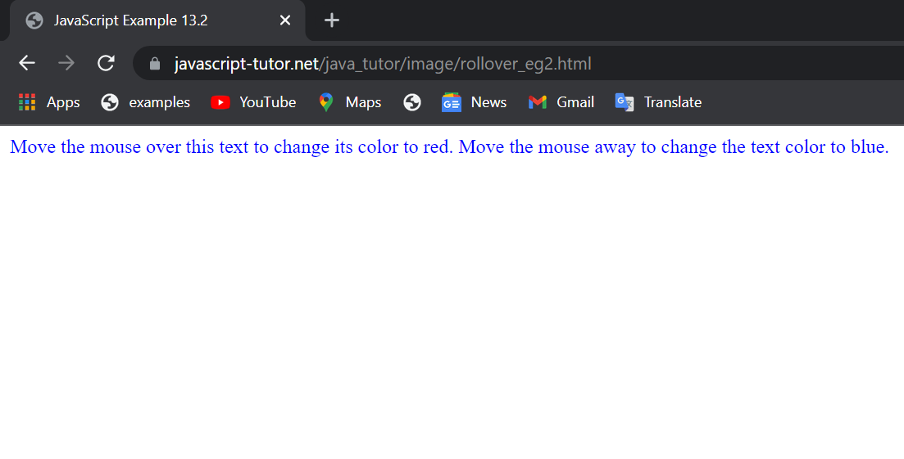
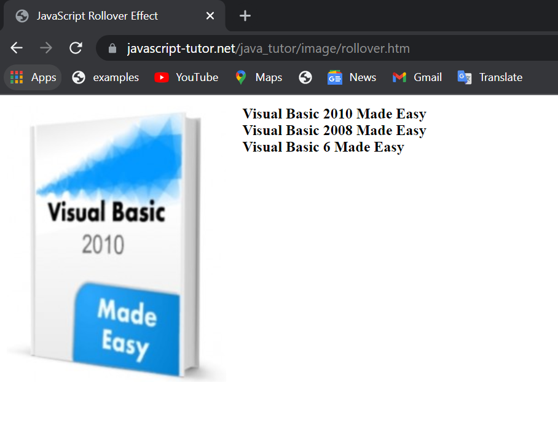
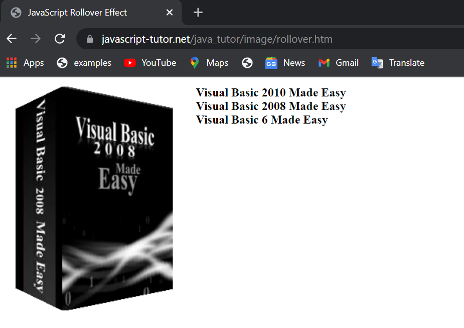
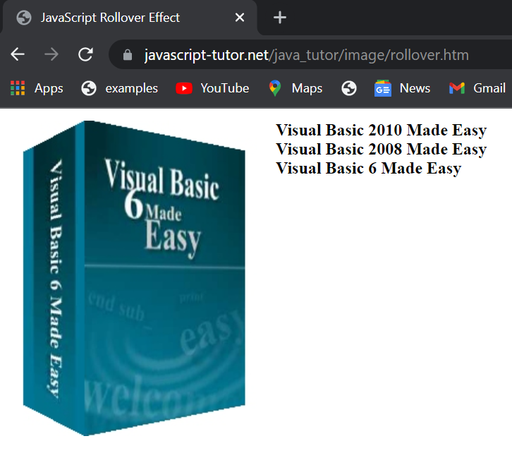
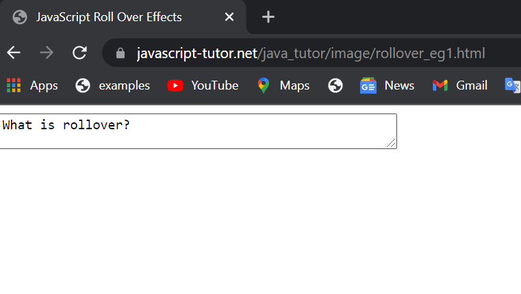
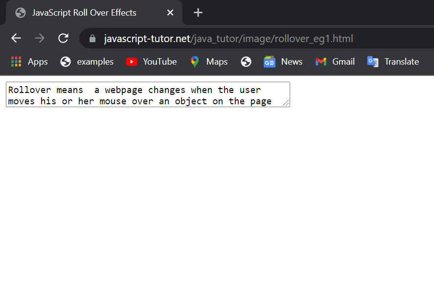

# __Rollovers__
* Rollover is a JavaScript technique used by __Web developers__ to produce an effect in which the appearance of a graphical image changes when the user rolls the mouse pointer over it.
* Rollover also refers to a __button__ on a Web page that allows interactivity between the user and the Web page. It causes the button to react by either replacing the source image at the button with another image or redirecting it to a different Web page.
* Rollover is triggered when the mouse moves over the primary image, causing the secondary image to appear. The primary image reappears when the mouse is moved away.
* Occasionally, rollover is referred to as synonym for __mouseover__.

# **Features of Rollover**

   Some of the key features of rollover include:

 * Enables interaction between the user and the Web page.
 * Makes an image appear or disappear when the mouse is moved over it.
 * Makes a hidden image or element to appear when the mouse is moved over it.
 * Makes an element of the page change the color of the entire Web page when the mouse is moved over it.
 * Causes text to pop up or become highlighted with bold colors when the mouse is moved on a text element.

# **Creating a Rollover**
<br>

  *  A rollover is caused by an event called onmouseover and occurs when a visitor to your web site moves the mouse over an object that appears on the page. An object can be an image, text, or any element of a form.

  *  You react to the onmouseover event by using the __onmouseover__ attribute of an HTML tag that defines the object on the web page and then assign to the onmouseover attribute the action you want performed when the event occurs. 
   *  The action can assign a new value to an attribute of an object, call a method of an object, or call a JavaScript function.


## **Example 1:**
<br>

 In example below, we create a rollover effect that can change the color of its text using the style attribute.

```html
<p
onmouseover="this.style.color='red'"
onmouseout="this.style.color='blue'">
Move the mouse over this text to change its color to red. Move the mouse away to
change the text color to blue.
</p>
```

## Output

<br>


<br><br>


<br>


<br><br>


## **Example 2:**
  This example shows how to create rollover effect that involves text and images. When the user places his or her mouse pointer over a book title, the corresponding book image appears.

 ```html 

<html>
<head>
<title>Rollover Effect</title>
</head>
<body>
<table>
<tbody>
<tr valign="top">
<td width="50">
<a></a>
</td>
<td></td>
<td><a onmouseover="document.book.src='vb2010book.jpg'"><b>Visual Basic 2010 Made Easy</b></a>
<br>
<a onmouseover="document.book.src='vb2008book.jpg'"><b>Visual Basic 2008 Made Easy</b></a>
<br>
<a onmouseover="document.book.src='vb6book.jpg'"><b>Visual Basic 6 Made Easy</b></a>
<br>
</td>
</tr>
</tbody>
</table>
</body>
</html>

```
## Output 

<br>


<br><br>
<br>


<br><br>

<br>


<br><br>


# **Text Rollover**
 You can create as many rollovers as you want on your web page; however,each one should be meaningful to the visitor. There is nothing more distracting to a visitor than to encounter rollovers on practically every object on a web page. Carefully placed rollovers can enhance a visitor's experience when browsing the web page. A clever rollover technique used by some developers is to enable a visitor to see additional information about an item described in text by placing the mouse cursor on the text. This eliminates the time-consuming task of using a hyperlink to display another web page that contains this additional information and reduces the information clutter found on some web pages.You create a rollover for text by using the **onmouseover** attribute.


## **Example :**

 In example below, we create a rollover effect that can change the text when move goes over the text.

```html
<HTML>
<head></head>
<Body>
<textarea rows="2" cols="50" name="rollovertext" onmouseover="this.value='What is rollover?'"
onmouseout="this.value='Rollover means a webpage changes when the user moves his or her mouse over an object on the page'"></textarea>
</body>
</html>
```

## Output

<br>


<br><br>

<br>


<br><br>

# **More Efficient Rollovers**
An efficient way of handling rollovers is to load images into an array when your 
web page loads. The browser loads each image once the fi rst time the image is referenced in the web page. Typically, the default setting for the browser is to check 
the browser cache for subsequent references for the image rather than download the 
image again from the web server. However, a visitor to your web page might have 
changed the default setting, causing the browser to reload the image each time the 
image is referenced. This might cause a noticeable delay.
Any delay in transmission is likely to be noticed by the visitor. While most visitors accept short delays when they're selecting a different web page, they tend to be 
unforgiving if the rollover takes longer than a second or two to display the new image. You can reduce this delay by creating a JavaScript that loads all the images into 
memory once at the beginning of the JavaScript, where they can be quickly called 
upon as the onmouseover event occurs.

Downloading images when the web page is f rst loaded is a simple three-step 
process:
 1. Declare an image object.
 2. Assign the image fi le to the image object.
 3. Assign the image object to the src attribute of the HTML tag that is going 
to react to the rollover event.


## **Summary**


A rollover provides an easy way to make your web page come alive, as visitors to 
your web site move the mouse cursor around the web page. Each time the mouse 
cursor rolls over an object on the web page, the browser signals an onmouseover 
event. An onmouseout event is then generated when the mouse cursor moves off the 
object. Your can design your web page to perform an action to respond to these 
events.

Contributor: [Utkarsha Kakade](https://github.com/utkarshakakade)