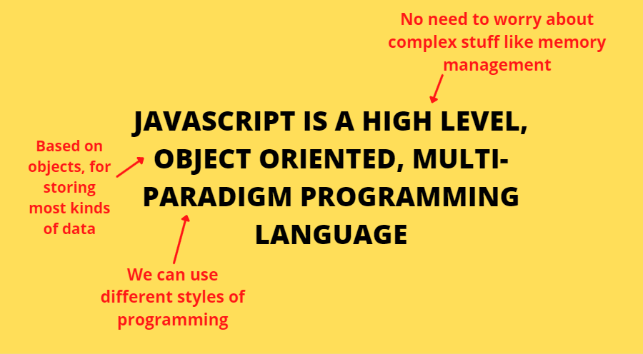
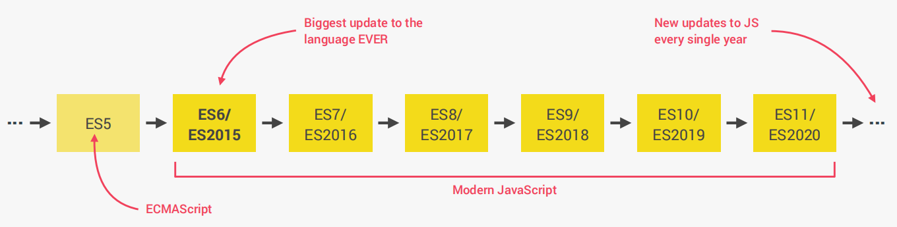

 

# What Is JavaScript?

 

  

# Timeline Of JavaScript

 

  

# A Brief History Of Javascript

 

| TIMELINE  | HISTORY                                                                                                                                                                                                                                              |
|-----------|------------------------------------------------------------------------------------------------------------------------------------------------------------------------------------------------------------------------------------------------------|
| 1995      | Brendan Eich creates the **very first version of JavaScript in just 10 days**. It was called Mocha, but already had many fundamental features of modern JavaScript!                                                                                  |
| 1996      | 1) Mocha changes to LiveScript and then to JavaScript, in order to attract Java developers. However, **JavaScript has almost nothing to do with Java**.    2) Microsoft launches IE, **copying JavaScript from Netscape** and calling it JScript. |
| 1997      | With a need to standardize the language, ECMA releases ECMAScript 1 (ES1), the **first official standard for JavaScript** (ECMAScript is the standard, JavaScript the language in practice).                                                         |
| 2009      | ES5 (ECMAScript 5) is released with lots of great new features.                                                                                                                                                                                      |
| 2015      | 1) ES6/ES2015 (ECMAScript 2015) was released: **the biggest update to the language ever!**    2) ECMAScript changes to an **annual release cycle** in order to ship less features per update.                                                     |
| 2016 - ♾  |  Release of ES2016 / ES2017 / ES2018 / ES2019 / ES2020 / ES2021 / … / ES2089                                                                                                                                                                         |

  

## ES5 

- Fully supported in all browsers
- Ready to be used today

## ES6/ES2015 ... ES2020 

- ES6+: Well supported in all modern browsers
- No support in older browsers
- Can use most features in production with transpiling and polyfilling

## ES2021 ... ♾ 

- **ESNext:** Future versions of the language (new feature proposals that reach Stage 4)
- Can already use some features in production with **transpiling and polyfilling**.

   

##### Contributor: Sushovan Banerjee 
