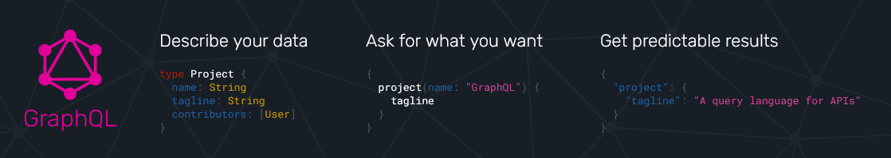
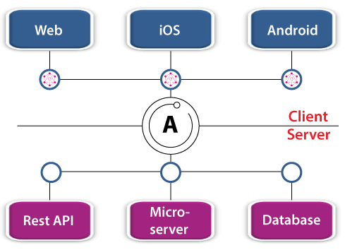
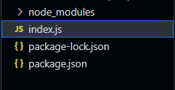
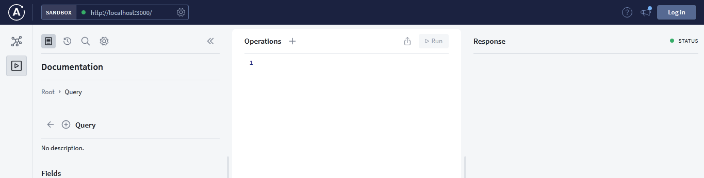
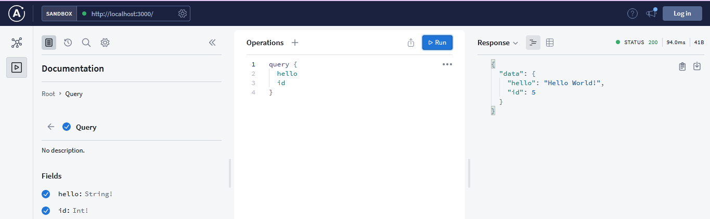

# GraphQL - Graph Query Language

## History of GraphQL
`GraphQL` was released in 2015 by Facebook. It has offered a new way and a promising alternative to the traditional REST API. Many companies including Github, Shopify, Intuit and many more have adopted GraphQL into their ecosystems. It's demand is increasing drastically and projected to grow exponentially over the new decade. 

**Note:- We will use an array as a database and will build API using [Node.js](https://nodejs.org/en/) with [Appolo Server](https://www.apollographql.com/docs/apollo-server/)**

## What is GraphQL?

<p align="center">




Demo from [official graphQL website](https://graphql.org/)
</p>


As the name suggests, GraphQL is a query language for APIs. While SQL is a query language for managing relational databases, GraphQL is a query language that allows the client (frontend) to request data from an API. 

## Advantages of graphQL

- **Single endpoint :-** In the traditional REST APIs, we have to create specific endpoints based on the data we want to request. This leads a problem of managing tens or hendreds or even more endpoints. GraphQL comes with a solution of having a single endpoint to query all the data.

- **Fewer server requests :-** GraphQL allows us to make multiple queries and mutations with only one server request.

- **Specific data fetching :-** Let's assume, we have a data of *users* with his id, name, address, contact, age etc. With the **REST API**, we cannot query only the *id* of a user but GraphQL only fetches what we actually need, and in this case we can get only *id* of the user with a single request.

- **Self-documenting :-** GraphQL is self-documenting, meaning that all of our queries and mutations will automatically be documented by GraphQL.

**Overall, it will save our time with a very few request, returning what actually we want.**

## Appolo Server



Since GraphQL is just a query language, we need a library that provides an easy-to-use GraphQL server. Luckily we have **Appolo** server which allows us for better scalability and features a larger community. Another GrpahQL server such as [express-graphql](https://graphql.org/graphql-js/express-graphql/) also exists but Appolo server is in high demand due to its neat GraphQL interface for performing queries and mutation during development. We will learn in a while about `query` and `mutation`.

## Building GraphQL API using node.js and Appolo server

Since we have explored much about GraphQL and Appolo Server, it's time to have some hands-on practise with some code.

### Pre-requisites

- You must have downloaded below mentioned things in your system
    - [Node.js](https://nodejs.org/en/)
    - [Visual Studio Code - A code editor](https://code.visualstudio.com/) or any other code editor

- You should have the knowledge of (or atleast familiar with)
    - Node.js
    - JavaScript


## Steps for building API

- ### Step 1 : Installing Dependencies / Package
    - Create a folder with name such as `graphql-tutorial` and  open it with a code editor such as `Visual Studio Code`

    We can do these things in our terminal with code given
    ```js
    mkdir graphql-tutorial
    cd graphql-tutorial
    ```
    - Initialize the directory with NPM

    ```js
    npm init -y
    ```
    This will create a *package.json* file in your diredctory

    - Install the required dependencies
    ```js
    npm i apollo-server graphql
    ```

    - Note :
        - apollo-server allows us to create a GraphQL server with ease
        - graphql is the required dependency for apollo-server

- ### Step 2 : Running server initially
    - Create an `index.js` file in the root of your directory. Your directory should look like this :

    

    - In `index.js` file, write the below code to import ApolloServer and gql from apollo-server NPM module, we just downloaded.

    ```js
    const { ApolloServer, gql } = require("apollo-server")
    ```
    - Since GraphQL is a query language, we need to define our data with a schema(how our data will look like).

    ```js
    const typeDefs = gql`
    type Query {
        hello: String!
        id: Int!
    }
    `
    ```

    - Note :-
        - Our typeDefs are passed into a gql tag. This tag sterilizes our type definitions and makes them readable to Apollo Server. This also allows for auto-completion during development.
        - The Query type lists all the possible queries that can be performed by our server.
        - hello and id are two different queries.
        - We define the type of the returned value after a colon (:). In this case, hello returns a String type, and id returns an Integer type.
        - An exclamation mark (!) after the type indicates a return value is required.

- ### Step 3 : Creating resolver function
    - Now we need to tell our server what to return when a specific query is called and we can do this by resolver function. We will write resolver function for each and every Query that we defined in Query in typeDefs.
    
    ```js
    const resolvers = {
        Query : {
            hello : ()=>"Hello World!",
            id : ()=>Math.round(Math.random()*10)
        },
    }
    ```

    - Note :
        - The resolvers should match our typeDefs. Just like we had a Query type in our typeDefs, we have a Query object in our resolvers.
        - The Query object contains the resolvers that correspond to our typeDefs. (Each query has a corresponding resolver function with the same name)
        - Whatever you return in the resolver, the query returns to the client.

- ### Step 4 : Creating server and Running it

    - At first, we need to create an instance of ApolloServer and passing our typeDefs and resolvers in an object

    ```js
    const server = ApolloServer({
        typeDefs,
        resolvers,
    })

    server.listen({port : 8000}).then(
        ({url})=> console.log(`Server running at ${url}`)
    )
    ```
    - Now run the below code in your terminal

    ```js
    node index
    ```

    - Your `index.js` file should look like this
    ```js   
    const { ApolloServer, gql } = require("apollo-server");

    const typeDefs = gql`
    type Query {
        hello: String!
        id: Int!
    }
    `;

    const resolvers = {
    Query: {
        hello: () => "Hello world!",
        id: () => Math.round(Math.random() * 10),
    },
    };

    const server = new ApolloServer({
    typeDefs,
    resolvers,
    });

    server.listen({ port: 8080 }).then(
        ({ url }) => console.log(`GraphQL server running at ${url}`)
    );
    ```

    - Visit *localhost:3000/* in your browser and you will find your server looking like this
    

- ### Step 5 : Querying our API
    - Now this is the time when we can query our API and for this we have a set-up of two query namely `hello` and `id` which return **Hello World!** and **a random number** respectively.

    - Write the code in query field which is present in operation tab or graphQL playground
    ```js
    query {
        hello
        id
    }
    ```
    - Here is the result you will get as a response, when you click run button
    

    - The beauty of GraphQL can be seen here. If we remove *id* query, it will give response of the query *hello* only.


## Conclusion 

- We have successfully created a GraphQL API with node.js and appolo server with an ease. 
- We are now familiar with the terms schema, resolver, query etc.
- We have learnt basics of GraphQL through this documentation, but for more advanced API you should visit [here](../2.Advanced/README.md)

__Contributor__ :- [Harsh Anand](https://www.github.com/its-me-Harsh-Anand)