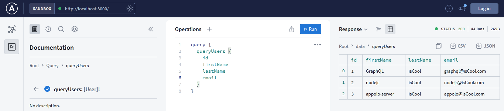
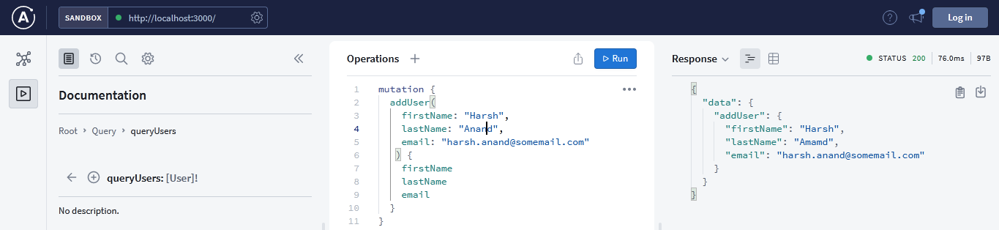
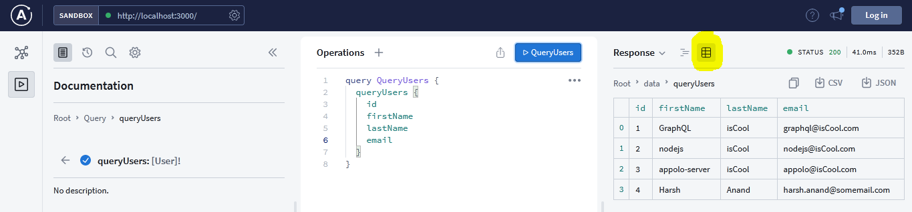
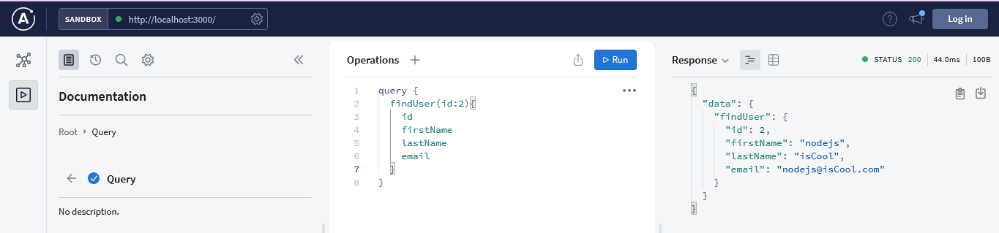

# Advanced API using GraphQL

Since we are now familiar with basics of GraphQL and Apollo server, we will create an API that will be able to query as well as adding the data. This time instead of only being able to query data, we will be able to add the data as well.

**Note :-** If you haven't gone through basics of GraphQL, I would suggest please go through once by clicking [here](../1.Basics/README.md). Please read whole blog once, and then start practising with the code.


> ## Steps for Querying API

We are going to create an API having id, first name, last name and email address of some users. We will be querying users as well as adding some user by our own. Adding user is known as **Mutation**.

### Step 1 : Creating our Database

- Instead of using actual database like **MongoDB** or **Firebase**, we will be using an **Array** as our database.

- First we are going to create an array with name `users`. Each user is having their id, firstName, lastName and an email field. We can add some users by our own to start with.

```js
const users = [
    {
        id: 1,
      firstName: "GraphQL",
      lastName: "isCool",
      email: "graphql@isCool.com"
    },
    {
        id:2,
      firstName: "nodejs",
      lastName: "isCool",
      email: "nodejs@isCool.com"
    },
    {
        id: 3,
      firstName: "appolo-server",
      lastName: "isCool",
      email: "appolo@isCool.com"
    }
  ];
```

### Step 2 : Setting up the typeDefs

- In the [basics of our GraphQL](../1.Basics/README.md), we have defined a way to query **hello** and **id**. In this tutorial, we will write some typeDefs to query all the Users, user with their id and adding some user. The first part we are going to do is getting all users i.e, querying from our database. And for this, our typeDefs will look like this

```js
type User {
    id : Int!
    firstName : String!,
    lastName : String!,
    email : String!,
    }

type Query {
    queryUsers : [User]!             
}
```

- Let's know the code written
    - The queryUsers query returns an array of objects (Hence the brackets).
    - Till now, we have queried hello and id of type String and Int respectively. But, User is not something of primitive data type. We have to define our own type of User and for this we use `type` keyword to define our own type.
    - In curly-brackets ({}), we specify the fields that type will return (Our User type will return four fields: id, firstName, lastName, and email. Three of them are strings and one is of type Int in which all are required).

### Step 3 : Configuring our resolvers

- Here the time comes where we can actually get the data we want through our query. Resolvers are something which does all this part for us.

```js
const resolvers = {
    Query : {
        queryUsers : ()=> users,
        }
    }
```

- This new line of code creates a resolver function that, when invoked, will return the `users` array.

- By this time, I hope you are ready with your setup such as creating direcotry, initializing it with npm and installing all the required dependencies. Now then your `index.js` file should look like this.

```js
const { ApolloServer, gql } = require("apollo-server")

const users = [
    {
        id: 1,
      firstName: "GraphQL",
      lastName: "isCool",
      email: "graphql@isCool.com"
    },
    {
        id:2,
      firstName: "nodejs",
      lastName: "isCool",
      email: "nodejs@isCool.com"
    },
    {
        id: 3,
      firstName: "appolo-server",
      lastName: "isCool",
      email: "appolo@isCool.com"
    }
  ];


const typeDefs = gql`
    type User {
        id : Int!
        firstName : String!,
        lastName : String!,
        email : String!,
    }

    type Query {
        queryUsers : [User]!             
    }

`

const resolvers = {
    Query : {
        queryUsers : ()=> users,
        }
    },

}

const server = new ApolloServer({
    typeDefs,
    resolvers,
})

server.listen({port: 3000}).then(({url}) => console.log(`Server is running at ${url}`))

```

### Step 4 : Testing the query

- After you have started your server by running below code in your terminal, you are ready to query the API.

- Code to start Server

```js
node index
```
- Code to query in graphQL playground

```js
query {
  queryUsers {
    id
    firstName
    lastName
    email
  }
}
```

- `Output` of our query



- When we call the queryUsers query, we need to specify which fields we want the API to return in curly-brackets ({}). The code above returns all four fields, but if the client only needs the first and last name of each user, you could omit the email and id field to save bandwidth:


> ## Steps for adding users to our array, `users` 

API is something which will be not much of use if it has only the hardcoded data. Luckily, we can also add some data through our API. We are going to add some users in our `users array`.
<br><br>
### <p align= center>Creating, Updating and deleting other than reading operation is known as Mutation</p>

<br>

### Step 1 : Adding Mutation to our typeDefs

- Whenever we perform any other operations other than reading from a database, we should use GraphQL mutations.

- All mutations must be in the GraphQL Mutation type, as every query was inside GraphQL Query type.

- Update your `typeDefs` section in your `index.js` file as

```js
const typeDefs = gql`
    type User {
        id : Int!
        firstName : String!,
        lastName : String!,
        email : String!,
    }

    type UserM {
        firstName : String!,
        lastName : String!,
        email : String!,
    }
    type Query {
        queryUsers : [User]!             
    }

    type Mutation {
        addUser(firstName:String!, lastName:String!, email:String!): UserM!
    }
```

- Let's look out what the above code means
    - We are creating a new mutation named addUser
    - addUser takes in three arguments: firstName, lastName, and email. All three arguments are of type string and required (specified in the parentheses). Remember, we have also an specific `id` for each user. We will set that part in our resolver function.
    - *addUser* returns a *UserM* type: an object containing the new user’s firstName, lastName, and email.

### Step 2 : Adding the resolver function for addUser

- Before writing resolver function, let's plan out what it should accomplish.

- First the resolver function will need the firstName, lastName and email argument from the mutation when we run it. Then it will create an id for the new user and then with all the four data, it will push new user to `users` array.

- Update the resolver function with the given code:

```js
const resolvers = {
    Query : {
        queryUsers : ()=> users,
    },

    Mutation : {
      addUser : (parent, args) =>{
        const user = {id: users.length+1, firstName : args.firstName, lastName:args.lastName, email:args.email}
        users.push(user)
        return user
      }
    }
}
```

- Let's see what the code means-
    - Just like queries, mutations must match our typeDefs and go in the Mutation object.
    - Every resolver (not only mutations) has access to four parameters, which you can learn more about in the [documentation](https://www.apollographql.com/docs/apollo-server/data/resolvers/#resolver-arguments). We only need the second argument for this resolver.
    - The second argument, args, will contain the firstName, lastName, and email of the new user. If you wish, console.log the args argument in the resolver function to see what data it contains.
    - Since we are not passing id as an argument, we manulally have to create id for that user as `id = users.length + 1` and pushing new user to existing user array as our database
    - Our mutation needs to return the new user that was created. We can do that by returning the args object.

- With this less than 10 line of codes, we are able to query as well as add users!

- ### Step 3 : Calling our Mutation

- Calling mutation is very similar to calling Query in GraphQL

```js
mutation {
  addUser(
    firstName: "Harsh", 
    lastName: "Anand", 
    email: "harsh.anand@somemail.com"
   ) {
    firstName
    lastName
    email
  }
}
```

- Let's know about the above code
    - To signify a mutation, we use the mutation keyword instead of query.
    - We can pass arguments into a GraphQL query by specifying them inside of parentheses, just like a JavaScript function.
    - Here, we create a new user with the name of Harsh Anand and the email of harsh.anand@somemail.com and added id for the new user. Feel free to change the arguments if you wish.
    - Like our queryUsers query, we can choose what fields to return. Remember that this mutation returns only the new user that was created.

- `Output we got in GraphQL playground`



- Now if you run the queryUsers query again, without restarting the server, you should see a new user added to the array.




> ## Practising with some code

As we have learnt some cool stuffs till now such as querying, passing argument while mutation, mutation etc. I would suggest to practise with some code and here is your task<br>

- Task: Query user based on their id. For example :- Query user having id 2
- Hint:- Create typeDefs and resolver function with passing id as an argument.
- Please do this by your own first then see the below code for hint


1. Update your typeDefs with below code
```js
const typeDefs = gql`
    type User {
        id : Int!
        firstName : String!,
        lastName : String!,
        email : String!,
    }

    type UserM {
        firstName : String!,
        lastName : String!,
        email : String!,
    }

    type Query {
        queryUsers : [User]!          
        findUser(id: Int!) : User!    
    }

    type Mutation {
      addUser(firstName: String!, lastName : String!, email: String!): UserM!
    }
`
```
2. Update your resolver function with below code

```js
const resolvers = {
    Query : {
        queryUsers : ()=> users,
        findUser : (parent, args)=>{
          const user = users.find(user => user.id === args.id);
          return user
        }
    },

    Mutation : {
      addUser : (parent, args) =>{
        const user = {id: users.length+1, firstName : args.firstName, lastName:args.lastName, email:args.email}
        users.push(user)
        return user
      }
    }
}
```

3. Query the user by passing some id in GraphQL playground

```js
query {
  findUser(id:2){
    id
    firstName
    lastName
    email
  }
}
```
4. Output



## Conclusion
- We have successfully created an API with the functionality of querying all users, users with some specific id and adding users to our database. 
- We can also apply this to our actual database with resolver function in `try catch` form. You can also explore updation and deletion same as we have done in querying user with specific id. 
- You can query specific user based on their id and make changes in it with the very few lines of code of JavaScript.
- Hope you have a clear idea of creating API with creating, updating, deleting and reading functionality.

__Contributor__ :- [Harsh Anand](https://www.github.com/its-me-Harsh-Anand)