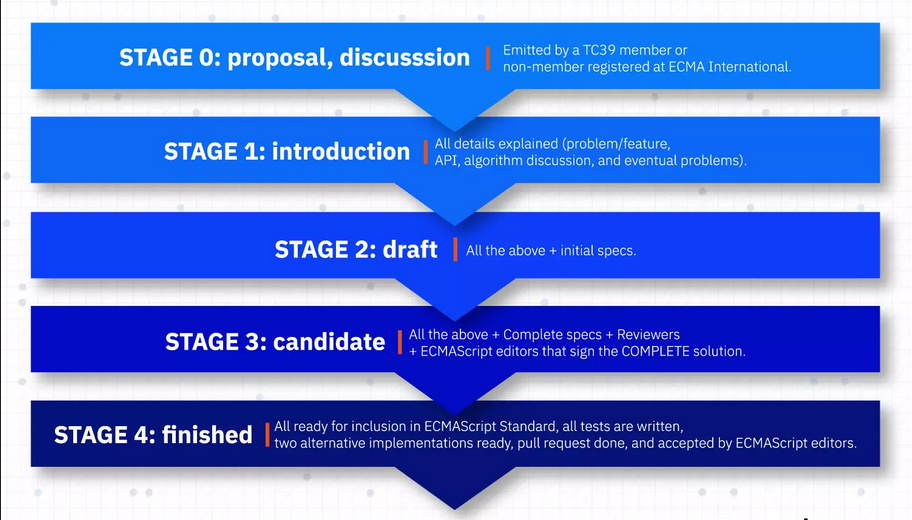

## ECMAScript
- JavaScript was invented by Bredan Eich in 1995, with a trademark of **Oracle** (which led to Microsoft calling its JavaScript dialect "JScript").
- Thus, when it came to standardization, a different name had to be used. **ECMAScript** was chosen, because the corresponding standard is hosted by Ecma International.
- The term **ECMAScript** is also frequently used to denote language versions (such as ECMAScript 5).
- ECMAScript versions have been abbreviated to ES1, ES2, ES3, ES5, and ES6.
- Since 2016, new versions are named by year (ECMAScript 2016 / 2017 / 2018).

#### ECMA-262
The ECMA International (a standard organization) has created the ECMA-262 standard which is the official specificarion of the ECMAScript language. 
Read more about ECMA-262 [here](https://www.ecma-international.org/publications-and-standards/standards/ecma-262/)

#### ECMA's Technical Committee 39 (TC39)
It is the group of people (Brendan Eich and others) who develop the ECMA-262 standard. 
Read more about TC39 [here](https://tc39.es/)

#### Different stages before ES updates

## Versions of ECMAScript

#### ES1 - ECMAScript 1 
* Released year
    * 1997

* Description
    * This was the first edition of ECMAScript

#### ES2 - ECMAScript 2
* Released year
    * 1998

* Description
    * Editorial Changes were done

#### ES3 - ECMAScript 3
* Released year
    * December 1999

* Description
    * This is the version of ECMAScript that most browsers support today. It introduced many features that have become an inherent part of the language.

* Features Added
    * Regular expressions
    * Better string handling
    * New control statements - switch, do-while
    * try/catch exception handling
    * tighter definition of errors
    * formatting for numeric output 
    * And many more...

#### ES4 - ECMAScript 4
* Released year
    * Never Released

* Description
    * ECMAScript 4 was developed as the next version of JavaScript, with a prototype written in ML. However, TC39 could not agree on its feature set. Hence, decision was made to develop an incremental update of ECMAScript (which became ES5).

#### ES5 - ECMAScript 5
* Released year
    * December 2009 - update with 10 year of huge gap 

* Description
    * This is the version of ECMAScript that most browsers support today. It introduced many features that have become an inherent part of the language.

* Features Added
    * "strict mode"
    * JSON support
    * String.trim() method/function
    * Array.isArray() method/function
    * Array iteration methods
    * Allows trailing commas for object literals

**Note :-** Currently most of the browsers are supporting upto ES5 only.

#### ES6 - ECMAScript 6
* Released year
    * 2015

* Description
    * ES6 is an next-gen of JavaScript, the ecma technical committee 39 governs ecma specification, they discovered new features to the JavaScript.
    * ES6 can't compile directly in browsers, so need an compiler from ES6 to ES5, for that compiling using [babel](../Transpile_and_babel/README.md), it produce the browser compatible JavaScript.

* Features Added
    * arrows
    * classes
    * enhanced object literals
    * template strings
    * destructuring
    * default + rest + spread
    * let and const datatype (earlier only **var** datatype was used)
    * iterators + for..of loop
    * generators
    * unicode
    * modules and module loaders
    * map, set, weakmap, weakset
    * proxies
    * symbols
    * subclassable built-ins
    * promises
    * math + number + string + array + object APIs
    * binary and octal literals
    * reflect api
    * tail calls
    * default parameter values
    * And many more...

#### ES7 - ECMAScript 7
* Released year
    * 2016

* Description
    * After ES6 update, they decided to release a new version of ECMAScript every year starting in 2015 with ES5 release.
    * From here onwards, naming convention was given based on released year (for example:- ES7 to ECMAScript 2016).

* Features Added
    * exponential operator 
    * exponential assignment 
    * Array.prototype.includes()

#### ES8 - ECMAScript 8
* Released year
    * 2017

* Description
    * At the TC39 meeting in January 2017, the last feature of ECMAScript 2017, “Shared memory and atomics” was the major feature.

* Features Added
    * Async functions
    * Shared memory and atomics
    * Object.values / Object.entries
    * string padding
    * object.getOwnPropertyDescriptors()
    * Train=ling commas in function parameter lists and calls

#### ES9 - ECMAScript 9
* Released year
    * 2018

* Description
    * At the TC39 meeting in January 2017, the last feature of ECMAScript 2017, “Shared memory and atomics” was the major feature.

* Features Added
    * Asynchronous iteration
    * Rest/Spread properties
    * RegExp named capture groups
    * RegExp Lookbehind Assertions
    * Promise.prototype.finally()
    * Template literal revision

## Summary
- ECMAScript is the “official” name for JavaScript. It was eventually abandoned and ES3.1 became ES5, which is the JavaScript version used in the **“HTML5”** world.
- The main understanding of ES5 and ES6 can explore your JavaScript knowledge as well ES7,ES8,ES9.

## Resources
You can practise all the features [here](https://www.w3schools.com/js/js_versions.asp)

Yay! we have learnt so far about ECMAScript. Thanks for reading. 
__Contributor__ : [Harsh Anand](https://github.com/its-me-Harsh-Anand)

