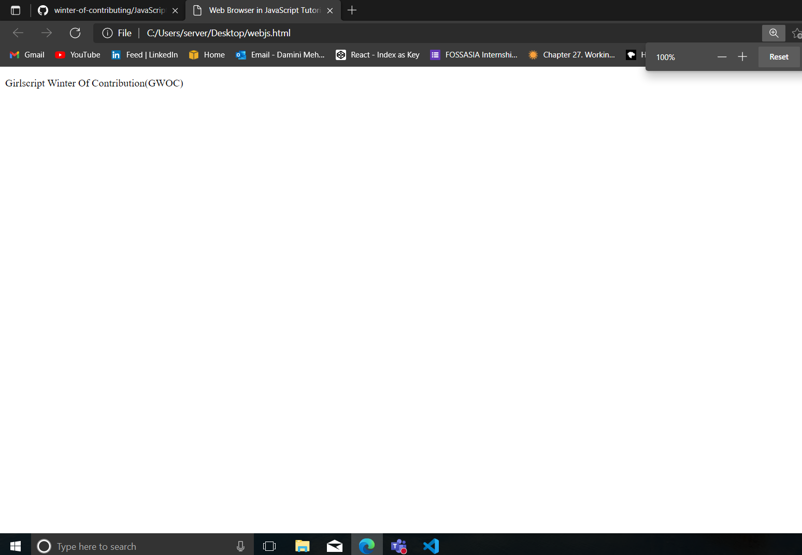
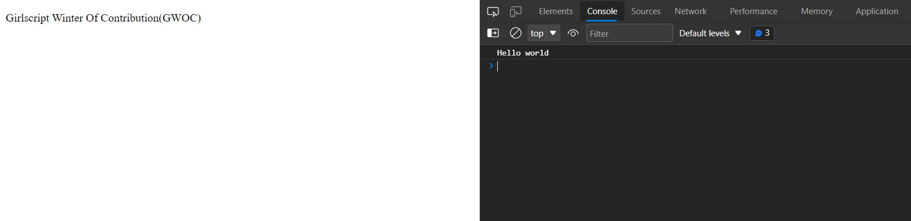
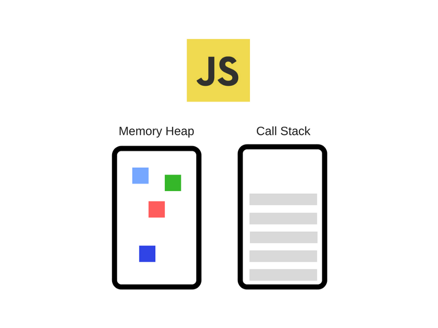
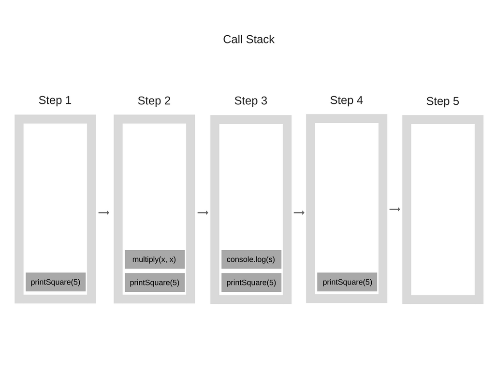
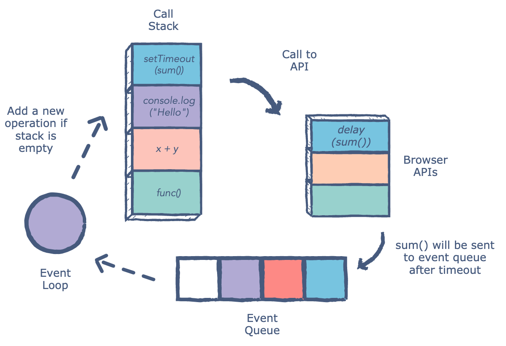

# Web Browser In Javascript

Web Browsers are one of the the runtime for JavaScript, which means it's the environment where your JavaScript code gets executed also it's a platform that extends the core JavaScript and provides additional features through specific objects and functions.
</br>

* The global object for **JavaScript** in web browser is the window object. It represents web browser window and simultaneously the ECMAScript Global object. 

* The window object has properties that specify details of the browser window **(navigator, location, history) and methods (alert(), setTimeot())** which perform various operations.

* Another **important part of JavaScript in web browser** is handling events. Event handler allow you to define function, that is called when specified event (for example an click) occurs.

* The most important of them is **XMLHttpRequest object** which enables communication with web-servers.

## **In this tutorial, we will see How to write JavaScript, what are the methods to write it.**

First give the title(of your choice) as "Web Browser in JavaScript Tutorial" under the \<title> tag.

### **Code**

```html
<!DOCTYPE html>
<html lang="en">
<head>
    <meta charset="UTF-8">
    <meta name="viewport" content="width=device-width, initial-scale=1.0">
    <meta http-equiv="X-UA-Compatible" content="ie=edge">
    <title>Web Browser in JavaScript Tutorial</title>
   
</head>
<body>
    <div class="container">
        <div class="row">
            <p>
              Girlscript Winter Of Contribution(GWOC)  
            </p>
        </div>
    </div>
    <script>
        //Write your js here
        console.log('Hello world');
        
    </script>
</body>
</html>

```

The result of the above code will look as follows on the HTML Page-



However, our main focus in this tutorial is to understand JavaScript. Therefore, we will not do any styling or add CSS here.

We have two options to place the JavaScript in the code. One is in the \<head> section and the other is after the \<body> tag. But if we view other professional websites, they place their JavaScript at the end of the \<body> tag so that the DOM does not get affected. The basic code of JavaScript is as follows-

```js
//Write your js code here
console.log("Hello world");
```

If we open the console section of the browser, we can see the output of the above code as shown below-



**It is important to write \<script> tag at the end of \<body>** 

It's convention to have the dependencies (such as jQuery) within the head tag. However, without loading the DOM into the window there is no way for a script to access it.
If we open the console section of the browser, we can see the output of the above code as shown below-
```html
<!DOCTYPE html>
<head>
   <script src="http://cdnjs.cloudflare.com/ajax/libs/jquery/2.1.1/jquery.min.js
   </script>
</head>

<script type="text/javascript">
   $('#appleTest').html("Apples are great.");
</script>

<body>
   <div id="appleTest">
   </div>
</body>
```
If you were to run this, you would not see 'Apples are great.' in the browser window because the jQuery selection doesn't have anything to select. If you move the script to underneath the \</body> tag, when the jQuery selector method is called, it can find the div since it has been loaded into the window.
</br>

## **Browser is a runtime and a runtime consits many things, like js engine, call stack and heap, event loop, callback queue and some browser api's like fetch & console.** ##

* **js engine** are programs that convert JavaScript code into lower level or machine code. A popular example of a JavaScript Engine is Google’s V8 engine. The V8 engine is used inside Chrome and Node.js for example. Here is a very simplified view of what it looks like:



The Engine consists of two main components:

1) Memory Heap — this is where the memory allocation happens.
2) Call Stack — this is where your stack frames are as your code executes.

* **Browser or Web APIs** — They are built into your web browser and are able to expose data from the browser and surrounding computer environment and do useful complex things with it. They are not part of the JavaScript language itself, rather they are built on top of the core JavaScript language, providing you with extra superpowers to use in your JavaScript code.
For example, the Geolocation API provides some simple JavaScript constructs for retrieving location data so you can say, plot your location on a Google Map. In the background, the browser is actually using some complex lower-level code (e.g. C++) to communicate with the device’s GPS hardware (or whatever is available to determine position data), retrieve position data, and return it to the browser environment to use in your code. But again, this complexity is abstracted away from you by the API.
So, we have the Engine but there is actually a lot more. We have those things **called Web APIs** which are provided by browsers, like the DOM, AJAX, setTimeout and much more.
And then, we have the so popular **event loop and the callback queue.**

* **The Call Stack** - JavaScript is a single-threaded programming language, which means it has a single Call Stack. Therefore it can do one thing at a time.
The Call Stack is a data structure which records basically where in the program we are. If we step into a function, we put it on the top of the stack. If we return from a function, we pop off the top of the stack. That’s all the stack can do.
Let’s see an example. Take a look at the following code:
```js
function multiply(x, y) {
    return x * y;
}
function printSquare(x) {
    var s = multiply(x, x);
    console.log(s);
}
printSquare(5);
```

When the engine starts executing this code, the Call Stack will be empty. Afterwards, the steps will be the following



* **Event or Callback Queue** — It is responsible for sending new functions to the track for processing. It follows the queue data structure to maintain the correct sequence in which all operations should be sent for execution.

* **Memory Heap** — Objects are allocated in a heap which is just a name to denote a large mostly unstructured region of memory.



* **Console** is one of the place, where you will find all the errors, logs, warnings...etc made in the code and their is Chromium Debugger and many extensions also. If you have locked any request or have applied AJAX in the code, the errors regarding all these things will be shown in the console tab itself. Also, we can see the values of different variables if written in the code. Although there may be a chance that if you are using any other browser apart from Chrome like Opera, Mozilla Firefox, Microsoft Edge or Safari, you may find a different console tab, the high-level ideas of all the browsers will be the same. Therefore, it is recommended to use the Chrome browser due to its high developer tools.

So I believe you must have got some basic ideas about Web Browser in JavaScript and the developer console provided by the browser.

**Contributor**: [Damini Mehra](https://github.com/daminimehra)


