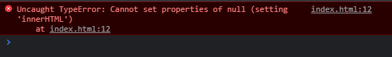

# JavaScript's usage in the Web Browser

JavaScript is commonly utilised in both front-end and back-end web development. However, the focus of this lesson will be on front-end JavaScript implementation.

## Where Javascript is used in Front-End?

The structure of a web page is provided by HTML, the layout and rudimentary animations are provided by CSS, and the website's interactivity is provided by JavaScript.

JavaScript can support:<br>

1. Rich UI libraries
2. Validation of forms, which may be linked to the backend
3. Browser APIs to manipulate HTML and CSS
4. Three-dimensional animations which CSS isn't capable
   
Plus a lot more!

The following material shows how to use the `<script>` element in a web browser to implement JavaScript.
<hr>
<br>

# Use of `<script>` tag

Externally, JavaScript may be used by generating a separate file with the `.js` extension and linking to the HTML file. This is called *external JavaScript*. Or it can be used inside in HTML files which is called *internal JavaScript*.

## 1. Internal JavaScript

JavaScript code can be written in the HTML file inside `<script>` tag.

<b>Note:</b><br>
a) If the `<script>` content is inside the `<body>` content, then make sure to include it at the last.

```
<!DOCTYPE html>
<html lang="en">
<head>
    <meta charset="UTF-8">
    <meta http-equiv="X-UA-Compatible" content="IE=edge">
    <meta name="viewport" content="width=device-width, initial-scale=1.0">
    <title>Internal JS</title>
</head>
<body>
    <h1 id = "main"></h1>

    <script>
        "use strict";
        let x = document.getElementById("main");
        x.innerHTML = "Internal JavaScript";
    </script>
</body>
</html>
```

b) If the `<script>` content is inside the header content, then add *window.onload* function before writing the code. Else, the following error will display in the browser's Console window because the JavaScript file runs even before the page load.



After adding the `window.onload` function:

```
<!DOCTYPE html>
<html lang="en">
<head>
    <meta charset="UTF-8">
    <meta http-equiv="X-UA-Compatible" content="IE=edge">
    <meta name="viewport" content="width=device-width, initial-scale=1.0">
    <title>Internal JS</title>

    <script>
        "use strict";
        window.onload = function what() {
            let x = document.getElementById("main");
            x.innerHTML = "Internal JavaScript";
        };
    </script>
</head>
<body>
    <h1 id = "main"></h1>
</body>
</html>
```

The output is shown below, after running the HTML file.


## 2. External JavaScript
The most reliable approach to construct the webpage is to write the JavaScript code in a separate file. It should always be a practice to write JavaScript code in the separate file, so that when a programmer creates a large block of code, they can quickly traverse the code snippets in the separate file rather than scrolling through the HTML page.

The following code snippet is added inside the header content to link JavaScript with the HTML file:

`<script src = "file_name.js"></script>`

The js file is shown below:<br>
```
"use strict";
window.onload = function what() {
    let x = document.getElementById("main");
    x.innerHTML = "External JavaScript";
};
```

The output is shown below, after running the HTML file.<br>


<hr>

# Why should JavaScript be chosen as the sole language for front-end web scripting? 

1. JavaScript offers browser functionality as well as a graphical user interface, which HTML and CSS cannot accomplish.
2. When implemented, JavaScript uses the notion of object-oriented programming to decrease the load on the server.
3. JavaScript contains a large library of libraries, such as jQuery, AJAX, and others, that are useful for complex work/projects.
4. Many front-end engineers prefer JavaScript because of its clear and straightforward syntax.
5. JavaScript is rapidly improving as a result of its popularity, and its capacity to make web pages more interactive is growing by the day.
   
<br>

# References
1. https://developer.mozilla.org/en-US/docs/Learn/JavaScript/First_steps/What_is_JavaScript
2. https://www.w3schools.com/js/
3. https://trio.dev/blog/examples-javascript
   
<br>

<b>Contributors: </b> @subhendudash02