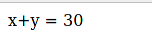
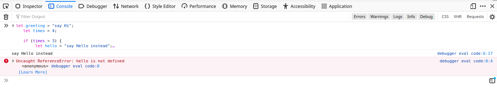
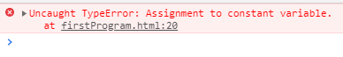
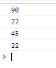
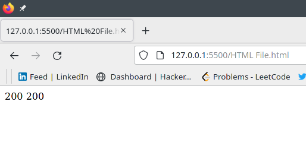

## Javascript Variables

In this article you are going to learn everything about **Javascript Variables** from scratch. 

Variables are "containers" for storing information, JavaScript variables are used to hold values or
expressions. A variable can have a short name, like x, or a more descriptive name, like carname.

 ## Rules for declaring Javascript Variable name:
There are some rules while declaring a JavaScript variable (also known as identifiers).

   1. Name must start with a letter (a to z or A to Z), underscore( _ ), or dollar( $ ) sign.
   2. After first letter we can use digits (0 to 9), for example value1.
   3. JavaScript variables are case sensitive, for example x and X are different variables.
## Correct JavaScript variables
```js
    var x = 10;  
    var _value="sonoo";  
```
## Incorrect JavaScript variables
```js
    var  123=30;  
    var *aa=320;  
```
Creating variables in JavaScript is most often referred to as "declaring" variables.
There are 3 ways to declare a JavaScript variable:
   1. Using **var**
   2. Using **let**
   3. Using **const**

## Javascript var Variable
Before the advent of ES6, var declarations ruled. There are issues associated with variables declared with var, though. That is why it was necessary for new ways to declare variables to emerge.**var variables can be re-declared and updated.**
First, let's get to understand var more before we discuss those issues.
## Syntax For Variable *var*:-
```js
var x;
var name;
//you can also assign values to the variables when you declare them:
var x=5;
var name="Ram";
```
**Note :-** When you assign a text value to a variable, use quotes around the value. If you redeclare a
JavaScript variable, it will not lose its value.

var is function scoped when it is declared within a function. This means that it is available and can be accessed only within that function.

## To understand further, look at the example below.

```js
    var greeter = "hey hi";
    
    function newFunction() {
        var hello = "hello";
    }
```

Here, greeter is globally scoped because it exists outside a function while hello is function scoped. So we cannot access the variable hello outside of a function. So if we do this:

```js
    var tester = "hey hi";
    
    function newFunction() {
        var hello = "hello";
    }
    console.log(hello); // error: hello is not defined
```
We'll get an error which is as a result of hello not being available outside the function.

## Example of JavaScript var variable

Let’s see a simple example of JavaScript variable.
__Source Code:__

```html
<html>
 <body>
  <script>  
    var x = 10;  
    var y = 20;  
    var z=x+y;  
    document.write("x+y = ",z);  
  </script>  
 </body>
</html>
```
## Output of the above example



## Javascript Let Variable

let is now preferred for variable declaration. It's no surprise as it comes as an improvement to var declarations. It also solves the problem with var that we just covered. Let's consider why this is so. One of the features that came with ES6 is the addition of let and const, which can be used for variable declaration.

**let is block scoped**

A block is a chunk of code bounded by {}. A block lives in curly braces. Anything within curly braces is a block.

So a variable declared in a block with let  is only available for use within that block. Let me explain this with an example:
```js
   let greeting = "say Hi";
   let times = 4;

   if (times > 3) {
        let hello = "say Hello instead";
        console.log(hello);// "say Hello instead"
    }
   console.log(hello) // hello is not defined
```
## Output of Above Example


We see that using hello outside its block (the curly braces where it was defined) returns an error. This is because let variables are block scoped .
## let can be updated but not re-declared.

Just like var,  a variable declared with let can be updated within its scope. Unlike var, a let variable cannot be re-declared within its scope. 

## Example of let variable
```html
<html>
<head>
    <title>JavaScript Block Scope let keyword example</title>
</head>
<body>
    <script>
        let mango = "yellow"
        if (mango === "yellow") {
            let mango = "orange"
            console.log(mango)
        }
        console.log(mango)
    </script>
</body>
</html>
```
## Javascript Const Variable
Variables declared with the const maintain constant values. const declarations share some similarities with let declarations.**const declarations are block scoped.**
Like let declarations, const declarations can only be accessed within the block they were declared.
## const cannot be updated or re-declared

This means that the value of a variable declared with const remains the same within its scope. It cannot be updated or re-declared. So if we declare a variable with const

## When to use JavaScript const?

As a general rule, always declare a variable with const unless you know that the value will change.

Use **const** when you declare:
   1. A new Array
   2. A new Object
   3. A new Function
   4. A new RegExp

## Example 1: It explains that the const variable cannot be reassigned.
```html
<html>
<head>
    <title>JavaScript const variable cannot be reassigned example</title>
</head>
<body>
    <script type="text/javascript">
            const x = 12;
            x = 13;
            x += 1;
    </script>
</body>
</html>
```
## Output of the above example



## Example 2: It explains the const variable which contains the Block Scope.
```js
<html>
<head>
    <title>JavaScript const variable which contains the Block Scope example</title>
</head>
<body>
    <script type="text/javascript">
        const x = 22;
        {
            const x = 90;
            console.log(x);

            {
                const x = 77;
                console.log(x);
            }
            {
                const x = 45;
                console.log(x);
            }
        }
        console.log(x);
    </script>    
</body>
</html>
```
## Output of the above example



## Types of Javascript Variables

A JavaScript variable is simply a name of storage location. There are two types of variables in JavaScript : **local variable and global variable**.

## Javascript Local Variable
A JavaScript local variable is declared inside block or function. It is accessible within the function or block only.

__Source Code:__
```html
  <html>
    <body>
      <script>  
       function abc(){  
          var x=10;//local variable  
        }  
     </script>  
    </body>
  </html>
```
## JavaScript global variable

A JavaScript global variable is accessible from any function. A variable i.e. declared outside the function or declared with window object is known as global variable.

__Source Code:__

```html
<html>
 <body>
   <script>  
     var data=200;//gloabal variable  
     function a(){  
      document.writeln(data);  
     }  
     function b(){  
       document.writeln(data);  
      }  
      a();//calling JavaScript function
      b();
   </script>  
 </body>
</html>
```
## Output of the above example

## Javascript global variable with window object
To declare JavaScript global variables inside function, you need to use window object. For example:
```js
window.value=90;  
```
Now it can be declared inside any function and can be accessed from any function.
__Source Code:__
```html
<html>
 <body>
  <script>
    function m(){  
     window.value=100;//declaring global variable by window object  
    }  
    function n(){  
    alert(window.value);//accessing global variable from other function  
    }  
    m();
    n();
  </script>
 </body>
</html>
```
## Output of the above example
  This will generate a alert box in your browser.


## Conclusion
Congratulations! You've Successfully learnt everything about Javascript Variable.

Happy learning..!! :wave:

__Contributor:__  [Mansi Mishra](https://github.com/0904-mansi) :heart:


