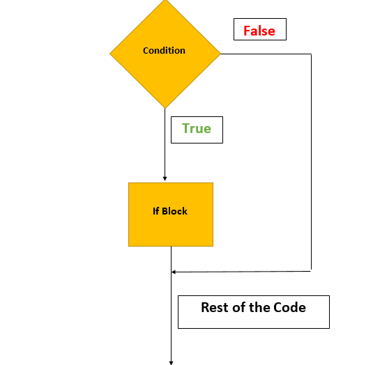

# Conditional Statements

Conditional Statements are often used in any programming language to perform different actions based on different conditions.

The conditional statements in JavaScript are:

1. ```if``` statement.
2. ```if``` - ```else``` statement.
3. ```else if``` statement.
4. ```switch``` statement.

## JavaScript ```if``` statement

In this, the part of the code will only execute if the condition given is ```true```.

__Syntax:__
```js
if (condition) {
    // code to be executed if the condition satisfies
}
```

__Example:__
```javascript
var a = 10;
if (a<=15) { // condition is true(10<=15)
    console.log("Value of a is less than 15");
}
```

__Output:__
```
Value of a is less than 15
```

__Flowchart:__



# JavaScript ```if```-```else``` statement

In this, if the given condition satisfies the part of code under ```if``` will get executes otherwise the code under ```else``` will get execute.

__Syntax:__
```js
if (condition) {
    // code get executes if the condition is true
} else {
    // this will get execute if the condition is false
}
```

__Example:__
An example program to check whether the citizen is adult or not.

```javascript
var age = 26;
if (age>=18) {
    console.log("Citizen is Adult");
} else {
    console.log("Citizen is not Adult");
}
```

__Output:__
```
Citizen is Adult
```

__Explanation:__

Here the ```age``` is 26 that means the citizen is Adult so the code under ```if``` gets executed as the condition is __true__.

__Flowchart:__


# JavaScript ```if``` - ```else if``` statement

In this, if the conditions of ```if``` and ```else if``` is satisfied the code under ```if``` and ```else if``` then the code under these ```if``` and ```else if``` will get executes, otherwise the code under ```else``` will get executes.

__Syntax:__
```js
if (condition 1) {
    // will execute if the condition is true
} else if (condition 2) {
    // will executes if condition 2 is true
} else {
    // will execute if the condition is false
}
```

__Example:__

```javascript
var a = 100;
if (a==10) {
    console.log("Value of a is equal to 10");
} else if (a==50) {
    console.log("Value of a is equal to 50);
} else {
    console.log("Value of a is not equal to 10 or 50");
}
```

__Output:__
```
Value of a is not equal to 10 or 50
```

__Explanation:__
Here the value of ```a``` is 100 and none of the conditions given is satisfied so the code under ```else``` gets executed.

# JavaScript ```switch``` statement

In this, one of the case(condition) gets executed among multiple cases(conditions). 

It is similar to ```if``` - ```else if``` statement and in ```switch``` you can use numbers and characters. You will get clear with an example below.

__Syntax:__
```js
switch (condtion) {
    case 1:
    // gets executes if condition satisfies
    break;

    case 2:
    // gets executes if condition satisfies
    break;

    case 3:
    // gets executes if condition satisfies
    break;

    default:
    //gets executes if none of the cases gets matched with the condition
}
```

__Example:__
```javascript

var res = 9.0;
var grade;

switch (res) {
    case 9.0:
    grade = 'A';
    break;

    case 8.0:
    grade = 'B';
    break;

    case 7.0:
    grade = 'C';
    break;

    default:
    grade = 'F';
}
console.log(grade);
```

__Output:__
```
A
```
__Explanation:__

Here, the value of ```res``` is 9.0 so the ```case 9.0``` is executed. And if the grade is not matching with any of the cases then the code ```default``` gets executed.

# JavaScript Ternary Operator

You can also use ternary operator instead of ```if``` - ```else``` .

__Syntax:__
```js
(condition)? statement-1 : statement-2;
```
If the condition is ```true``` then statement-1 will get executed, else the statement-2 will get executed.

__Example:__
```javascript
var marks = 80;
var result = (marks>=35)? "Pass" : "Fail";
console.log(result);
```

__Output:__
```
Pass
```

# Conclusion

Congratulations! You've successfully learnt about JavaScript conditional statements.

Keep exploring JavaScript :wave:

Contributor : [Abhinandan Adhikari](https://github.com/AbhinandanAdhikari) :heart:
