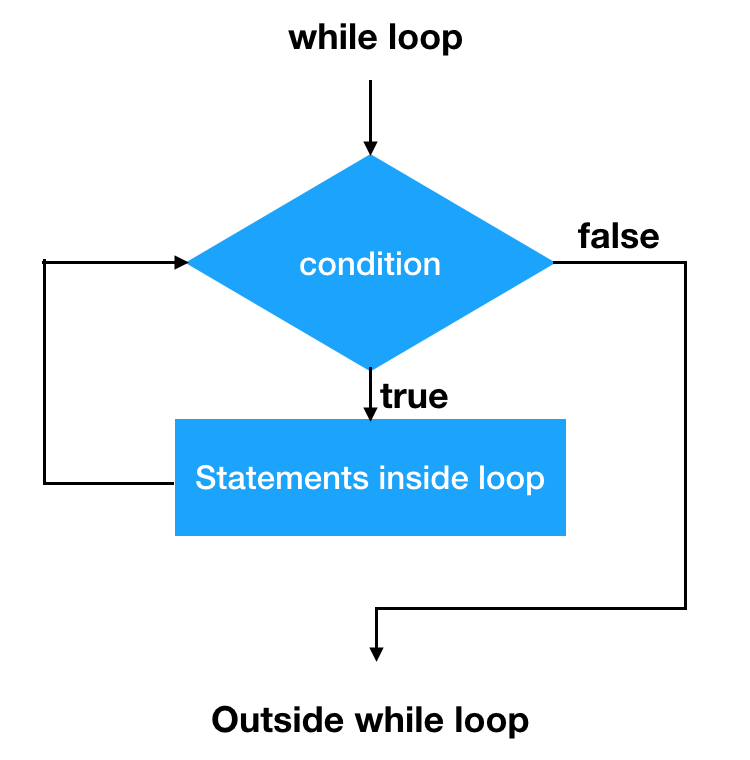

# While Loop

A while loop is a control flow statement that allows code to be executed repeatedly based on a given Boolean condition. The while loop can be thought of as a repeating if statement.

**Syntax :**

```
while (boolean condition)
{
   loop statements...
}

```

Control Flow of a while loop


- While loop starts with the checking for the condition. If the condition is true, then the loop body is executed. It is an **Entry control loop**
- Once the condition is evaluated to true, the statements in the loop body are
executed. Normally the statements contain an update value for the
variable being processed for the next iteration.
- When the condition becomes false, the loop terminates which marks the end of its life cycle.

## Example

```jsx
// Exit when x becomes greater than 4
    while (x <= 4)
    {
        console.log("Value of x:" + x);
        x++;
    }
```

### Output:

```
Value of x:1
Value of x:2
Value of x:3
Value of x:4

```