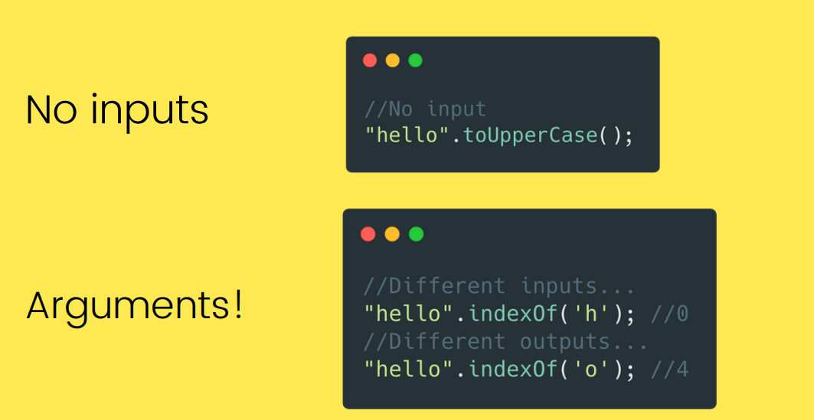

## What is scope?
- **Scope**: Space or environment in which a certain variable is declared (variable 
environment in case of functions). There is global scope, function scope, and block scope.
- **Scope of a variable**: Region of our code where a certain variable can be accessed.
- **Scoping**: How our program’s variables are organized and accessed. “Where do variables live?” or “Where can we access a certain variable, and where not?”.
- **Lexical scoping**: Scoping is controlled by placement of functions and blocks in the code.

Scope in javascript manages availability of variables. Let's take an example
``` javascript
var a=100 ;
console.log(a); // 100
```
You can easily console log this variable. Let's consider another 
example
``` javascript 
if (true) {
  const a = 2;
}
console.log(a); //ReferenceError: a is undefined
```
This time javascript throws an error. Why is it so?
Because **if** block creates a scope for `a` and `a` can be used within that scope only.
You are free to access the variable within its scope , but a variable cannot 
be accessed outside its scope.
<br>

### There are 3 types of scope -
- ### **GLOBAL SCOPE**
    - Outside of any function or block
    - Variables declared in global scope are accessible everywhere
    ```js
    const me = 'Sushovan';
    const job = 'Student';
    const year = 2002;
    ```
- ### **FUNCTION SCOPE**
    - Variables are accessible only inside function, NOT outside
    - Also called local scope
     ```js
    function calcAge(birthYear){
        const now = 2021;
        const age = now - birthYear;
        return age;
    }
    console.log(now); //Reference Error
    ```
- ### **BLOCK SCOPE**
    - Variables are accessible only inside block (block scoped)
    - HOWEVER, this only applies to let and const variables!
    - Functions are also block scoped (only in strict mode)
```js
if (year >= 1981 && year <= 1996){
   const millenial = true;
   const food = 'Pasta';
}
console.log(millenial) //Reference Error
```

<hr>
<br>

## What is the lifetime of JavaScript variables?
The lifetime of a JavaScript variable starts as soon as it is declared.
Local variables are deleted when the function is completed.
In a web browser, global variables are deleted when you close the browser window (or tab).
<br>

- The lifetime of a JavaScript variable begins when it is declared.

- A local variable will be visible only within a function where it is defined. Function parameters are always local to that function.The completion of a function deletes the local variable.

- A global variable has a global scope which means it can be defined anywhere in your JavaScript code. Global variables delete when the web browser is closed. However if a new page is loaded in the same browser window, then it remains.
<hr>

## Syntax to write a function in javascript 
- Use the keyword **function** followed by the name of the function.
- After the function name, open and close parentheses.
- After parenthesis, open and close curly braces.
- Within curly braces, write your lines of code.
``` javascript 
function funcName()
{

  lines of code to be executed

}
```
Let's look at an example 
``` javascript 
function sayHello(){
   console.log("Hello");
}
```
This function will console log hello.
<hr>


## What are parameters in functions?
A parameter is a named variable passed into a function. Parameter variables
are used to import arguments into functions which means parameters are given 
while function definition.
<br>

# Arguments
We can also write functions that accept inputs, called arguments.
<br>


<br>


<hr>
<br> 

# Function Parameters
<br>

## Default parameters:
- Default function parameters allow formal parameters to be initialized with default values if no value or ```undefined``` is passed.
<br>

## Rest parameters:
- The rest parameter syntax allows representing an indefinite number of arguments as an array.
<hr>
<br> 

### Let's see a difference between arguments and parameters 
- Parameters are given while function definition.
- Function arguments are the real values passed to the function.

<hr>

### Types of function in javascript 
1. Anonymous Function 
- Anonymous function is a function with no name.
- Let's look at its syntax.
```javascript 
var fullName = function(firstName, lastName) {
 //code goes here
}
```

2. Generator Functions 
- Generators are functions that can be exited and later re-entered. 
- Let's have a look at its syntax.
``` javascript 
function* name(param) {
   statements
}
```

3. Arrow Function 
- An arrow function expression is a compact alternative to a traditional function expression, but is 
limited and can't be used in all situations.
- The syntax is as follows 
``` javascript 
(a) => {
  return a + 100;
}
```
<hr>

### First Class Functions
- JavaScript treats functions as **first-class citizens**
- This means that functions are **simply values**
- Functions are just another **“type” of object**
    - Store functions in variables or properties:
    ```js
    const add = (a, b) => a + b;
    const counter = {
        value: 23,
        inc: function(){this.value++;}
        // ...
    }
    ```
    - Pass functions as arguments to OTHER functions:
    ```js
    const greet = () => console.log('Hey Sushovan!');
    btnClose.addEventListener('click', greet);
    ```
    - Return functions FROM functions
    - Call methods on functions:
    ```js
    counter.inc.bind(someOtherObject);
    ```
### Higher Order Functions
- A function that receives another function as an argument, that returns a new function, or both
- This is only possible because of first-class functions
    1. Function that receives another function
    ```js
    const greet = () =>console.log('Hey Sushovan!');
    btnClose.addEventListener('click', greet);
    // addEventListener is a higher order function and greet is a callback function
    ```
    2. Function that returns new function
    ```js
    function count(){
        let counter = 0;
        return function(){
            counter++;
        };
    }
    ```
# Arrow Function Expressions
An **arrow function expression** is a compact alternative to a traditional function expression, but is limited and can't be used in all situations.
<br>

### **Differences & Limitations:**
- Does not have its own bindings to ```this``` or ```super```, and should not be used as ```methods```.
- Does not have ```new.target``` keyword.
- Not suitable for ```call```, ```apply``` and ```bind``` methods, which generally rely on establishing a scope.
- Can not be used as constructors.
- Can not use ```yield```, within its body.

```js
const names = [
  'Magnus',
  'Kasparov',
  'Grischuk',
  'Fischer'
];

console.log(names.map(name => name.length));
// expected output: Array [6, 8, 8, 7]

```
<hr>
<br>

# Block-level Functions
In strict mode, starting with ES2015, functions inside blocks are now scoped to that block. Prior to ES2015, block-level functions were forbidden in strict mode.
<br>

```js
'use strict';

function f() {
  return 1;
}

{
  function f() {
    return 2;
  }
}

f() === 1; // true

// f() === 2 in non-strict mode
```
<hr>

## Why use functions?
Functions are a good alternative to having repeating blocks of code in a program. Functions also increase the reusability of code. Values can be passed to a function using variables – we call these parameters or arguments.
Functions can also return values.
<br>

- Functions can be seen as the JavaScript’s workhorses. They alone play roles that other languages fulfill with multiple distinct features: procedures, methods, constructors and even classes and modules. Every one of this is covered by the versatility of functions.

- In the newest version of Javascript, concepts like class, method and constructor were introduced but this are nothing more than syntactic sugar over the same functionalities, already covered by the function.
- Functions are everywhere, why not use them!
<br><br><br>

Contributor : [Siddhi Bhanushali](https://github.com/siddhi-244) and
              [Sushovan Banerjee](https://github.com/sushovanb02)
