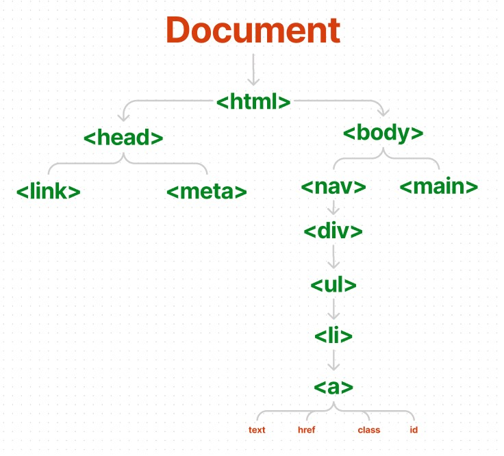

# Document Object Model
Document Object Model, mostly referred to as DOM is an API which is used to manipulate HTML and XML documents. It is the standard way to get, change, add or delete HTML elements
If we dig deeper, the meaning of individual word is like this:

- Document: It is a webpage that is used by the programming language (In our case, JS) to interact. Document is the root node iof any webpage which has only one child, `<html>`.
- Object: These are the actual HTML elements of the webpage. Each and Every element within your webpage is treated as an object. You can call valid JS methods or properties that you'd call on normal JS objects. 
- Model: Objects are connected to each other in a tree-like structure. Every object is called as 'node'.

| |
|:--:|
|Tree like representation of DOM Tree|  

> 'Node' is anything from the HTML DOM that can be changed by the programming language. 

## Why DOM is used for:
- Change or modify content, structure or style of the document.
- Interact with HTML elements and attribute
- Change styling
- Add animation, transitions
- Validations
- Call events/ triggers

## Accessing DOM Elements
There are various ways to select a DOM element in JavaScript. JS provides a set of methods that can be called on `document` object which is root element of entire DOM tree.

|   Method  |   Description |
|-----------|---------------|
|getElementById()   |   based on `id` of the element    |
|getElementByName()   |   based on `name` of the element    |
|getElementByTagName()   |   based on `HTML tag` of the element    |
|getElementByClassName()   |   based on `class` of the element    |
|querySelector()   |   based on `CSS Selector` of the element    |

Consider the following snippet for every example:
```html
<nav class='navbar'>
    <ul class='list'>
        <li class='item current' id='home' name='nav-list'> <a href='#home'>Home</a> </li>
        <li class='item' id='about' name='nav-list'> <a href='#about'>About</a> </li>
        <li class='item' id='contact' name='nav-list'> <a href='#contact'>Contact</a> </li>
    </ul>
</nav>
```

### getElementById('id')
This method returns an element object with the specified `id`. It returns `null` if there is no element with that id present in the DOM.

```js
const home = document.getElementById('home');
console.log(home);  // <a href='#home'>Home</a>
```
> If there are multiple elements with the same `id`, first element will be returned.

### getElementByName('name')
This method takes `name` attribute of the element as the parameter and returns a `NodeList` of elements.

| **What is NodeList?** |
|-----------------------|
|1. NodeList is a collection of nodes present in DOM.|
|2. NodeList is an **array-like object**, not an **array object**. However, we can user array methods like `forEach()` on NodeList.|
|3. **Live NodeList** updates automatically as the DOM changes its state.|
|4. **Static NodeList** Changes in DOM doesn't affect the NodeList.|

```js
let elements = document.getElementsByName(name);
console.log(elements);  // NodeList of three list elements
```

### getElementsByTagName('tag')
This method takes `tag name` the element as the parameter and returns a `HTML Collection` of elements with same tag.

| **What is HTMLCollection?** |
|-----------------------|
|1. An HTMLCollection object is an array-like list of HTML elements.|
|2. It represents a generic collection of elements and offers methods and properties for selecting from the list.|
|3. Unlike `NodeList`, **HTMLCollection** is always live.|

```js
    const list = document.getElementsByTagName('li');
    console.log(list);  // HTML Collection of list items
```

### getElementsByClassName('class')
This method accepts a single string argument that contains one or more class names separated by a space. It returns a live HTML collection of elements. 
```js
    const list = document.getElementsByClassName('item');
    console.log(list);  // HTML Collection of list items
```


### querySelector(selector)
This method returns the first element that matches one or more CSS selectors.
```js
const items = querySelector(.item);
console.log(items)  // only first element (in this case, 'home')
```

### querySelectorAll(selector)
```js
const items = querySelectorAll(.item);
console.log(items)  // list of all the elements with class 'item'
```

## Modifying DOM Nodes
Consider the following snippet for the entire section

```html
<div class='parent'>
    <div class='child-1'><p id='text'>I am the first child.</p></div>
</div>
```

### Adding HTML Elements
### innerHTML
By using this property, it is possible to get or set the HTML markup text of the selected element

```js
const text = document.getElementById('text')
text.innerHTML = "I have changed!"
```

#### createElement(tag)
The `createElement()` accepts an HTML tag name and returns a new `Node` with the `Element` type.

```js
const div = document.createElement('div');
div.innerHTML = '<p>I am the second element.</p>';
```

#### appendChild('child')
This method appends an HTML element to parent element

```js
// Continuing previous code
const parent = document.querySelector('.parent')
parent.appendChild(div)
```

### Deleting Elements
#### removeChild(element)
This method removes the child of the selected HTML parent node.

```js
// Continuing previous code
parent.removeChild(parent.lastElementChild)
```

> `lastElementChild` property returns the last child element.

### Replacing Elements
#### replaceChild(new, old)
This property replaces `old` child of the parent element with the `new` one. 

```js
// Continuing previous code
const article = document.createElement('article');
article.innerHTML = '<p>I am replaced :*(</p>';

parent.replaceChild(article, parent.lastElementChild)
```
