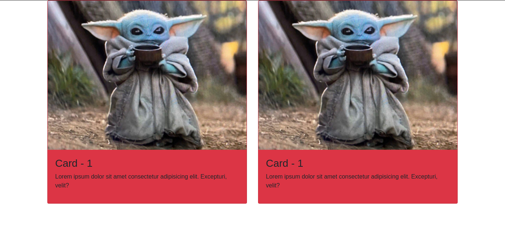
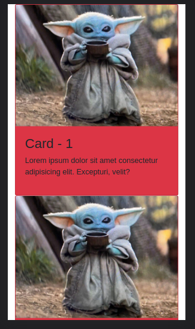

# Bootstrap

Bootrap is a free and open-source framework for building responsive websites using the bare minimum of CSS and JS.

Bootstrap produces websites that work on every platform, including desktops, mobile phones, and tablets.

<br>

# Using Bootstrap in a webpage

Bootstrap can be imported either by installing the package into the local machine or importing Content Delivery Network (CDN) in the header file of the HTML page.

To import CDN, two links have to be imported in the header file, one for CSS content and another JS content.

JS has 2 bundles and can be used <b>any one</b> at a time : `bootstrap.bundle.js` and `bootstrap.bundle.min.js`.

CSS: https://stackpath.bootstrapcdn.com/bootstrap/4.5.2/css/bootstrap.min.css <br>
JS: https://stackpath.bootstrapcdn.com/bootstrap/4.5.2/js/bootstrap.bundle.min.js OR https://stackpath.bootstrapcdn.com/bootstrap/4.5.2/js/bootstrap.bundle.js

For example,

``` HTML

<head>
    <meta charset="UTF-8">
    <meta http-equiv="X-UA-Compatible" content="IE=edge">
    <meta name="viewport" content="width=device-width, initial-scale=1.0">
    <title>Bootstrap</title>

    <script src="https://stackpath.bootstrapcdn.com/bootstrap/4.5.2/js/bootstrap.bundle.min.js"></script>

    <link rel="stylesheet" href= "https://stackpath.bootstrapcdn.com/bootstrap/4.5.2/css/bootstrap.min.css">
</head>

```

## Pre-requisites

1. Make sure, HTML5 is supported. For that, include the tag `<!DOCTYPE html>`.

2. Include the responsive viewport meta tag.

``` HTML

<meta name="viewport" content="width=device-width, initial-scale=1.0">

```

3. Add the box-sizing feature in CSS. This is optional when Bootstrap's padding interferes with the existing padding set in external CSS.<br>

``` CSS

<some-selector> {
    box-sizing: content-box;
}

```

# Including JavaScript in Bootstrap

Bootstrap's major goal was to make templates without the need of JavaScript or jQuery. It may, however, be used to customise the templates. <br>

There are several ways to include JavaScript in BootStrap: 

1. As mentioned earlier, there is a separate JavaScript CDN provided by Bootstrap which is `bootstrap.bundle.js` and `bootstrap.bundle.min.js`. It is usually included in the header section of the HTML page.

2. jQuery can also be used to customise Bootstrap plugins and jQuery is included separately, the CDN for jQuery is (for v3.5.1 )<br>
https://code.jquery.com/jquery-3.5.1.min.js

<b>Note: </b> Bootstrap will listen to jQuery events only if it is wrapped under `window` object.

For example,

``` JS

$('<selector>').on('<bootstrap-plugin>', function(){
    // Code here
})

```

Instead of `addEventListener()`, `.on()` or `.one()` function is preferred for the jQuery events to work.

3. We can add Bootstrap as a module inside the script tag as 

```HTML

<script type = "module">
    import 'bootstrap.esm.min.js';
    /*JS Code here*/
</script>

```

But, the module has to be installed as node.js module using npm. For example, if we need Bootstrap in ReactJS then it needs to be installed using npm.

<br>

# How to use Bootstrap? - An Example

Because there are so many components in Bootstrap that they can't all be shown in this article, this part shows how to use Bootstrap components in a webpage.

Divide the page in half and add some information in the form of a display card with a picture, a title, and a description. This may be accomplished by utilising the Bootstrap grid structure and Bootstrap cards.

<b>Step-1: </b> The page is divided into two sections by using the div class `col-<device>-<number>`. The column is divided into 12 divisions and we can divide the row into two halves by adding `col-md-6` class inside the row class.

For example, 

``` HTML

<div class = "container">
    <div class = "row">
        <div class = "col-md-6">
            <!-- Content goes here -->
        </div>
        <div class = "col-md-6">
            <!-- Content goes here -->
        </div>
    </div>
</div>

```

<b>Note: </b> The term 'md' refers to a device with a responsiveness of fewer than 768px on the screen.

<br>

<b>Step-2: </b> Add the bootstrap cards inside the left column and the right column using `card` class.

For example,

``` HTML

<div class = "card bg-danger">
    
    <div class = "card-body">
        <h3>Card - 1</h3>
        <p>Lorem ipsum dolor sit amet consectetur adipisicing elit. Excepturi, velit?</p>
    </div>
</div>

```

In this example, several features are used. Let's explain one by one.

1. `.card`: Defines the Bootstrap card.

2. `.bg-danger`: Defines the background colour of the card. Here danger indicates red colour. There are other banground colours available too.

3. `.card-img-top`: Places the image inside the card body.

4. `.card-body`: Description can be added inside that class.

Header and footer can also be added inside the card.

The output is given below: <br>



For smaller devices: <br>



<b>Note: </b> The margin, padding, etc. can be modified using CSS.

<br>

# Advantages of Bootstrap

1. Bootstrap is free and open-source.

2. Bootstrap brings responsiveness to the small devices without using media query in CSS.

3. It saves time in writing the codes both in HTML and CSS.

4. Bootstrap has got an excellent grid system defined separately for small devices, medium devices and large devices.

<br>

# Disadvantages of Bootstrap

1. Lack of customisation to the Bootstrap templates leads to the creation of similar websites.

2. Not suitable if only one or two Bootstrap components are used throughout the page.

3. Massive usage of Bootstrap may slow down the loading of the page.

<br>

# References

1. https://getbootstrap.com/docs/5.1/getting-started/javascript/#no-conflict-only-if-you-use-jquery

2. https://getbootstrap.com/docs/4.0/getting-started/webpack/

3. https://www.uplers.com/blog/what-are-the-pros-cons-of-foundation-and-bootstrap/#:~:text=The%20Disadvantages%20of%20Bootstrap%20are%3A&text=Styles%20are%20verbose%20and%20can,Non%2Dcompliant%20HTML

4. https://skat.tf/pros-cons-bootstrap-web-development/

5. https://getbootstrap.com/docs/5.1/layout/grid/

6. https://getbootstrap.com/docs/4.0/components/card/

<hr><br>

<b>Contributors: </b> [Subhendu Dash](https://github.com/subhendudash02)
