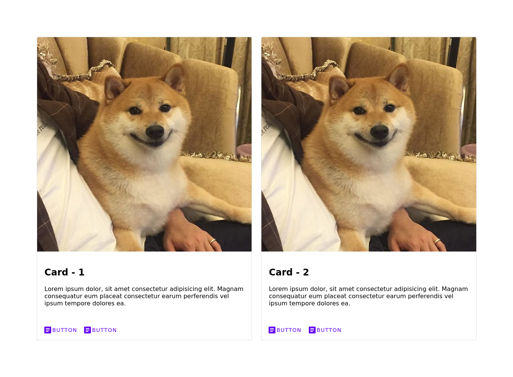
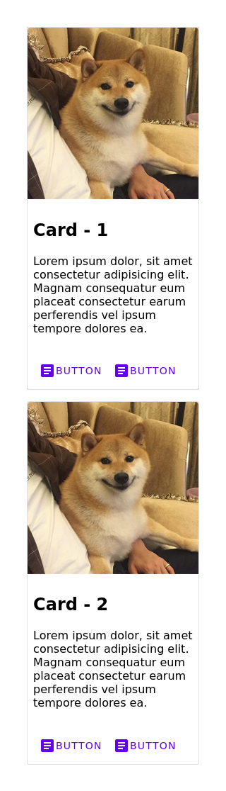

# Material

Material is a free and open-source library which focuses on the adaptable User Interface components in the web, Android and iOS version.

Material is developed and maintained by Google Developers and mainly focuses on cross-platform and easy-to-use components. 

<br>

# Using Material in a webpage

As there are different versions for Mobile and Web, this article focusses on web version and usage of JavaScript and its frameworks.

There are several ways to import Material in the web page.

The first method is importing the Content Delivery Network (CDN) in the header file of the HTML page.

CSS: https://unpkg.com/material-components-web@latest/dist/material-components-web.min.css <br>
JS: https://unpkg.com/material-components-web@latest/dist/material-components-web.min.js

Also, many icons will be used from <b>Google Fonts</b> ([link](https://fonts.google.com/icons?selected=Material+Icons)).

So, the header section will look like this

``` HTML

<head>
    <meta charset="UTF-8">
    <meta http-equiv="X-UA-Compatible" content="IE=edge">
    <meta name="viewport" content="width=device-width, initial-scale=1.0">
    <title>Material Library</title>

    <link href="https://unpkg.com/material-components-web@latest/dist/material-components-web.min.css" rel="stylesheet">
    <link href="https://fonts.googleapis.com/icon?family=Material+Icons" rel="stylesheet">
    <script src="https://unpkg.com/material-components-web@latest/dist/material-components-web.min.js"></script>
    <script src="../JS/script.js"></script>
</head>

```

Before going to the second method, make sure <b>npm</b> is installed in your local machine. Then install Material by executing this command in command line

```
npm i material-components-web
```

Then Material components can be used without even importing the CDN.

<br>

# Material in Different JavaScript Frameworks

Material is supported in many popular framworks of JavaScript such as React (Material UI - MUI), Vue.js (Vuetify), Angular (Angular Material).

If we create a webpage without using any of the above mentioned frameworks, components can be created using minimal of CSS and JavaScript, even the animations like ripple effect in button, etc.

<br>

# How to use Material? - An Example

Material has plenty of components that can't be discussed in a single article. So, this topic discusses how to use material components in a webpage. 

Divide the page in half and add some information in the form of a display card with a picture, a title, and a description. This may be accomplished by utilising the Material grid structure and Material cards.

<b>Step - 1: </b> Divide the page into two halves using Material Grid.

For example,

``` HTML

<div class="mdc-layout-grid">
    <div class="mdc-layout-grid__inner">
        <div class="mdc-layout-grid__cell--span-6">
            <!-- Content Here -->
        </div>
        <div class="mdc-layout-grid__cell--span-6">
            <!-- Content Here -->
        </div>
    </div>
</div>

```

`mdc-layout-grid` makes a layout (like a canvas) in which we can divide the layout. Then, column is created using `mdc-layout-grid__inner` and `mdc-layout-grid__cell--span-<size>`. `<size>` can be changed accordingly, make sure there should be 12 divisions in total.

<b>Step - 2: </b> We can insert the card in both the columns using Material Cards.

For example,

``` HTML

<div class="mdc-card mdc-card--outlined">
    <div class="material-card__media mdc-card__media mdc-card__media--square"></div>
                    
    <div class="body">
        <h2>Card - 1</h2>
        <p>Lorem ipsum dolor, sit amet consectetur adipisicing elit. Magnam consequatur eum placeat consectetur earum perferendis vel ipsum tempore dolores ea.</p>
    </div>
            
    <div class="mdc-card__actions">
        <button class="mdc-button foo-button">
            <span class="material-icons">article</span>
            <div class="mdc-button__ripple"></div>
            <span class="mdc-button__label">Button</span>
        </button>
        <button class="mdc-button foo-button">
            <span class="material-icons">article</span>
            <div class="mdc-button__ripple"></div>
            <span class="mdc-button__label">Button</span>
        </button>
    </div>
</div>

```

Here, `mdc-card mdc-card--outlined` is used to create an outlined card. `material-card__media` is used to insert the image using css. `body` class is created just to adjust the margin. Buttons are created using `mdc-button foo-button` class and wrapped under `mdc-card__actions` class.

The CSS code is shown below

``` CSS

body {
    font-family: 'Gill Sans', 'Gill Sans MT', Calibri, 'Trebuchet MS', sans-serif;
}

.mdc-layout-grid__inner {
    padding: 5%;
}

.material-card__media {
    background-image: url("../images/Card_Photo.jpg");
}

.body {
    margin: 3.5%;
}

```

The output is given below

| <b>Desktop View</b> | <b>Mobile View</b> |
|----------|----------|
|  |  |

<br>

# Advantages of Material

1. Free and open-source.

2. Provides responsiveness without using media-query feature in CSS.

3. All the components are already created and it can be imported and reused in HTML page.

4. Readymade icons are already available in Google Fonts which can be easily used in Material in one line.

<br>

# References

1. https://en.wikipedia.org/wiki/Material_Design
2. https://material.io/components/cards
3. https://github.com/material-components/material-components-web
4. https://material.io/develop/web
5. https://material.io/develop/web/getting-started

<hr><br>

<b>Contributors: </b> [Subhendu Dash](https://github.com/subhendudash02)
