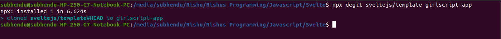
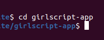
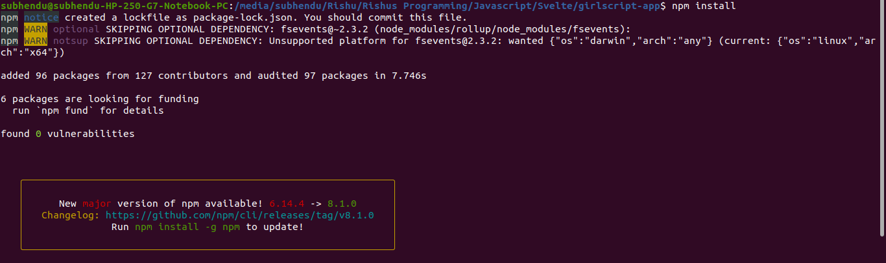
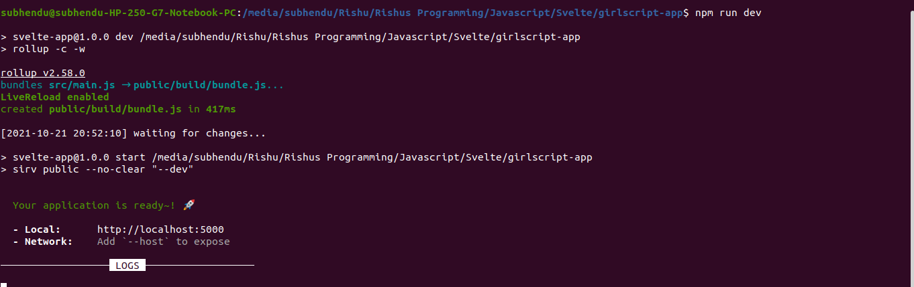
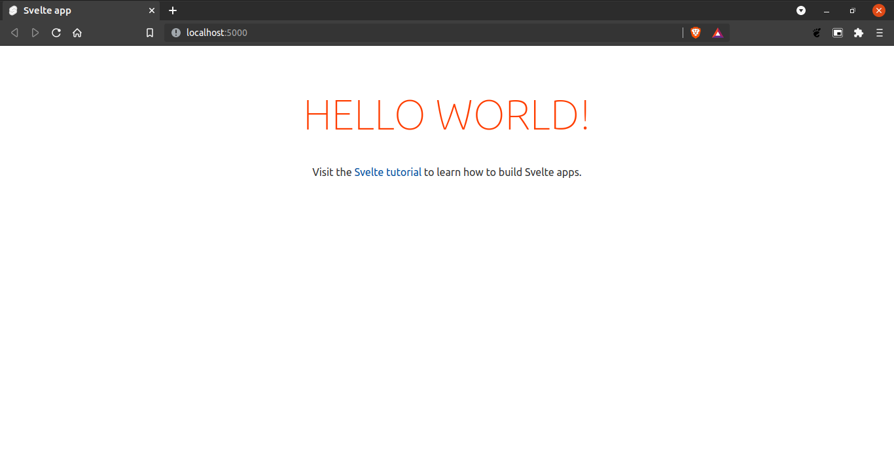

# Introduction

Svelte is an open-source front-end compiler which has an unique approach to execute the front-end code and displays it in browser in an efficient way. <br>

Other frameworks like ReactJS execute the code in the browser itself, when the app is running. Whereas Svelte does it in a different way. It executes the code during the compile time, producing highly-optimised Vanilla JavaScript. <br>

As compared to other frameworks, Svelte uses less concepts and tools to create a web application. For example, virtual DOM is present in ReactJS but not in Svelte. <br>

Svelte is created by <b>Rich Harris</b> which is licensed under <b>MIT License</b>.

<br>

# Creation of Svelte App

<b>Note: </b> Make sure NodeJS and npm is downloaded before creating Svelte App.

<b>Step-1: </b> Download and unzip the Svelte repo using `degit` method.

``` 
npx degit sveltejs/template <app-name>
```

For example,



<b>Step-2: </b> Go to the app directory.

```
cd <app-name>
```

For example,



<b>Step-3: </b> Run the application.

```
npm install
npm run dev
```

For example, 


<br>


<b>Step-4: </b> Go to the link as shown in the above picture `http://localhost:5000`



Tada!!! We have created the app!

<br>

# Understanding File Structure in Svelte App

The file structure of Svelte app is given below:

<br>

```
girlscript-app
├── node_modules
├── public
    ├── build
        ├── bundle.css
        ├── bundle.js
        ├── bundle.js.map
    ├── favicon.png
    ├── global.css
    ├── index.html
├── scripts
    ├── setupTypeScript.js
├── src
    ├── App.svelte
    ├── main.js
├── package.json
├── package-lock.json
├── README.md
├── rollup.config.js
```

The compiled file `App.svelte` is the where we write and run the code. `main.js` is the external JS file which is optional. Here it is shown after the installation just for the demonstration.

Let's observe the contents of `App.svelte`.

<br>

# Contents of `App.svelte`

As discussed earlier, `App.svelte` is the main file to show the contents in the webpage.

After creating the Svelte app, this file already has some pre-written codes which looks like the following below code:

``` HTML
<script>
	export let name;
</script>

<main>
	<h1>Hello {name}!</h1>
	<p>Visit the <a href="https://svelte.dev/tutorial">Svelte tutorial</a> to learn how to build Svelte apps.</p>
</main>

<style>
	main {
		text-align: center;
		padding: 1em;
		max-width: 240px;
		margin: 0 auto;
	}

	h1 {
		color: #ff3e00;
		text-transform: uppercase;
		font-size: 4em;
		font-weight: 100;
	}

	@media (min-width: 640px) {
		main {
			max-width: none;
		}
	}
</style>
```

The above code has three main tags: 

1. <b>Script: </b> To write JS/TypeScript codes.
2. <b>Style: </b> To write CSS codes.
3. <b>Main: </b> To write HTML codes.

<br>

# Advantages of Svelte

1. Svelte is processed in the compile time, not in runtime. That's why it shows the webpage faster than other JS frameworks.

2. Many concepts of HTML and CSS can be applied with some modifications.

3. It enables output flexibility.

4. It has got minimal learning curve.

<br>

# Disadvantages of Svelte

1. Svelte has got small open-source ecosystem which will take time to grow up.

2. It has got limited packages and tooling support.

3. Svelte has less IDE integration, which needs a lot of work compared to other frameworks that have been around for a long time.

<br>

# References

1. https://en.wikipedia.org/wiki/Svelte

2. https://developer.mozilla.org/en-US/docs/Learn/Tools_and_testing/Client-side_JavaScript_frameworks/Svelte_getting_started

3. https://daily.dev/blog/building-with-svelte-all-you-need-to-know-before-you-start

4. https://svelte.dev/docs

<hr><br>

<b>Contributors: </b> [Subhendu Dash](https://github.com/subhendudash02)