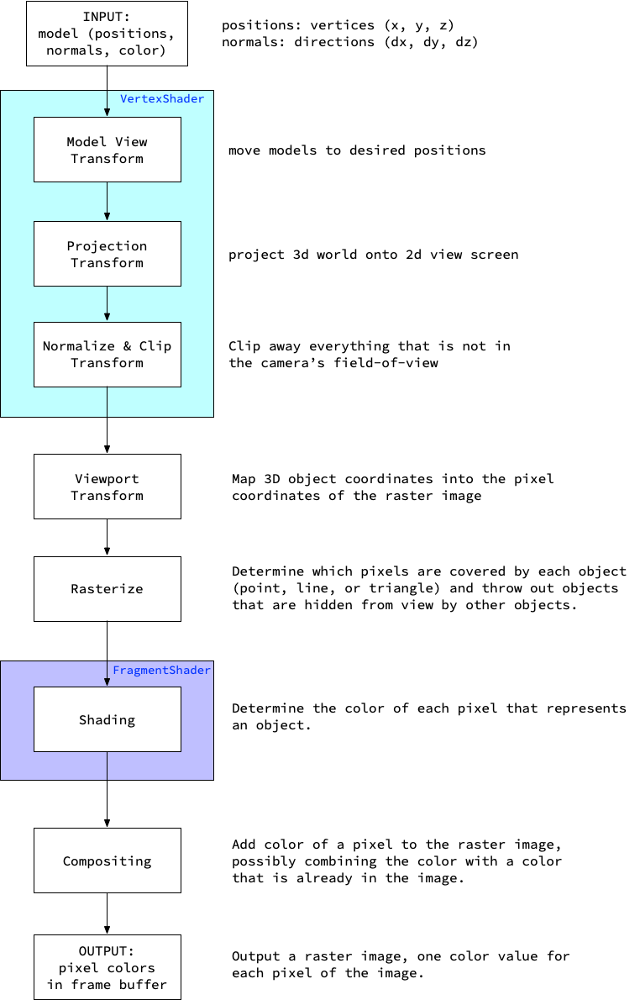
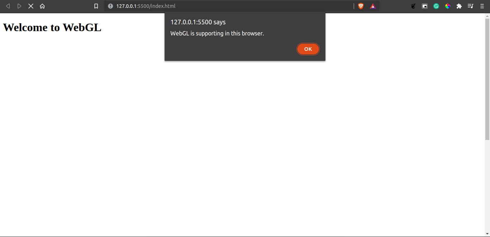
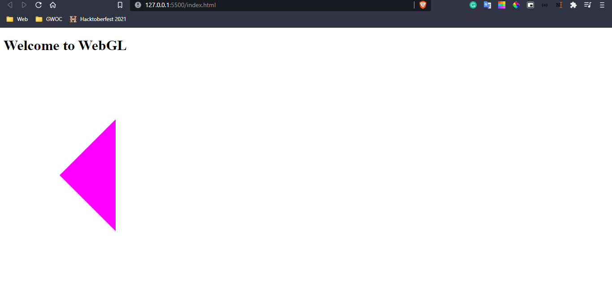

# WebGL

<p align="center">
  
</p>

<br>

# Introduction

WebGL or <b>Web Graphics Library</b> is a JavaScript API that supports 2-D and 3-D animations in the web-browsers. <br>

WebGL is developed and maintained by <b>Khronos Group</b> and some of the effects in WebGL is derived from <b>OpenGL Shading Language.</b> <br>

WebGL's major goal is to make it simple to utilise any of the capabilities, and it can also be used in HTML pages. Animations and other graphical elements, for example, are shown in HTML pages using the `<canvas>` tag.

<br>

# How WebGL works?

To show content on the canvas display, the WebGL API requires both CPU and GPU memory. To execute the output, it goes through a series of processes. For faster execution, both the GPU and the CPU execute in parallel.

The CPU is in charge of retrieving vertex data and executing JavaScript code. The GPU is in charge of rendering shaders. In the GPU, there are multiple shaders that are beneficial in various scenarios. The key shaders here, though, are the vertex and fragment shaders.

The vertex shader is in charge of connecting the vertices, projection, and determining the normal vector for each surface, among other things.

The Fragment shader is in charge of filling each pixel's colours.

Finally, both the shaders are combined into one program and compiled to display the output on the canvas.

The detailed pipeline diagram for the above explanation is given below <br>



<b>Source: </b> [Will Xu's Blog](https://tensor.sh/webgl-basics)

<br>

# Getting Started with WebGL

To get started with WebGL, we create a canvas in HTML and then we can add any 2-D or 3-D content.

## Checking the compatibility of WebGL in Browser

``` HTML

<!-- HTML body content -->
<body>
    <h1>Welcome to WebGL</h1>
    <canvas width = "1000" height = "1000"></canvas>  
    
</body>

```

``` JS

// WebGL compatibility check
// JS content
function main() {
  const getCanvas = document.querySelector("canvas");
  const init = getCanvas.getContext("webgl");
  
  if (init === null) {
    alert("WebGL not supported!!!");
    return;
  }
  
  else {
    alert("WebGL is supporting in this browser.");
  }
}

window.onload = main;

```

In the JS file, WebGL is initiated using `getContext()` in HTML canvas. Then it is checked whether WebGL is supported or not. <br>

The output is <br>


Usually, all modern versions of the browsers (Google Chrome, Mozilla Firefox, Brave, Opera, etc) will support WebGL. <br>

## Creating a 2-D shape

There are plenty of functions in WebGL which can't be demonstrated in one article, in this topic we will demonstrate a generalised step-by-step procedure on how to create a 2-D figure in WebGL. 

<b>Step-1: </b> Create a canvas in HTML page as shown in the last topic.

``` JS

function main() {
  const htmlCanvas = document.querySelector("canvas");
  const getCanvas = htmlCanvas.getContext("webgl");
}

window.onload = main;

```

We will write the code in that main function itself.

<b>Step-2: </b> Define the coordinates of the vertices to be placed in the canvas in the form of an array. 

<b>Note: </b> The array should be in the form of "Float32" datatype. Changing the datatype changes the coordinate and hence it changes the shape too.

For example, 

``` JS

const vertices = new Float32Array([
  -0.5, 0, 0,
  0, 0.5, 0,
  0, -0.5, 0,
]);

```

Here we are aiming to make a triangle.

<b>Step-3: </b> Create a buffer to store the coordinates and bind that buffer as an array of coordinates.

``` JS

const buffer = getCanvas.createBuffer();
getCanvas.bindBuffer(getCanvas.ARRAY_BUFFER, buffer);
getCanvas.bufferData(getCanvas.ARRAY_BUFFER, vertex, getCanvas.STATIC_DRAW);

```

<b>Step-4: </b> Create a vertex-shader program.

``` JS

const vertexShader = getCanvas.createShader(getCanvas.VERTEX_SHADER);
getCanvas.shaderSource(vertexShader, `
    attribute vec3 position;
    void main() { 
        gl_Position = vec4(position, 1);
    }
`);
getCanvas.compileShader(vertexShader);

```

Here, vertex-shader is created using `createShader()` function and that shader is compiled using `compileShader()` program.

<b>Note: </b> The code written in (``) quotes inside the `shaderSource()` function is the OpenGL Shader Language.

In the OpenGL program, the coordinates are in the form of "vec3" type. They are converted into "vec4" by adding 1 to the position.

<b>Step-5: </b> Create a fragment-shader program.

``` JS

const fragmentShader = getCanvas.createShader(getCanvas.FRAGMENT_SHADER);
getCanvas.shaderSource(fragmentShader, `
    void main(){
        gl_FragColor = vec4(1, 4, 0, 1);
    }
`);
getCanvas.compileShader(fragmentShader);

```

`gl_FragColor` defines the colour of the figure.

<b>Step-6: </b> Create a program to connect both vertex and fragment shader.

``` JS

const program = getCanvas.createProgram();
getCanvas.attachShader(program, vertexShader);
getCanvas.attachShader(program, fragmentShader);
getCanvas.linkProgram(program);

```

<b>Step-7: </b> Load the attributes to the program.

``` JS

const pos = getCanvas.getAttribLocation(program, `position`);
getCanvas.enableVertexAttribArray(pos);
getCanvas.vertexAttribPointer(pos, 3, getCanvas.FLOAT, false, 0, 0);

```

The  syntax of vertexAttribPointer function is `gl.vertexAttribPointer(index, size, type, normalised, stride, offset);`

"normalised" is set as false, "stride" and "offset" is set to zero.

"size" is the number of inputs to be taken at a time which is 3 (x, y, z coordinate).

<b>Step-8: </b> Execute the program and display the output on the screen.

``` JS

getCanvas.useProgram(program);
getCanvas.drawArrays(getCanvas.TRIANGLES, 0, 3);

```

The output is shown below



<br>

# Applications of WebGL

1. Map view and GPS (Example: Google Maps)
2. Medical field (Example: demonstrating the three-dimensional view of each organ)
3. Gaming (Example: Xbox Game Bar, DirectX, Unity WebGL)
4. Architecture (Example: Three-dimensional view of homes and buildings, Solidworks, AutoCAD)
5. Modeling
6. Marketing

<br>

# References

1. https://developer.mozilla.org/en-US/docs/Web/API/WebGL_API
2. https://developer.mozilla.org/en-US/docs/Web/API/WebGL_API/Tutorial
3. https://webglfundamentals.org/webgl/lessons/webgl-how-it-works.html
4. https://en.wikipedia.org/wiki/WebGL
5. https://tensor.sh/webgl-basics
6. https://manu.ninja/25-real-world-applications-using-webgl/#:~:text=WebGL%20brings%20plugin%2Dfree%203D,on%20embedded%20and%20mobile%20systems.

<hr><br>

<b>Contributors: </b> [Subhendu Dash](https://github.com/subhendudash02)
