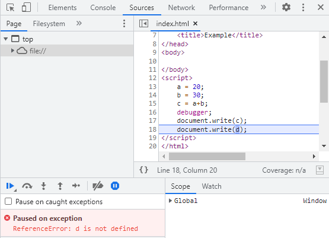

# Debugging 

It is possible that a code may contain certain mistakes or errors. Because being a scripting language, Javascript does not display any error messages in the browser. However, these error might have an impact on the final output.

```Debugging``` the code is the best way to figure out what's going wrong. Using web browsers like __Google Chrome__, __Mozilla Firefox__,etc you may quickly debug the code.

# JavaScript Debugging

Here, you will learn to detect the errors using built-in web browser debugger. Any of the following techniques can be used to do debugging:
1. __console.log() method__
2. __debugger keyword__

# ```console.log()``` method

The ```console.log()``` method prints the output to the browser's console. And if there is a error or mistakes in a code, an error message is generated over there.

With the help of an example, you will get more clarity.

__Example:__

```javascript
var  a = 20;
var  b = 30;
var  c = a+b;
console.log(c);
console.log(d); // d is not initialized
```

__Explanation:__

Here the console.log() method will print the output and give error message on browser's console. To open your browser's console, you can press <kbd>Ctrl</kbd>+<kbd>Shift</kbd>+<kbd>I</kbd> on the opened web page or you can simply __right click__ over the web page and then click on inspect. Now, after this your developer tools will open and you can simply shift to __console__ tab. And over there you will see the following output.

__Output:__

.png)

# ```debugger``` keyword

__Breakpoints__ are generally used in debugging to analyse each line of code one by one. In JavaScript, there is no need to perform this action manually.

The ```debugger``` keyword in JavaScript allows to set a breakpoint directly in the code. The ```debugger``` halts the program execution at the point where it is applied. You can now manually begin the execution flow, if an exception occurs, the execution will come to a stop on that line.

With the help of an example, you will get more clarity.

__Example:__

```javascript
a = 20;
b = 30;
c = a+b;
debugger;
document.write(c);
document.write(d);
```

__Explanation:__

Now open the developer tools on your browser and move to __Sources__ tab. And there you will see which line produces the exception.

__Output:__



# Conclusion
Congratulations! You've successfully learned about JavaScript Debuggging and ```debugger``` keyword.

Keep exploring JavaScript :wave:

Contributor : [Abhinandan Adhikari](https://github.com/AbhinandanAdhikari) :heart: