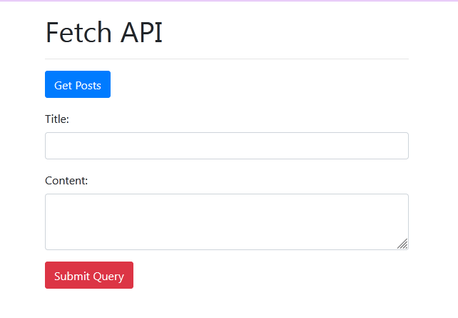
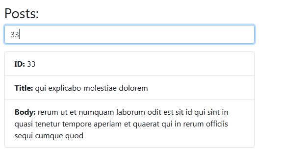
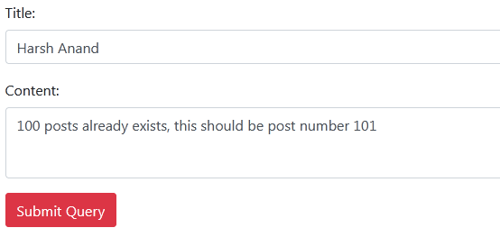
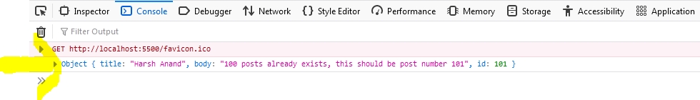

# The Fetch API


## What is Fetch API?

The Fetch API is a modern interface that allows US to make HTTP requests to servers from web browsers. If you have worked with XMLHttpRequest ( XHR ) object, the Fetch API can perform all the tasks as the XHR object does. In addition, the Fetch API is much simpler and cleaner.

Let's learn by building a simple API based application that how to fetch data asynchronously from an external API using the fetch API. The API which we are going to use is [JSON Placeholder](https://jsonplaceholder.typicode.com/). So, let's get started.

We will create this application in two phases.

1. Getting the data from the API
2. Submitting data to the API

## Creating Interface

First of all we are going to create an interface of our application. Without an interface, there is no meaning of getting useful data. 

- Create a file say, `index.html` and put the code into it.

    ```js
    <!DOCTYPE html>
    <html>
    <head>
        <meta charset="utf-8" />
        <meta http-equiv="X-UA-Compatible" content="IE=edge">
        <title>Using Fetch</title>
        <link rel="stylesheet" href="https://stackpath.bootstrapcdn.com/bootstrap/4.3.1/css/bootstrap.min.css" integrity="sha384-ggOyR0iXCbMQv3Xipma34MD+dH/1fQ784/j6cY/iJTQUOhcWr7x9JvoRxT2MZw1T" crossorigin="anonymous">
        <meta name="viewport" content="width=device-width, initial-scale=1">
        
    </head>
    <body>
        
    <div class="container">
        <h1 class="mt-3">Fetch API sample</h1>
        <hr>
        <button class="btn btn-primary" id="postBtn">
                Get Posts
        </button>

        <form action="">
            <div class="form-group">
                <label for="title" class="mt-3">Title:</label>
                <input type="text" id="title" class="form-control">
            </div>
            <div class="form-group">
                <label for="body">Content:</label>
                <textarea id="body" class="form-control"></textarea>
                <input type="submit" class="btn btn-danger mt-3" id="submitBtn">
            </div>
        </form>

        <div id="posts"></div>
    </div>

        <script src="https://unpkg.com/@babel/standalone/babel.min.js"></script>
    </body>
    </html>
    ```

- `Output`

    Run this HTML file & make sure you are connected to the internet and you will get this output

    


- Note :- 
    - For avoiding custom styling, we are using [bootstrap](https://getbootstrap.com/)
    - In case you are wondering what babel is (included within the script tag); it is simply a JavaScript compiler. It will basically convert the code in ES6 to regular JS. That is for browser compatibility’s sake. You don’t have to include it unless you’re taking browser compatibility into consideration. You can read more about it [here](https://babeljs.io/docs/en/).

## Getting data from API

To write the JavaScript code, let's create a `script.js` file and include it at the end of the body of `index.html`

In order to get data from a server, we need to make an HTTP request. The traditional way is to use AJAX, thus, our code will look like this

```js
//creating an XMLHttpRequest object
const http = new XMLHttpRequest();

//sending our request to the api 
http.open("GET", "https://jsonplaceholder.typicode.com/posts");
http.send();

//handling the returned data
http.onreadystatechange=(e)=>{
  if (this.readyState == 4 && this.status == 200) {
    //do something...
  }
}
```

- Admittedly, this way is kind of long and can become really tedious at times. That’s when the Fetch API comes into place; it is a really powerful web API to make asynchronous requests feasible. What I love about Fetch is that it returns a [Promise](https://developer.mozilla.org/en-US/docs/Web/JavaScript/Reference/Global_Objects/Promise).


### <p align= center>A promise is an object returned by a module, library, function, that will be resolved or rejected some time in the future.</p>


- To get data using fetch , we’ll only need the endpoint URL which is the URL that we can use to access the data provided by the web API.

- Finally your `script.js` file will look like this and make sure you include this `script.js` file in your `index.js` file.

    ```js
    document.getElementById('postBtn').addEventListener('click',getPosts());

    function getPosts(){
        let endpoint = 'https://jsonplaceholder.typicode.com/posts';

            fetch(endpoint).then((response=>{
                // Returning it in JSON format
                return response.json()
            })).then((data=>{
                // Displaying it to the DOM
                let output = "<h3>Posts:</h3>"+
                            "<div class='form-group'>"+
                            // We will use this input later on to search for posts
                            "<input type='text' id='search' class='form-control' placeholder='search by title or ID..'>"+
                            "</div>";

                data.forEach(post => {
                    output += `
                            <ul class="list-group mb-3" id="${post.id}">
                                <li class="list-group-item"><strong>ID:</strong> ${post.id}</li>
                                <li class="list-group-item"><strong>Title:</strong> ${post.title}</li>
                                <li class="list-group-item"><strong>Body:</strong> ${post.body}</li>
                            </ul>
                            `;
                });

                document.getElementById('posts').innerHTML = output;
                }))
            }
    ```

- Let's break our code to understand it

    - At first, we selected our `Get Post` button and added event listener to it.
    - We then used `fetch` to send our request which returns a promise.
    - We called `.then()` to have access to the response that the API has provided, and then we returned it as JSON
    - When our first promise gets resolved, we get the received data and display it to the DOM.  

## Getting filtered data from API

Now, what if we want data of post having some specific id or title? We can add some functionality to get filtered data. 

- Function for filtering data by id or title

    ```js
    document.addEventListener('keyup', (e)=>{
                        if(e.target.matches('#search')) search()
                        else console.error(e)
                    })
            
                    function search(){
                        let value = document.getElementById('search').value;
                        data.forEach(post=>{
                        if((post.id == value)||(post.title.indexOf(value) > -1)||(value == '')){
                            document.getElementById(post.id).style.display = 'block';              
                            }
                            else{
                            document.getElementById(post.id).style.display = 'none';
                            }
                        })
                    }
    ```

- Here is what our `script.js` look like, now

    ```js
    document.getElementById('postBtn').addEventListener('click',getPosts());

    function getPosts(){
    let endpoint = 'https://jsonplaceholder.typicode.com/posts';
    
          fetch(endpoint).then((response=>{
              // Returning it in JSON format
              return response.json()
            })).then((data=>{
                // Displaying it to the DOM
                let output = "<h3>Posts:</h3>"+
                "<div class='form-group'>"+
                // We will use this input later on to search for posts
                         "<input type='text' id='search' class='form-control' placeholder='search by title or ID..'>"+
                         "</div>";
                         
                data.forEach(post => {
                  output += `
                        <ul class="list-group mb-3" id="${post.id}">
                        <li class="list-group-item"><strong>ID:</strong> ${post.id}</li>
                        <li class="list-group-item"><strong>Title:</strong> ${post.title}</li>
                        <li class="list-group-item"><strong>Body:</strong> ${post.body}</li>
                        </ul>
                        `;
                    });
                
                    // document.getElementById('search').addEventListener('keyup', search); -->this technique will not work as there is no component in HTML that matches with id = "search", we have added input element with id= search through JavaScript not directly by HTML
                    //Hence the below technique will work, if we have added some element through javascript and want to access it.
                    document.addEventListener('keyup', (e)=>{
                        if(e.target.matches('#search')) search()
                        else console.error(e)
                    })
            
                    function search(){
                        let value = document.getElementById('search').value;
                        data.forEach(post=>{
                        if((post.id == value)||(post.title.indexOf(value) > -1)||(value == '')){
                            document.getElementById(post.id).style.display = 'block';              
                            }
                            else{
                            document.getElementById(post.id).style.display = 'none';
                            }
                        })
                    }
                    document.getElementById('posts').innerHTML = output;

                
                }))
            }
                
    ```

- Search data with id=33 and here is the `output`

    

## Submitting / Posting data to API

Now, what if we want to send the data to the server? With `fetch`, that's pretty simple. It is the exact same process except this time, we’re going to add some options such as: the method, headers and the body.

```js
//Only for example
const options = {
    method : "POST",
    headers : {
        "content-type" : "application/json",
        "Accept" : "application/json"
    },
    body : data //it should be in json format
}
```

- Our code for adding a Post will look like this
    ```js
    //selecting submit button and adding event to it
    document.getElementById('submitBtn').addEventListener('click',submitPost);

    //getting the input values
    let title = document.getElementById('title').value;
    let body = document.getElementById('body').value;

    //submitting a post
        function submitPost(e){
        e.preventDefault();
      
      fetch('https://jsonplaceholder.typicode.com/posts', {
        method:'POST',
        headers: {
          'Accept': 'application/json',
          'Content-type':'application/json'
        },
        body:JSON.stringify({
          title,
          body 
        }) //equivalent to ({title:title, body:body})
      }) //getting data into console to verify
      .then((res) => res.json()).then((data =>{
          console.log(data)
      }))
    }

    ```

- Put some data into input and hit the `Submit Query` button

    

- You will see in console of your browser that we already having 100 posts earlier and this post should be 101th post and same result is showing in the output.

    


## Resources
- [JSON Placeholder](https://jsonplaceholder.typicode.com/)
- [Babel](https://babeljs.io/)
- [Fetch API](https://developer.mozilla.org/en-US/docs/Web/API/Fetch_API)
- [Promise in JavaScript](https://developer.mozilla.org/en-US/docs/Web/JavaScript/Reference/Global_Objects/Promise)


## Conclusion

It is that simple. Once you get a hold of the concept, the code will be much easier to play with. 

__Contributor__ : [Harsh Anand](https://github.com/its-me-Harsh-Anand)