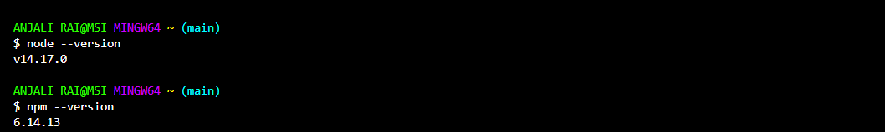
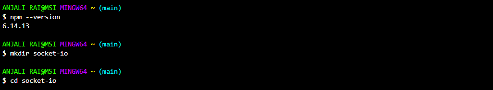
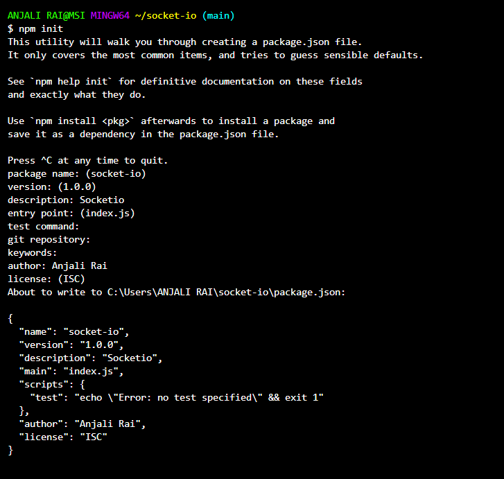

# Socket.io
---
In this Tutorial , we will learn about Javascript **Socket.io**.


## What is Socket.io?

Socket.io is a JavaScript Library which allows communication between  a client and a server.Socket.IO is built on top of the WebSockets API (Client side) and Node.js.It is one of the most depended upon library on npm (Node Package Manager).

It is bi-directional communication, means data can flow in both directions:

* Client to Server
* Server to Client

Socket.io has two parts: client-side and server-side. Both parts have an identical API.

* The server-side library runs in node.js.
* The client-side library runs in the browser.


## Why to use Socket.io?

Developing a real-time application with popular web  applications stacks like PHP will be very hard. It involves keeping track of timestamps, and it is a lot slower than it should be.

Whereas, it is very easy to do bi-directional communication between browser and server using socket.io. Whenever an incident occurs, the server automatically sends the message to the client. It does not require any tracking on the timestamp.

## How to get started with Socket.io?

To get started with developing using the Socket.IO, you should have **Node** and **npm (node package manager)** installed. If you do not have these, first install these two.

To install **Node** and **npm** , you can refer [Node and npm installation.](https://www.guru99.com/download-install-node-js.html)

Confirm that node and npm are installed by running the following commands in your terminal.

> node --version <br> npm --version

If node and npm have installed successfully on your local system , then you should get similar output like this:




**Now, Installation Of socket.io:**

**Step 1:** Open your terminal and enter the following in your terminal to create a new folder and enter the following commands:

> mkdir socket-io<br>cd socket-io<br>npm init



It will ask you some questions, answer them in the following way:



This will create a **'package.json node.js'** configuration file.


Now , we need to install **Express** and **Socket.io** and save these to **package.json node.js** file. To do this task, enter the following command in your terminal:

> npm install --save express socket.io

Finally, the only installation we are left with is **Nodemon**.To install nodemon, open your terminal and enter the following command:

> npm install -g nodemon

Whenever you need to start the server, use **nodemon app.js** instead of **node app.js**.This will ensure that you don't need to restart your server everytime when you change a file. It helps in speeding up the development process.


Now, you have your development environment set up. You can start developing real-time application with socket.io.


**Let's consider an Example:**

1. First create a file **app.js** in same directory that we have created above **"socket-io"** and enter the following code in it:

```js
var app = require('express')();
var http = require('http').Server(app);
var io = require('socket.io')(http);

app.get('/', function(req, res){
  res.sendFile('index.html');
});

//Whenever someone connects this gets executed
io.on('connection', function(socket){
   console.log('A user connected');

   //Whenever someone disconnects this code gets executed
   socket.on('disconnect', function () {
      console.log('A user disconnected');
   });
});
// listening on port no.30000
http.listen(3000, function(){
   console.log('listening on port no. :3000');
});
```

The require('socket.io')(http) creates a new socket.io object attached to the http server. The io.on event handler handles connection, disconnection, etc., events in it, using the socket object.

2. We now have to include the client script and initialize the socket object there, so that clients can establish connections when required.

The script is served by our io server at **'/socket.io/socket.io.js'**.

So , we need to create an **index.html** file and add following code in it:

```HTML
<!DOCTYPE html>
<html>
   <head><title>Hello world</title></head>
   <script src="/socket-io/socket.io.js"></script>
   <script>
      var socket = io();
   </script>
   <body>Hello world</body>
</html>
```

To test if this works, go to the terminal and run this app using the following command:

> nodemon app.js

Now, Go to the browser and enter localhost:3000 to check this, if everything goes well , you will see a message **"Hello World"** printed on page.

Then, check your server logs, you well get to see this  message:

> A user connected   

And, if you refresh your browser, you will get to see these messages in your log:

> A user connected<br>A user disconnected<br>A user connected


## Event handling in Socket.io:

Sockets work based on events. There are some reserved events, which we can access using the socket object on the server side.

These are:

* Connect
* Message
* Disconnect
* Reconnect
* Ping
* Join and
* Leave

The client-side socket object also provides us with some reserved events, which are:

* Connect
* Connect_error
* Connect_timeout
* Reconnect, etc.

## Features of  Socket.io:

1. It relies on Engine.IO, which establishes a long-running polling connection before attempting to upgrade to better "testing" transports, such as WebSocket.

1. It provides auto-reconnection support. The disconnected client keeps trying to reconnect until the server is available again.

1. It lets both the server and the client know when no one else is responding.

1. Socket.IO allows you to create multiple namespaces to separate concerns within your application, which will act as separate communication channels but share the same underlying connection.


---

> Contribution by :  
> <cite>[Anjali Rai](https://github.com/anjalirai12)</cite>
