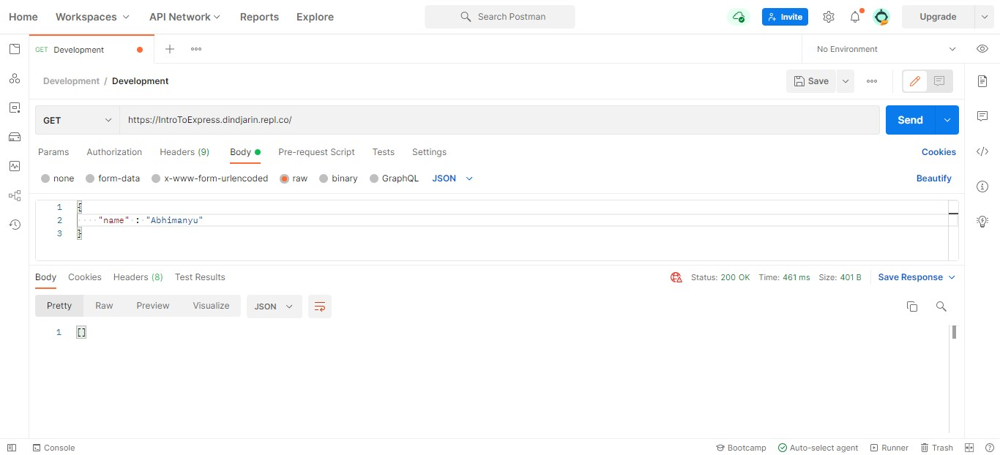
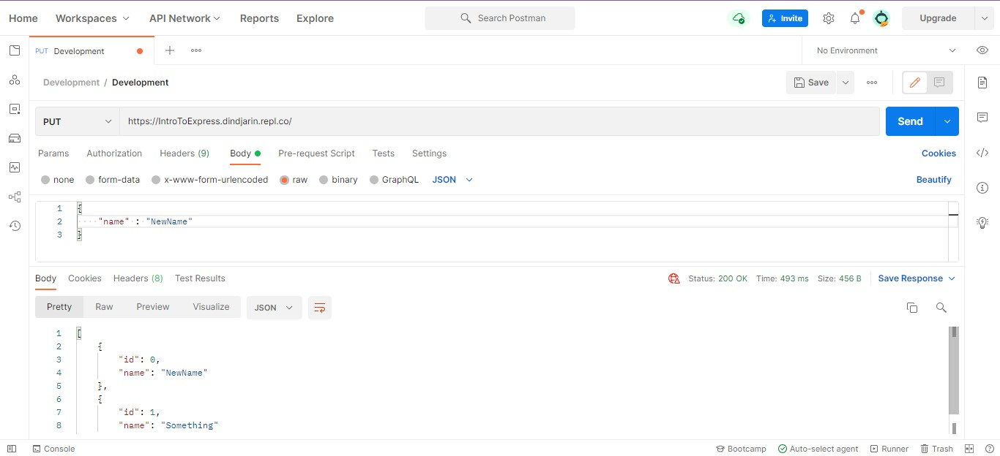

# Intro to Express 

Express is a open source backend web application framework for Node.js. It is used to create web application and APIs.

## Installation

> Pre-requisite

```shell
Node.js >= 0.10
npm >= 4.17
```

* Step 1 : Create a directory

```shell
mkdir myApp 
cd myApp
```

* Step 2 : Run `npm init --y`. It will create a default package for your directory.

```shell
npm init -y
```

* Step 3 : Install Express. Run this command to install express in your working directory.

```shell
npm install express --save
```
__*Now you've installed express you can create your first express server*__

## Creating an Express Server

Create a new file in the directory and call it index.js and write this code in it.

```javascript
const express = require('express');

const app = express();

app.get('/', (req,res) => {
  res.send("Yey, this is my First Express Server!")
})

app.listen(3000, () => {
  console.log("Server started");
})
```
**Let's understand what is happening in the above code?**

First we imported express in our index.js file and stored in our constant variable express.
Then we initialized a constant variable `app` and set it equal to `express()`. You might be wondering what `const app = express()` means. Here `app` is a placeholder to recieve the output from `express()` function, which is an object. 

After that we have a `get` route with `callback()` functions `(req,res)`. 

> __What is a `Callback()` function?__

> *When a function is passed to antother function as parameter then it is called a callback function. They are important in asynchronous programming, i.e, when we want to run our code sequentially but code runs after something else happens. Callbacks make sure that a function is not going to run before a task is completed but will run right after the task has completed. It helps us develop asynchronous JavaScript code and keeps us safe from problems and errors.*

In above code `(req,res)` is our callback function. `req` stands for request, the data we are receiving from our user in the form of an object and `res` stands for response, the data we will be sending to the user.

In the callback function we are sending a message to the user `res.send("Yey, this is my First Express Server!")`. What this is doing is sending response message `Yey, this is my First Express Server!` when a person accessing `"/"` this route.

And last we have `app.listen(3000)`. Here we are telling our application to run on port 3000. In this with the port number we have passed a function also that logs a message to the console `Server started`.

And with this we have created our web application server.

## Creating APIs in Express

### What are routes?

> _Routes are simply the path taken by our data to travel._

### Creating `GET` request API

```javascript
const express = require('express');

const app = express();

let names = [];
let id = 0

app.get('/', (req,res) => {
  res.send("This route is for getting data!")
})

app.listen(3000, () => {
  console.log("Server started");
})
```
You just have to use get method present in the express and in first parameter passed the route `"/"` and second parameter is a callback() and from callback() we are sending a message to user that displays on screen `This route is for getting data!` whenever a user accessing this route.



### Creating a `POST` request API.

We cannot use `POST` method directly because browser by default uses only `GET` method. We can use various tool to test our APIs. One tool is *Postman*. You can head our to [Postman's]('https://www.postman.com/') website and explore. If you're working locally you need to install its desktop agent. 

```javascript
const express = require('express');

const app = express();

app.use(express.json());

let names = [];
let id = 0

app.get('/', (req,res) => {
  res.send(names)
})

app.post('/create', (req,res) =>{
  try{
    let name = req.body.name;
    names.push({id: id,name:name});
    id++;
    res.redirect("/");
  } catch (err){
    console.log(err);
  }
});

app.listen(3000, () => {
  console.log("Server started");
})
```
In the above code we have created a `GET` method and a `POST` method. What `GET` method is doing is sending an empty list when we start our server. When we send a `POST` request to the server through **Postman**, we pass some data in body `name = Abhimanyu` an what it does is extract data from request body and store in a variable. Then it add that data into the list in the form of an object. And finally redirects to our home route i.e., `'/'`.


### Create a `PUT` request API

```javascript
...

app.put('/update', (req,res) => {
  try{
    names.forEach((data) => {
    if(data.id === 0){
      data.name = req.body.name;
    }
  });
  res.redirect('/');
  } catch (err) {
    console.log(err);
  }
})
...
```
Above we have created a `PUT` route. What this route is doing when we send a put request to `'/update'` this route it update the name where the id is 0 and redirects user to homeroute.



### Create a `DELETE` request API

```javascript
...

app.delete('/delete', (req,res) => {
  res.send("This is delete request");
})

...
```
In this way you can make a delete route for things like logout, deleteing something.
