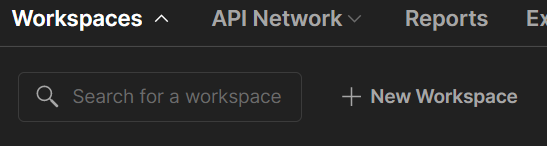
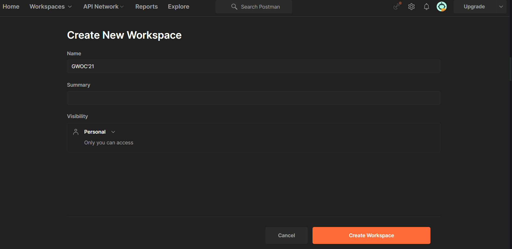
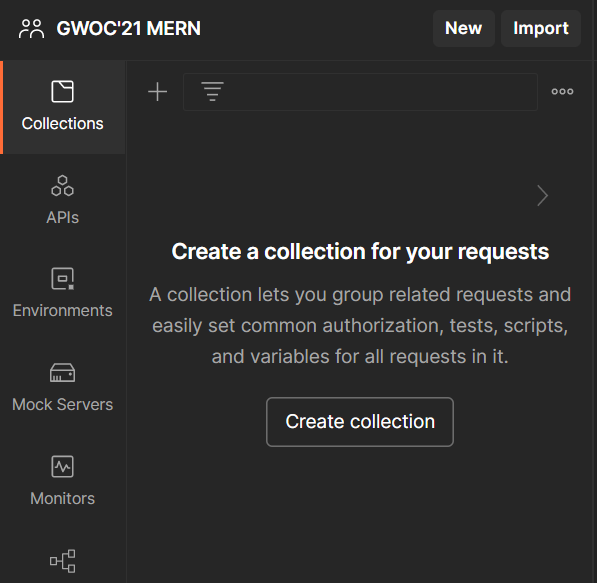
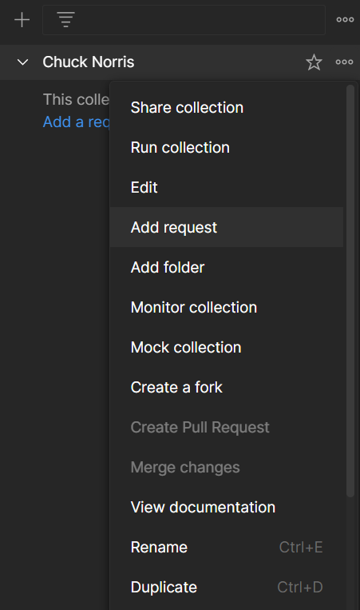
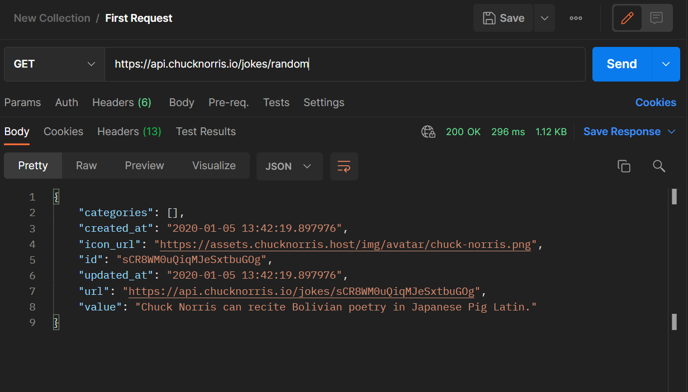

# Introduction to Postman
Postman is an API platform (or more precisely an API testing platform). Every stage in the API lifecycle i.e Creation, Publishing, Deprecation, Retiring is simplified with the help of Postman. Postman also makes collaboration a lot more easier with the help of Team Workspaces, and this enables rapid development of high quality APIs. With Postman, developers can check the behaviour of an application for a particular API [endpoint](https://searchapparchitecture.techtarget.com/definition/API-endpoint) therefore making it a very useful tool for development.
# Installation
Installation is pretty simple in Windows, Mac and Linux.

## Windows
Simply download the exe file from this [link](https://www.postman.com/downloads/) and double click it after the download is complete. Postman will be installed in your windows device.

## MacOS
Download the file from this [link](https://www.postman.com/downloads/) and unzip it. If prompted, move this file to the Applications folder so that future updates will be properly installed.

## Linux
Postman for Linux can be downloaded from the [Snap store](https://snapcraft.io/postman) or with the following command
```shell
snap install postman
```
Refer this [link](https://learning.postman.com/docs/getting-started/installation-and-updates/#installing-postman-on-linux) to manually install postman on a Linux device

# Usage
## Sending Requests
To get started with postman, let us send a request to the [Chuck Norris API](https://api.chucknorris.io/) and retrieve a fun fact related to Chuck Norris.

Once you open Postman, select the Workspaces tab, and click **+ New Workspace**





Name your workspace and set the visibility of your workspace to Personal so that it is only accessible by you. 





Once inside the workspace, let us create a collection. A collection contains a collection of requests with various HTTP request methods. 





Once the collection is created, you can rename it by clicking the three dots you see on the right end of the collection name, when you hover it. Now let us add a request. To add a request as well, you need to click the three dots at the right end and select Add Request. 





Once the request is created, you should be able to see a page like this. This is where you will be testing the Chuck Norris API. 


Populate the input field that says Enter request URL with this URL https://api.chucknorris.io/jokes/random (*You can get this URL from the Chuck Norris API homepage*). And hit send. You should be able to see the response body like this





The value property in the response body, is the Chuck Norris fact we are looking for. We can use this property's value in a suitable application. If you were to test an endpoint in an API you're designing, you would do a very similar process like the one we did.

By default the GET HTTP request method will be used while sending a request. You can also change the HTTP request method to other methods like POST, PUT, DELETE and so on.

This is a very basic usage of Postman. You can do a lot more with it like setting query parameters, add a request body, check headers,writing scripts (both pre request and post request), chaining requests and so on.

# Alternatives
Postman is arguably the best API testing platform in the market. But here are some alternatives:
- [Rapid API](https://rapidapi.com/products/api-testing/?utm_source=google&utm_medium=cpc&utm_campaign=Testing&utm_term=postman%20alternative_e&gclid=CjwKCAjw7--KBhAMEiwAxfpkWCzs854JkLN9RA3UKK8eU6oZEkWFq1tG-GsiAul-U8yukBtA1dPaEhoCUwEQAvD_BwE)
- [Insomnia](https://insomnia.rest/)
- [Paw](https://paw.cloud/)
- [SoapUI](https://www.soapui.org/)
  
# Additional Resources
- The [official documentation](https://learning.postman.com/docs/getting-started/introduction/) of Postman
- Take a look at the [Student Programs](https://www.postman.com/company/student-program/) offered by Postman and earn awesome badges on completing challenges.