# Creating Database in MongoDB

Hello all 👋,
In this topic I have tried to cover everything on What is MongoDB and how to create database and collections in MongoDB using Cli as well as Compass along with the Code Sample.

So let's start the learning and below is the Index for Topic Contents we are going to cover, also you can directly navigate to the specific topic by clicking on the URL.

| Index                                                                              |
| ---------------------------------------------------------------------------------- |
| [Introduction to MongoDB](#introduction-to-mongodb)                                |
| [MongoDB Installation guide](#mongodb-installation-guide)                          |
| [Introduction to Compass](#introduction-to-compass)                                |
| [Working with databse](#working-with-database)                                    |
| [Working with collections](#working-with-collections)                              |
| [Working with documents](#working-with-documents)                                  |
| [Conclusion](#conclusion)                                                          |

## Introduction to MongoDB

MongoDB is one of the most popular NoSQL database. It means it does not have table which are in relationship with each other. Ii is a document oriented NoSQL Database means data is stored in mongoDB in the form of documents. This format of storing data is called as BSON( similar to JSON format). It has it's own way of storing and retrieving from database.

Here is a sample of mongodb document structure
```
{
    "participant": "Pankaj Makhijani",
    "event": "GWOC",
    "topic": "Creating database in MongoDB",
    "date": "26-NOV-2021"
}
```

Here is a comparison between mongodb and RDBMS for better understanding


## MongoDB Installation guide

There are 2 ways of using mongoDB

1. Using MongoDB locally in our System
2. Using MongoDB Atlas(Database as a service offered by mongoDB)

◻ For using mongoDB locally
<br/>
◾ Download mongoDB community server from its official website.
<br/>
◾ After installation set the path of mongodb bin folder in your System environment variables.
<br/>
◾ To start the mongodb server locally type mongod.exe in powershell
<br/>
◾ To start the interactive shell interface for working with mongodb type mongo.exe (Now in powershell, you can run various commands to interact with mongoDB)
<br/>
◻ MongoDB compass
<br/>
◾ MongoDB compass is a GUI software offered by mongoDB for interacting with our Database easily. It can be used for running mongoDB locally and also with MongoDB Atlas.

## Introduction to Compass

MongoDB Compass is a powerful GUI for querying, aggregating, and analyzing your MongoDB data in a visual environment. Compass is free to use and source available, and can be run on macOS, Windows, and Linux.

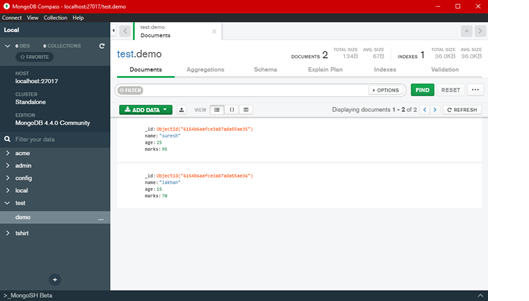

## Working with database

### Creating database using cli

◾ MongoDB use DATABASE_NAME  is used to create database. The command will create a new database if it doesn't exist, otherwise it will return the existing database.
<br/>
◾ If you want to check your databases list, use the command show dbs.
<br/>
◾ To check your currently selected database, use the command db.
<br/>
◾ MongoDB db.dropDatabase() command is used to drop a existing database.

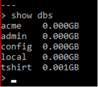
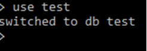
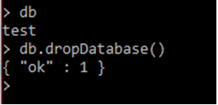

### Creating database using Compass

◾ In order to create database using compass firstly make sure you have successfully downloaded mongodb and compass.
<br/>
◾ Start your mongo server locally using cli(It will run on port no 27017 by default)
<br/>
◾ Open compass app and on the left side it will show localhost connection then click on it and then click connect it will open database page.
<br/>
◾ If localhost connection is not present on left column then in navbar click on connect and in connection string paste this connection string mongodb://localhost:27017/?readPreference=primary&appname=MongoDB%20Compass&ssl=false and click connect.
<br/>
◾ Click on create database button on the top of the page and enter database and collection name and click create.🎉 Wohoo! Your database is created successfully using mongoDB compass.
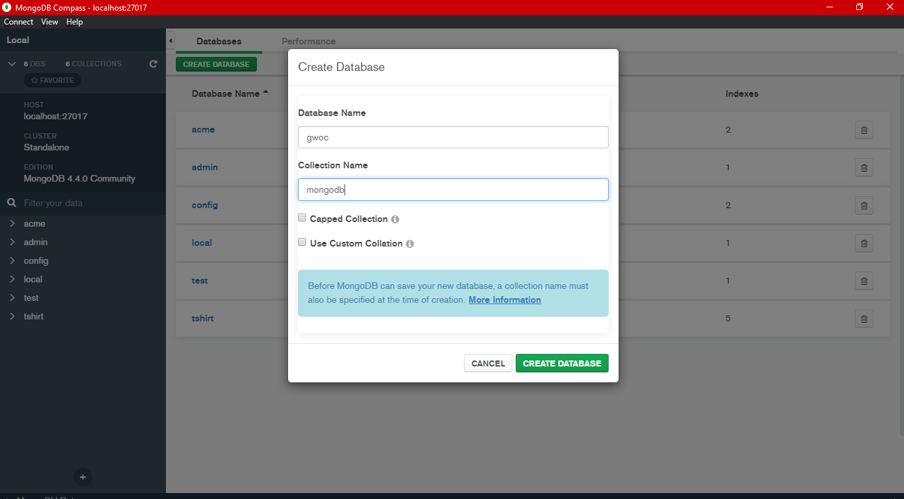

## Working with collections

◾ Collection is a group of MongoDB documents.
<br/>
◾ It is the equivalent of an RDBMS table.
<br/>
◾ A collection exists within a single database.
<br/>
◾ Collections do not enforce a schema.
<br/>
◾ Documents within a collection can have different fields.
<br/>
◾ Typically, all documents in a collection are of similar or related purpose.

Example of collections in mongodb
<br/>
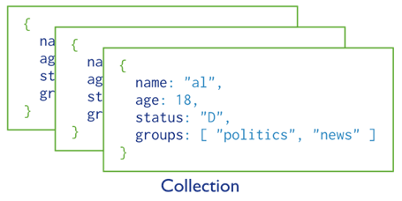

### Collection Commands

MongoDB db.createCollection(name, options) is used to create collection.
<br/>
You can check the created collection by using the command show collections.
<br/>
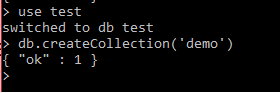
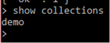
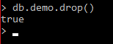

## Working with documents

### Creating documents

◾ To insert single record of data into your MongoDB collection, you can use insert() or insertOne() commands
<br/>
◾ To insert array of records you can use insertMany command., 

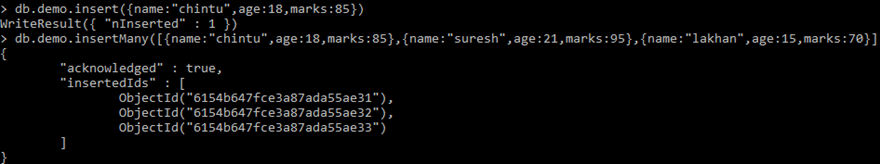

### Finding documents

◾ In order to get all documents in mongodb collection, use command db.COLLECTION_NAME.find()
<br/>
◾ In order to find only one document, use command db.COLLECTION_NAME.findOne()
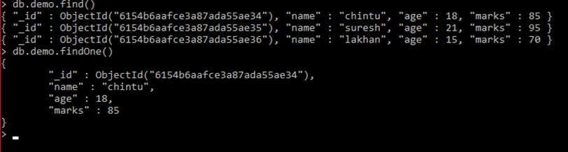

### Updating documents

◾ The “db.COLLECTION_NAME.update(SELECTION_CRITERIA, UPPDATED_DATA)” method updates the values in the existing document.
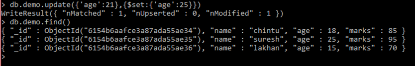

### Deleting documents

MongoDB remove() method is used to remove a document from the collection. remove() method accepts two parameters. One is deletion criteria and second is justOne flag.
<br/>
◾ deletion criteria − (Optional) deletion criteria according to documents will be removed.
<br/>
◾ justOne − (Optional) if set to true or 1, then remove only one document.
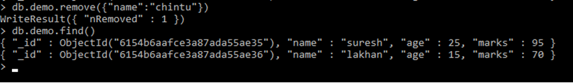

## Conclusion

So from this tutorial we have understood what is mongodb, how to create databse in mongodb and also how to perform various operations in mongodb using cli and mongoDB compass. I hope you enjoyed this tutorial and got your concepts clear.Thank you for reading 😊.
