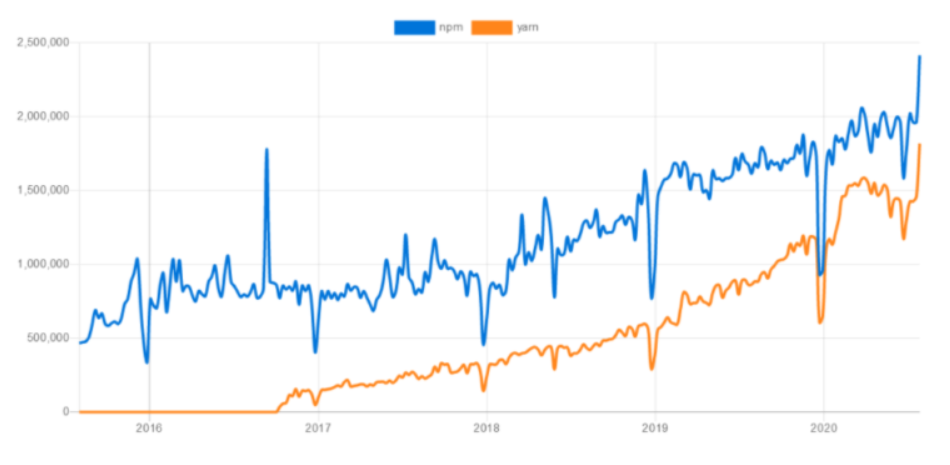

> # :arrow_down_small: **NPM v/s YARN**

Package managers like NPM and Yarn make it easier to handle a project's dependencies. A dependency is, as the name implies, anything on which a project relies, a piece of code that is required for the project to function properly. We require them because maintaining the project's dependencies is a challenging undertaking that quickly becomes laborious and out of hand as the project grows. Managing dependencies entails the inclusion, exclusion (or removal) and updating them. <br />

<br />

> ***[NPM](https://www.npmjs.com/) :***  
It is a package manager for the programming language _JavaScript_. It's the default package manager for Node.js, which is a JavaScript runtime environment, and is hence called **Node Package Manager (NPM)**. It consists of a command-line client, commonly known as `npm`, and the npm registry, an online database of public and paid-for private packages.  
<br />
It includes <span style="color: #DC143C">three</span> components: the website, which allows you to manage various aspects of your npm experience, the Command Line Interface (CLI), which allows you to interact with npm via the terminal, and the registry, which gives you access to a large public database of JavaScript applications.

<br />

> ***[YARN](https://classic.yarnpkg.com/en/) :***  
**Yet Another Resource Negotiator**, or `yarn`, is a package manager similar to npm. It was created by _Facebook_ and is now available as open-source software. The goal of yarn development at the time was to address performance and security issues with npm.  
<br />
This package manager was made in the year 2016, primarily to overcome certain shortcomings of npm. Since then, npm has undergone a number of enhancements in order to address some of its inefficiencies. As a result, npm and Yarn are now in a head-to-head battle to see who can outperform the other.  
<br />
Yarn 2 was published in January 2020 by the main team behind its development in an attempt to take Yarn to the next level. While Yarn 2 has various enhancements, it has been widely ridiculed by the developer community, and even Facebook developers have publicly said that they would not be utilizing it. AS a result, yarn 2 was stepped back down to yarn.

<br />

# :arrow_down_small: Let's begin comparing!

While comparing these two package managers, the most common question that arises is:

> ## <span style="color: #DC143C">Which one should be used?</span>
>
> Well, to answer this question, let's look at a graphical representation of the popularity comparison of npm and yarn in the market.  

<br />



To explain the various differences between the two, we will take a look at: <br />
1. Syntactical Differences
2. Technical Differences

<br />

> # 1. Syntactical Differences

## <span style="color: #26ABFF">1.1 Installation:</span>

<br />

- **npm:** npm comes with Node installed by _default_.
- **yarn:** npm needs to be installed for yarn to be installed. In other words, npm is a _dependency_ for yarn.

```
npm install yarn --global
```

<br />


## <span style="color: #26ABFF">1.2 The lock file:</span>

<br />

- **npm:** NPM creates a file called <span style="color: #DC143C"> _package-lock.json_</span>. Because of a trade-off between determinism and simplicity, the package-lock.json file is a little more complicated. Package-lock will build the same node modules folder for multiple npm versions due to this complication. In the package-lock file, each dependency will be assigned an accurate version number.

- **yarn:** Yarn produces a script called <span style="color: #DC143C"> _yarn.lock_</span>. Yarn lock files make merging easier. Because of the lock file's design, the merges are also predictable.

<br />

## <span style="color: #26ABFF">1.3 Output log:</span>

<br />

- **install:** The npm generates a huge chunk of output logs when you run npm instructions. It's essentially a dump of what npm is doing in terms of stack traces.

- **add:** The yarn output logs are clean, easily identifiable, and short. They're also arranged in a tree format to make things easier to understand.

<br />

## <span style="color: #26ABFF">1.4 Installing global dependencies:</span>

<br />

- **npm:** The command to run to install all global dependencies is
```
npm install -g <package_name>@<version_number>
```

- **yarn:** The command to run to install all global dependencies is
```
yarn global add <package_name>@<version_number>
```

<br />

## <span style="color: #26ABFF">1.5 The _'why'_ command:</span>

<br />

- **npm:** npm does not currently have a built-in ‘why' functionality.

- **yarn:** The ‘why' command in Yarn explains why a dependency is there in the project. It could be a dependence, a native module, or a project dependency, for example.

<br />

## <span style="color: #26ABFF">1.6 License checker:</span>

<br />

- **npm:** Due to installed dependencies, npm lacks a license checker that can provide a concise explanation of all the licenses that a project is bound with.

- **yarn:** To run yarn's clean and efficent license checker, enter the following command
```
yarn licenses list
```

<br />

## <span style="color: #26ABFF">1.7 Fetching packages:</span>

<br />

- **npm:** All the `required` dependencies are fetched from the npm registry by running the following command
```
npm install
```

- **yarn:** Unlike npm, the dependencies of yarn are stored locally on a disk, and are fetched upon request using the following command
```
yarn add
```

<br />

## <span style="color: #26ABFF">1.8 Altered commands:</span>

<br />

These are all the commands where, other than `npm` & `yarn` the _action command_ (eg: `install` in npm and `add` in yarn) is different in both the cases.

| *COMMAND* | *NPM* | *YARN* |
|---------|-----|------|
| Install dependencies | `npm install` | `yarn` |
| Install package | 	`npm install package_name` <br /> `npm install` <br /> `package_name@version_number` | `yarn add package_name`<br /> `yarn add` <br /> `package_name@version_number` |
| Uninstall package | `npm uninstall package_name` | `yarn remove package_name` |
| Install dev package | `npm install package_name –save-dev` | `yarn add package_name –dev` |
| Update dev package | `npm update package_name` <br /> `npm update` <br/> `package_name@version_number` | `yarn upgrade package_name` <br /> `yarn upgrade` <br /> `package_name@version_number` |
| View package | `npm view package_name` | `yarn info package_name` |
| Global install package | `npm install -g package_name` | `yarn global add package_name` |

<br />

## <span style="color: #26ABFF">1.9 Same commands:</span>

<br />

These are all the commands where other than the keyword `npm` & `yarn` everything is the same.

| *NPM* | *YARN* |
| ----- | ------ |
| `npm init` | `yarn init` |
| `npm run [script]` | `yarn run [script]` |
| `npm list` | `yarn list` |
| `npm test` | `yarn test` |
| `npm link` | `yarn link` |
| `npm login or logout` | `yarn login or logout` |
| `npm publish` | `yarn publish` |

<br />

> # 2. Technical Differences

## <span style="color: #26ABFF">2.1 Performance:</span>

<br />

When dealing with a large number of packages, the performance of your package management is crucial. Because development is time-consuming, you'll need a lightweight tool that won't slow you down.

As previously stated, one of the primary motivations for the creation of Yarn was to address the performance difficulties with npm. So, in terms of performance, Yarn was the clear winner at first.

However, in recent versions, particularly v5 and v6, npm has made significant progress in closing the gap with Yarn. While Yarn is still the fastest option in most circumstances, npm is swiftly catching up.

The speed of these two stacks has been compared in several benchmark tests. For instance, the following table shows the findings of one test that examined the performance of installing several minor dependencies under various conditions:

<br />

|     | No Cache | Cached | Reinstalled |
|:---:|  :----:   | :----: |   :----:   |
| **Npm 6.13.4** | `67 seconds` | `61 seconds` | `28 seconds` |
| **Yarn 1.21.1** | `57 seconds` | `29 seconds` | `1.2 seconds` |

<br />

Yarn clearly outperformed npm in terms of performance speed, as shown above. In contrast to npm, which installs each package individually, Yarn installs several packages at once throughout the installation process.

When using Yarn, reinstallation was likewise a breeze. It's because of its offline mode, which employs a caching mechanism to speed up the download of previously downloaded files. While npm also has a cache feature, it appears that Yarn's is significantly superior.

<br />

## <span style="color: #26ABFF">2.2 Security:</span>

<br />

When comparing Yarn vs npm, security is another major point of dispute. While Yarn was once thought to be more safe, the npm team has made impressive comebacks by introducing important security improvements.

Security is built-in to npm v6. If you try to install code that has a known security vulnerability, npm will provide an automatic warning. In addition, a new command called <span style="color: #DC143C">npm audit</span> has been added to help you recursively check your dependency tree for irregularities.

Some of Yarn's fascinating security features, on the other hand, include employing checksums to ensure the integrity of every package and the ability to check the licensing of your installed packages.

<br />

## <span style="color: #26ABFF">2.3 Updating:</span>

<br />

Upgrading to the most recent package version is comparable in both tools, albeit there are some CLI command variations.

- **NPM Dependencies**
```
npm update
```
```
npm update [package-name]
```

- **YARN Dependencies**
```
yarn upgrade
```
```
yarn upgrade [package-name]
```
If you don't specify a package name in either tool, all of the project's dependencies will be upgraded to the most recent version. The version ranges given in the <span style="color: #DC143C">package.json</span> file will be used. Depending on the tool you're using, the <span style="color: #DC143C">package-lock.json</span> or <span style="color: #DC143C">yarn.lock</span> files will also be changed.

If you specify a package name, on the other hand, only that package will be updated.

<br />

# :arrow_down_small: Conclusion

> :heavy_check_mark: Yarn and npm are both useful tools for keeping track of your project's dependencies. While npm was the first to be introduced, Yarn has swiftly acquired popularity in the JavaScript community.
>
> :heavy_check_mark: Yarn took a lot of cues from npm, especially in terms of exploiting its flaws to design a package management system that developers would adore. Similarly, the core team of npm has continued to retaliate with each new release, improving its capabilities to satisfy the needs of developers.
>
> :heavy_check_mark: As a result, we can observe that the two package managers are currently approaching feature parity in terms of functionality. Nonetheless, there are a few twists and turns that may influence your decision.
>
> :heavy_check_mark: **`In the end, the decision between npm and Yarn will be based on one's  requirements, comfort, and preferences.`**