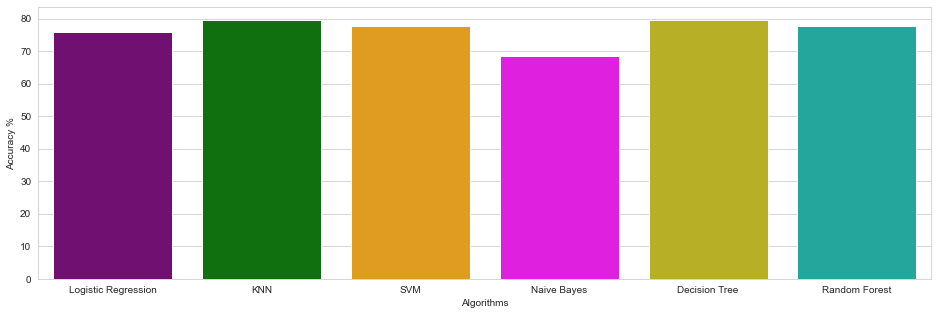

# Project Title : Heart Disease Prediction

## Abstract/Brief Description about the Project :
We have a data which classified if patients have heart disease or not according to features in it. We will try to use this data to create a model which tries predict if a patient has this disease or not. We will use multiple algorithms and the will decide the best algorithm that fits to the data.

I have also tried logistic Regression from scratch which shows pretty good results and then I have tried the inbuilt sklearn algorithms.

## Dataset :
The dataset which is used here, is collected from Kaggle website. 

Dataset : https://www.kaggle.com/rishidamarla/heart-disease-prediction

## Goal/Aim of the project :
The goal of this project is to analyse if the patient is suffering from any heart problem and build a classification model accordingly.

## Libraries used :
- Numpy
- Pandas
- Matplotlib
- Sklearn
- Seaborn

## Model comparison :

|Models|Accuray percentage on Train Data|
|-|-|
|Logistic Regression|75.93 %|
|KNN|79.63 %|
|SVC|77.78 %|
|Naive Bayes Algorithm|68.52 %|
|Decision Trees|79.63 %|
|RandomForest|77.78 %|

## Conclusion and Discussion :
Though accuracy is not the only metrics to judge a model. We can conclude the following observations about each classifier on the given dataset as follows:

Therefore, we saw that **Decision Trees** and **KNN** gave us the best results with theaccuracy of **79.63%**.  
While, 
- accuracy of **Support Vector Machine Algorithm** was **77.78%**  
- accuracy of **Sklearn Logistic Regression** was **75.93%**  
- accuracy of **Naive Bayes Classifier** was **68.52%**  

**********************************************************************
**GirlScript Winter of Contributions 2021**