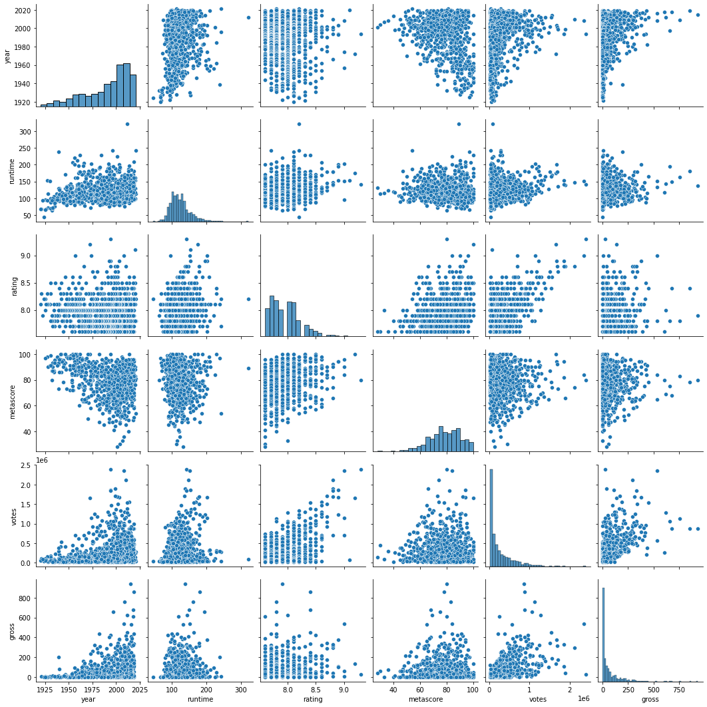
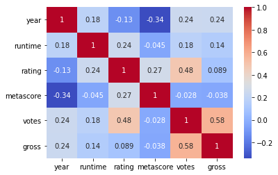
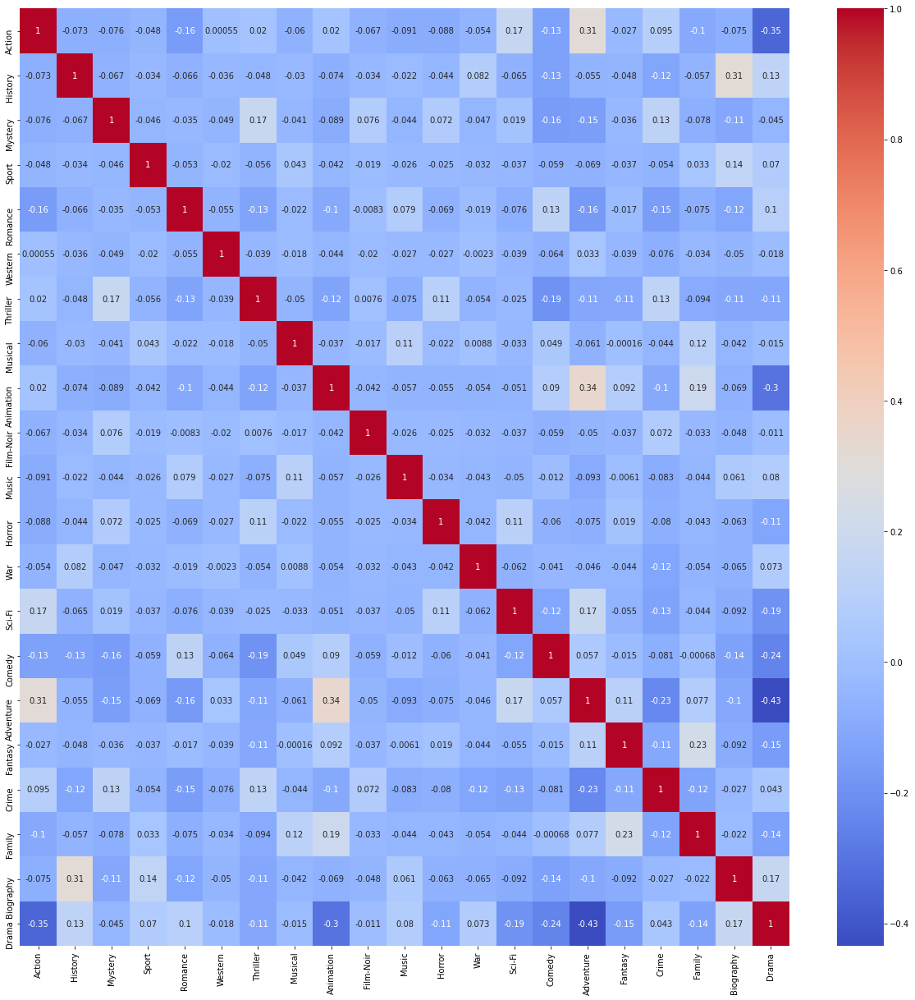

# Airbnb Price Prediction
IMDb is the world’s most popular and authoritative source for movie, TV, and celebrity content. IMDb users often look at ratings to get an idea of how good movies are, so that they can decide what movies to watch or which ones to prioritize. However, movies that are not yet released don’t have ratings, and even the ones with few votes often change as more users vote. Therefore, I wrote code to predict IMDb ratings of new movies based on various features, such as budget, actors, directors, writers, release year, genres, and plot. While others have used linear regressions to predict ratings of movies in general, those predictions rely on features like movie earnings or number of votes, which would not be available for new movies. I instead implemented two more algorithms to test the predictions and its accuracy.

## Dataset
The dataset which is used here, is collected from Kaggle website. Here is the link of the dataset : https://www.kaggle.com/preetviradiya/imdb-movies-ratings-details.

## Goal
The goal of this project is to make a prediction model which will predict the rating of the movies using different parameters.
***************************************

## What have I done?
1. Importing all the required libraries. Check [`requirements.txt`](../requirements.txt).
2. Upload the dataset and the Jupyter Notebook file.
3. Exploratory Data Analysis
4. Data Processing
5. Prediction Models
    - Linear Regression
    - Polynomial Regression
    - Random Forest
    - SVR
8. Validation Process
9. Conclusion

********************************
## Libraries used
1. Numpy
2. Pandas
3. Matplotlib
4. Sklearn
5. Seaborn

**********************************
## Exploratory Data Analysis
1. **Correlation between numerical parameters**

2. **Confusion matrix between numerical parmameters**

3. **Confusion matrix after feature engineering**

**************************************
## Model comparison
Here I have deployed four algorithms to deploy the models, now let's check the accuracy scores for these models.

|Models|Accuray Score|
|-|-|
|Linear Regression|0.49|
|Polynomial Regression|0.69|
|Random Forest Regression|0.93|
|SVR|0.59|
***************************************
## Conclusion
* Here I have applied four different algorithms.
* But the Random Forest Regressor stand out to be the best model among all those implemented models based on the accuracy scores.
* So, for this project, the best model is only **Random forest regressor** without any kind of transformation or stacked regression.