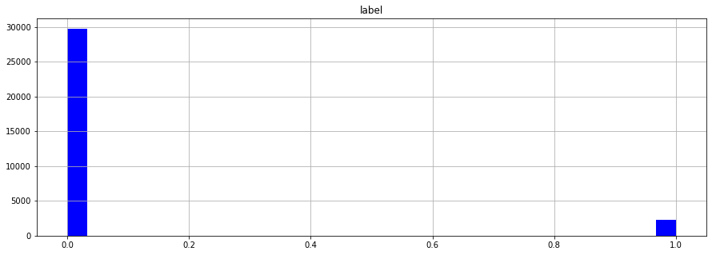
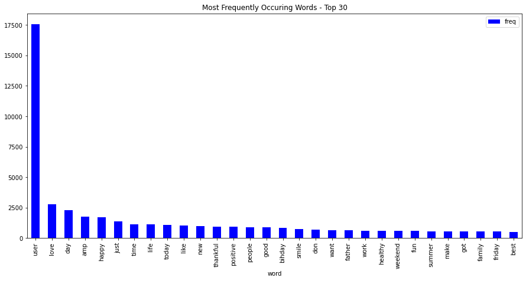
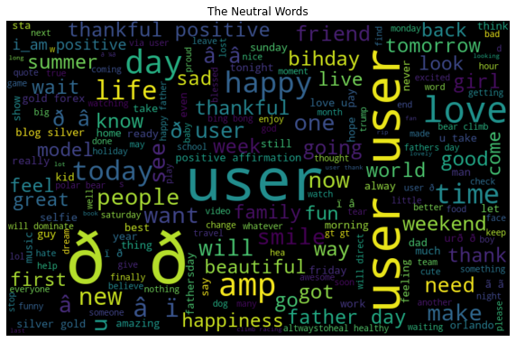
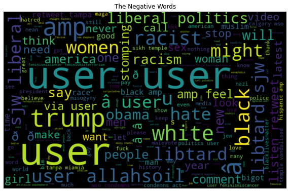
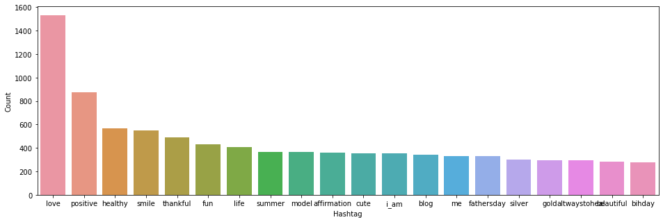
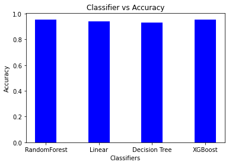

#  Sentiment Analysis on Twitter Data
Sentiment analysis refers to identifying as well as classifying the sentiments that are expressed in the text source. Tweets are often useful in generating a vast amount of sentiment data upon analysis. These data are useful in understanding the opinion of the people about a variety of topics. Twitter is one of the social media that is gaining popularity. Twitter offers organizations a fast and effective way to analyze customers’ perspectives toward the critical to success in the market place. Developing a program for sentiment analysis is an approach to be used to computationally measure customers’ perceptions.

##  Dataset

The dataset which is used here, is collected from Kaggle website. Here is the link of the dataset : [https://www.kaggle.com/arkhoshghalb/twitter-sentiment-analysis-hatred-speech](https://www.kaggle.com/arkhoshghalb/twitter-sentiment-analysis-hatred-speech).

##  Goal

The goal of this project is to detect hate speech in tweets using various prediction models. We say a tweet contains hate speech if it has a racist or sexist sentiment associated with it. So, the task is to classify racist or sexist tweets from other tweets.

***************************************

##  What have I done?

1. Importing all the required libraries. Check [`requirements.txt`](../requirements.txt).

2. Upload the dataset and the Jupyter Notebook file.

3. Exploratory Data Analysis

4. Data Processing

5. Prediction Models
    - RandomForest Classifier
    - Linear Regression
    - Decision Tree classifier
    - XGBoost Classifier

6.  Model Comparison

7. Conclusion

********************************

##  Libraries used

1. Numpy

2. Pandas

3. Matplotlib

4. Sklearn

5. Seaborn

6. nltk

7. wordcloud

**********************************

##  Exploratory Data Analysis
1. **Correlation between numerical parameters**

2. **Most frequently occuring words**

3. **Wordclouds generated for Neutral words and Negative Words**

  

4. **Collecting most used hashtags**

**************************************

##  Model comparison

Here I have deployed four algorithms to deploy the models, now let's check the accuracy scores for these models.

|Models|Accuray Score|f1-score|
|-|-|-|
|RandomForest|0.95|0.61|
|Linear Regression|0.94|0.59|
|Decision Tree|0.93|0.54|
|XGBoost|0.95|0.57|

Here is the Accuracy vs Classifier graph :

***************************************

##  Conclusion

* Here I have applied four different algorithms on the twitter dataset.

* We find that XGBoost and RandomForest both have same accuracy score but f1-score of Random Forest model is better.

* So the Random Forest Regressor stand out to be the best model among all those implemented models based on the accuracy scores along with f1 scores.

* So, for this project, the best model is only **Random forest regressor** without any kind of transformation or stacked regression.
