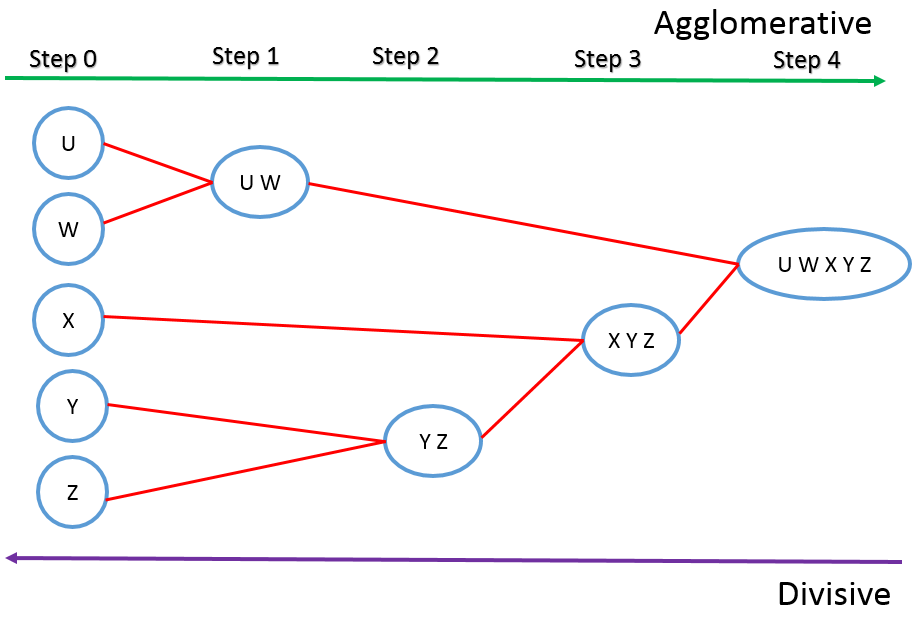
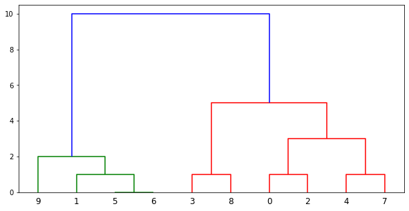

## Hierarchical Clustering
----
## What is Clustering? 
1) Clustering is techinque used to group data with similar characteristics from a group of large, unlabeled data. 
2) It divides the data set in small groups known as clusters, hence making it easy to process large, complex datasets. 

## What is Hierarchical Clustering 
1) Hierarchical Clustering is an unsupervised machine learning clustering techinque to group similar data. 
2) As the name suggests, it creates clusters but links them together in the form of a hierarchy or a tree-like structure. 
3) The root node of this tree symbolizes the whole dataset whereas branches created from this root node signifies the clusters(subsets of the dataset having similar        properties). 
4) This hierarchical or tree-like structure is known as a Dendrogram. 
5) Hierarchical Clustering technique is also known as Hierarchical Cluster Analysis or HCA. 
## Types of Hierarchical Clustering 
1) Agglomerative Hierarchical Clustering 
2) Divisive Hierarchical Clustering 

## Agglomerative Hierarchical Clustering 
### Definition and Working 
1) It is the most common type of Hierarchical Clustering and is widely used. 
2) It is created using the bottom-up approach; which means each separate value in the data set(data points) is counted as its own cluster at the start,but pairs of similar clusters with common attributes is then linked/ merged when one moves up in the Dendrogram.  
For example,in the above diagram- 
a) Elements are first grouped individually. 
b) If two individuals have same properties/attributes they are then grouped together. 
c) In the further steps we then have to calculate the closest distance(most similar) between two clusters to merge them together. 
d) At the end we get one full dataset containing all the merged clusters. 
## Divisive Hierarchical Clustering
### Definition and Working
1) Divisive Hierarchical Clustering is the opposite of Agglomerative Hierarchical Clustering. 
2) It follows a top-down clustering approach.  
For example in the above diagram- 
a) All data points are initially grouped together in one cluster. 
b) Gradually we separate the dissimilar data points as we move down the Dendrogram. 
c) This process is done recursively till we get the desired number of clusters we want.
## Measuring Similarities/Dissimilarities of Data Points.
To measure the closest distance between two clusters to be able to merge/ separate them, we use methods known as linkage methods. These methods decide the rule for clustering.Some popular linkage methods are : 
1) Minimum/Single Linkage- It signifies the shortest distance between the closest points of the clusters. 
2) Maximum/Complete Linkage- It is the farthest distance between the two points of two different clusters.It is more efficient as it forms tight clusters. 
3) Mean/Average Linkage- As the name suggests, each pair of datasets are added and divided by the total number of datasets to calculate mean between the clusters. 
4) Centroid Linkage- Here, the distance between two clusters is the calculated by measuring the distance between the two mean vectors of the clusters.  
## Sample Code Implementataion of Hierarchical Clustering 
1) 
&emsp;&emsp;&emsp;from scipy.cluster.hierarchy import dendrogram, linkage 
&emsp;&emsp;&emsp;from matplotlib import pyplot as plt 
&emsp;&emsp;&emsp;X = [[i] for i in [1, 9, 0, 5, 2, 8, 8, 3, 4, 10]] 
 
Here we use SciPy which is a computation library that supports various mathematical functions.We then define a variable X that holds 10 data points to be clustered.
  
2) 
&emsp;&emsp;&emsp;Z = linkage(X, 'complete') 
&emsp;&emsp;&emsp;fig = plt.figure(figsize=(10, 5)) 
&emsp;&emsp;&emsp;dn = dendrogram(Z)  
We use the linkage() supported by SciPy that takes two parameters the dataset containing the data points and the type of linkage we want to use in the program.Here we have used 'complete' linkage but it can be replaced by other types like- 'single','complete','average'.  
3) **OUTPUT :**  

 
## Advantages of Hierarchical Clustering
1) By using Hierarchical Clustering we get a tree/Dendrogram like structure which is easy to read, analyze and interpret. 
2) It offers clarity and helps us understand the actual dataset content. 
3) It also helps us in predicting what the future contents could be after seeing the Dendrogram. 
## Disadvantages of Hierarchical Clustering
1) Once the data points are assigned to a cluster, they cannot be moved around or changed easily. 
2) Large data sets can give a big time complexity when Hierarchical Clustering is used. 
3) The order of the	data impacts the final result and it is very sensitive to noise and outliers. 
## References
1) https://www.javatpoint.com/clustering-in-machine-learning
2) https://www.mygreatlearning.com/blog/hierarchical-clustering/
