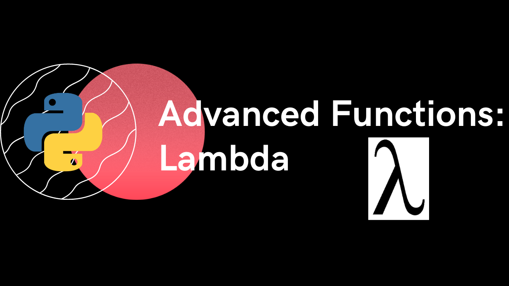

")

<h1>Advanced Python Functions: Lambda - Video</h1>
<h2>1. Introduction</h2>

> Definition

> General Syntax

> Parts

> Difference

<h2>2. Usage</h2>

> When to Use

> When not to Use

<h2>3. Use Case</h2>

> Filter Functions

> Map Functions

> Reduce Functions

<h2>4. Other Applications</h2>
