# Decorators in Python - Documentation

## Outline of Topics covered:
Elaborated the use and code snippets for Decorators in Python in this [Python notebook](decorators.ipynb).
* What are decorators?
* How and Why do they work?
* Decorating functions with parameters (using `*args` and `**kwargs`)
* Chaining Decorators in Python
* Decorator with arguments (decorator factory)
* Decorator class
* Decorating Class Methods

## Summary of Topics Covered
* **What are decorators?** 
A function that takes a function as a parameter and returns an augmented/modified/decorated function is called a decorator in Python.  
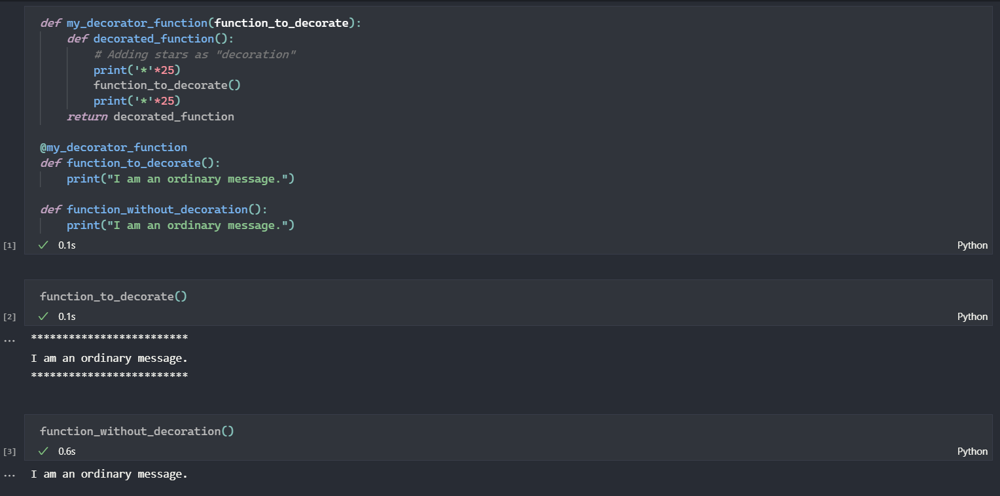 
Decorators allow the user to perform **metaprogramming** i.e. the concept when a part of the program tries to modify another part of the program at compile time.  
* **How and Why do they work?** 
Since in Python everything is an object. It is possible to pass function as argument in another function and thus it can be modified/decorated. It should also be considered that a function can create a function within itself and also return a function. This allows the basic functionality of decorators to exist.
    - Functions can be assigned as normal objects: 
    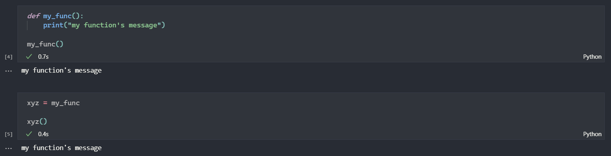 
    - Functions can be passed as arguments to other functions since they are basically objects in Python. 
    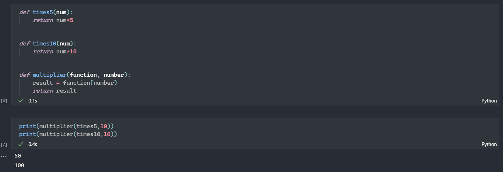 
    - Functions can create another functions within themselves and even return a function. 
    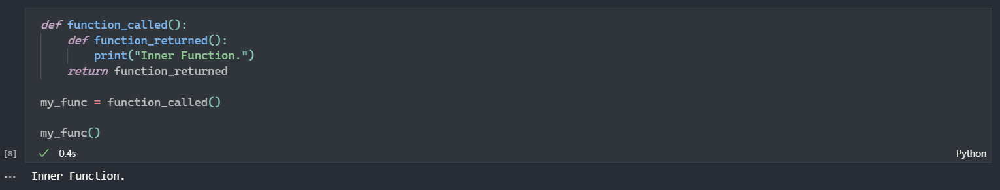 

    These are all the "prerequisites" we have to keep in mind to understand the hows and whys of Decorators. Additionally, the concept of Closures in Python should also be known.   
* **Decorating functions with parameters (using `*args` and `**kwargs`)** 
A mismatch in no. of positional arguments may result in a decorator to fail in decorating another function. This can be prevented by using `*args` and `**kwargs`. 
Let's consider a simple decorator with 0 positional arguments.
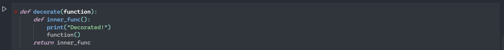 
This decorator will be able to decorate a similar function i.e. a function with 0 positional arguments but not the one with anything not 0.
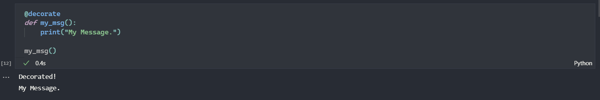 
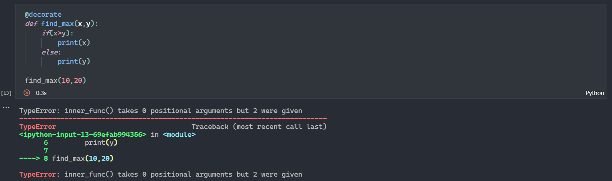 
A solution for this problem is to re-define the decorator with 2 arguments: 
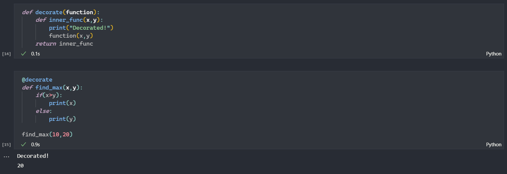 
but the problem here is that again it will not be able to decorate other functions with mismatch number of arguments.
 
The perfect solution is to make use of `*args` and `**kwargs` which allows us to pass a variable number of arguments to a function.
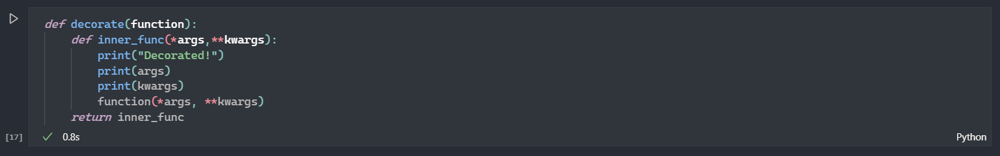 
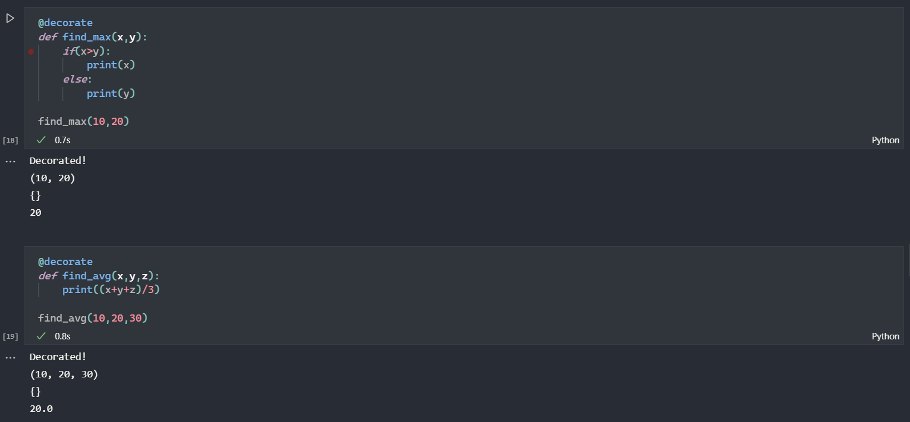  
* **Chaining Decorators in Python** 
Multiple decorators can be chained in Python i.e. a function can be decorated multiple times with different or same decorators by simply placing the decorators above the desired function.  
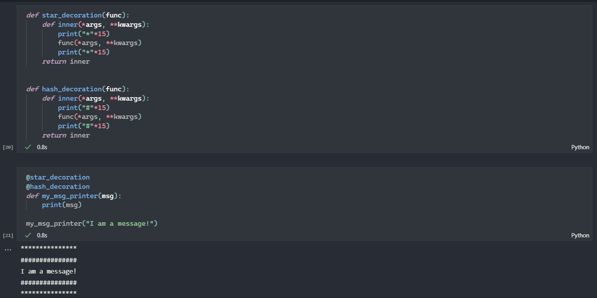  
* **Decorator with arguments (decorator factory)** 
A decorator takes just one argument i.e. the function to be decorated and there is no way to pass other arguments. However it can be made possible by creating a function which takes arbitrary arguments and returns a decorator.
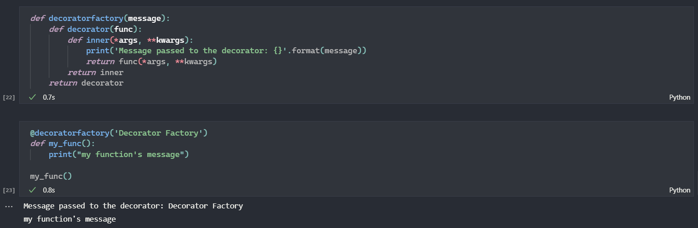  
* **Decorator class** 
Just like a decorator function we can have a decorator class, it works the same way as the decorator function with some minor changes in the syntax and using `__call__()` method.
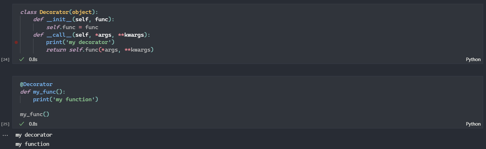  
* **Decorating Class Methods** 
For using decorators on class methods an additional `__get__()` method is defined.
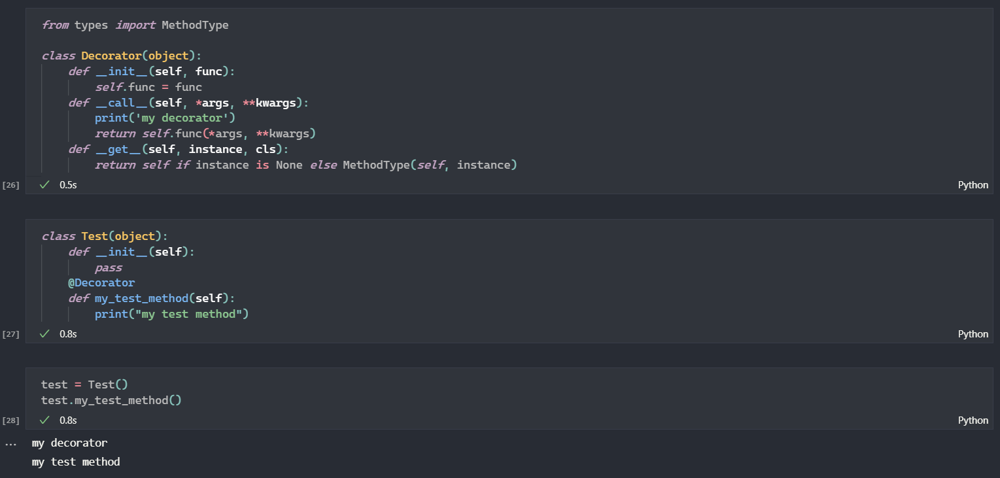  

## Resources refered:
- [Decorators in Python - GFG](https://www.geeksforgeeks.org/decorators-in-python/)
- [Class as decorator in Python - GFG](https://www.geeksforgeeks.org/class-as-decorator-in-python/)