# Web Framework - Flask

## **Outline of Topics covered:**
Elaborated the use and code snippets for Decorators in Python in this [Python notebook](flask.ipynb).
* Introduction
    * Why use a Web Framework?
    * About Flask
* Installation
    * Setting Up Virtual Environment
    * Flask Installation using pip
* Creating a Minimal App
* Files and Templates
* URL Routing
* Jinja Templating
* HTTPS Methods
* The Request Object

## **Summary of Topics covered:**
## Introduction
There are several modules or frameworks avaliable which allow us to build webpages using python. The most prominent ones are - Django and Flask. While Django being easy to use, Flask provides versatility and more control over your code.<br><br>
**Why use a Web Framework?**
<br>&emsp;Web Frameworks are popular because they simplify the development process. They are easy to code and have features like:
- multiple database support,
- provision of static and dynamic templates,
- user management (add/modify/delete users),
- easy URL mapping, and
- easy debugging,

**About Flask**
<br>&emsp;Flask is micro-framework which primarily depends on the Jinja template engine and the Werkzeug WSGI toolkit.
- [Jinja2](https://jinja.palletsprojects.com/) is templating engine for Python which allows the user to create dynamic web pages by combining a template with a certain data source.
- [Werkzeug](https://werkzeug.palletsprojects.com/) is a WSGI toolkit which implements requests, response objects along with other several utility functions.

(Click on the titles to reach the official documentation of the respective dependencies)

&emsp;Flask can be used to create simple content sites like blogs, deploy ML models, create APIs, etc. However since it is a lightweight framework it's not recommended to build a bulky and heavy load web application with it.

&emsp;Although with Flask and its various features a developer can create almost anything.&#128521;

## Installation:
**Python :**
<br>&emsp;Latest version is recommended (Python 3.6 and newer)<br>
**Dependencies :**
<br>&emsp;All these dependencies are automatically installed along with Flask during its installation.
- [Werkzeug](https://palletsprojects.com/p/werkzeug/) - a WSGI toolkit which implements requests, response objects along with other several utility functions.
- [Jinja](https://palletsprojects.com/p/jinja/) - a templating engine for Python which allows the user to create dynamic web pages.
- [MarkupSafe](https://palletsprojects.com/p/markupsafe/) - escapes untrusted input when rendering templates to avoid injection attacks. It comes with Jinja.
- [ItsDangerous](https://palletsprojects.com/p/itsdangerous/) - for security to protect Flask’s session cookie.
- [Click](https://palletsprojects.com/p/click/) - a framework for writing CLI apps.

&emsp;(Click on the titles to reach the official documentation of the respective dependencies)

### Setting up the Virtual Environment
&emsp;In order to avoid compatibility issues between the different versions of the libraries we must install ```virtualenv``` and create a separate Python environment for Flask installation.

1. Install ```virtualenv``` by running the following command in the terminal -
    ```
    ~$ pip install virtualenv
    ```
2. Create a virtual environment by running the following command -
    ```
    ~$ python3 -m venv myenv
    ```
3. Activate the virtual environment by -

    Windows:
    ```
    $ myenv\Scripts\activate.bat
    ```
    macOS/Linux:
    ```
    $ . myenv/bin/activate
    ```
4. Install ```Flask``` -
    ```
    $ pip install Flask
    ```

The above process can also be managed through a GUI alternative. We can install [Anaconda](https://www.anaconda.com/products/individual) which allows the developer to manage virtual environments, library packages, IDEs and other Python related software packages.<br><br>

## Setting Up a Minimal Application
&emsp;Let's see how can we setup a minimal web-app that displays the first words a program learns... ```Hello World!```.
1. Create a project directory.
    ```
    (myenv)$ mkdir my_flask_app
    (myenv)$ cd my_flask_app
    ```
2. Create a python file and copy the below starter given code -
    ```
    # Importing flask module
    from flask import Flask

    app = Flask(__name__)

    # Setting URL route
    @app.route('/')
    def hello_world():
        return 'Hello World'

    # driver function
    if __name__ == '__main__':
        # run() method of Flask class is used to run the application on the local development server (by default).
        app.run(debug=True)
    ```
    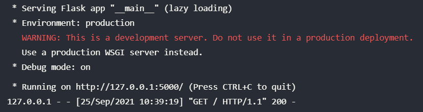<br>
    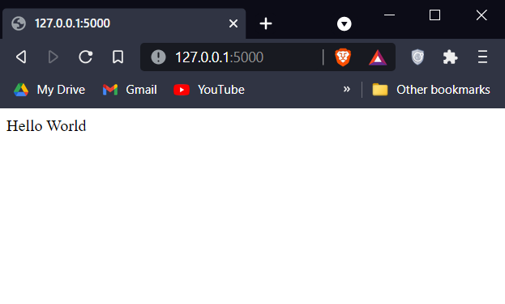<br>

&emsp;Let's now understand the above code:
1. First we import the flask module to get the Flask class.
2. We intialize our app using the Flask constructor which takes the current module as argument.
3. We setup the route using ```route()``` method which is a decorator in the Flask class. It tells the app which URL should call the associated function.
4. We create simple ```hello_world()``` method that returns our message.
5. We create a driver method that runs our app on the local development server in debug mode.

### Changing Host and Port for the Development Server:
&emsp;We can also change the host and port of our development server by simply passing them as arguments in the ```run()``` method as shown below:
    
    if __name__ == '__main__':
        app.run(host='0.0.0.0', port=8000, debug=True)

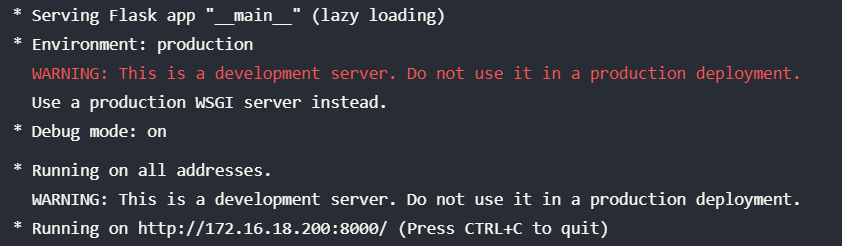<br>
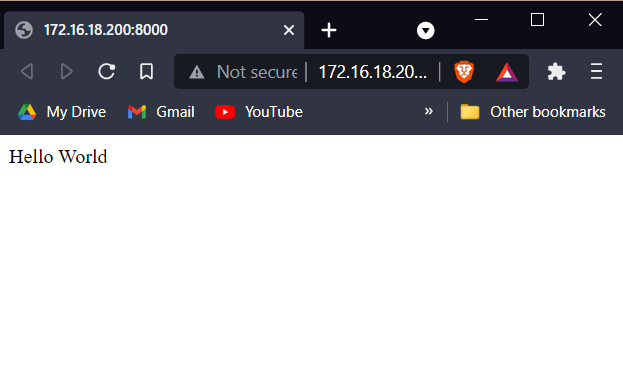<br><br>

## Files and Templates
&emsp;Now since we are dealing with Web-Apps, it is about time we have to understand how to work with HTML. One way to do it is -

    from flask import Flask

    app = Flask(__name__)

    @app.route('/')
    def hello_world():
        return "<h1>Hello World! using HTML</h1>"

    if __name__ == '__main__':
        app.run(debug=True)

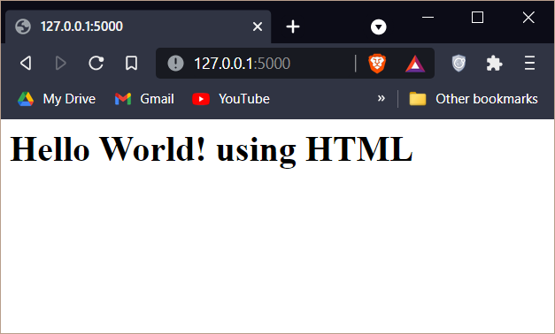<br>

&emsp;Although this works, this isn't the best practice. The best practice is to separate the templates and statics i.e. the HTML, CSS & JS from the Python file. Inorder to do this we create a templates folder which will contain all the HTML files and a static folder which will contain all the static files like CSS, JS, images, etc.
To ensure our application can find these files we must organize our directory in the following format:
```
- app.py
/templates
    - index.html
/static
    /styles
        - style.css
    /scripts
        - script.js
    /images
        - image.png
```
Failure to do so might lead to errors since the app won't be able to locate the files.

Now let's see how to use the templates:
<br>&emsp; We will make use of the ```render_template()``` method in Flask.

    from flask import Flask, render_template

    app = Flask(__name__)

    @app.route('/')
    def hello_world():
        return render_template('index.html')

    if __name__ == '__main__':
        app.run(debug=True)

<br>

**After adding static files:** (Code in [index.html](templates/index.html))

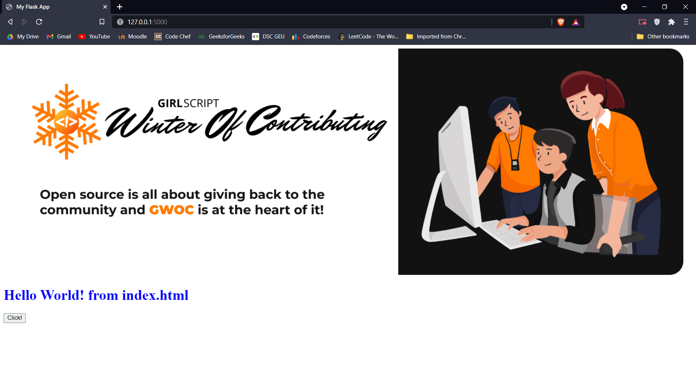<br>

Notice how we didn't have to provide the whole address of the index.html file. This is because flask knows it has to search the templates folder to get the file. This is why it is important to follow the above directory format.<br><br>

## URL Routing
&emsp;With Flask, URL routing is traditionally done using decorators. These decorators can be used for static routing, as
well as routing URLs with parameters.

**Static Routing**

    @app.route("/")
    def index():
        return "You are at the homepage (localhost:5000)"

    @app.route("/about")
    def about():
        return "You are at the about page (localhost:5000/about)"

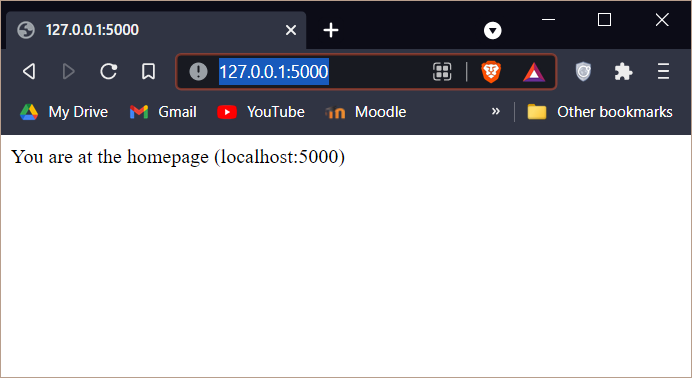<br>
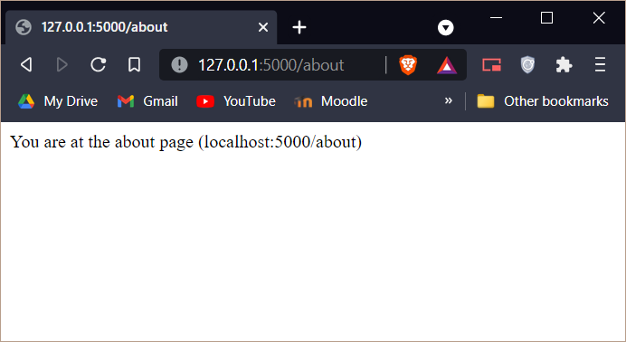<br>


**Dynamic Routing**

    @app.route("/users/<username>")
    def profile(username):
        return "Welcome to the profile of " + username

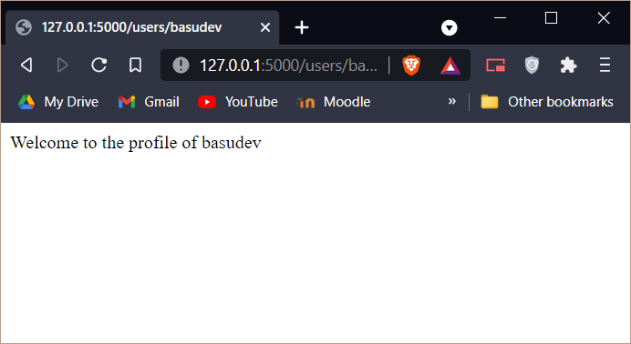<br><br>

## Jinja Templating
&emsp;Flask uses Jinja Templating to allow small snippets of code to be used in the HTML file such as conditionals or loops, etc. The following delimiters are used for different interpretations:
- `````` denotes a statement
- ```{{ ... }}``` denotes an expression where a template is outputted
- ```{# ... #}``` denotes a comment (not included in template output)
- ```{# ... ##``` implies the rest of the line should be interpreted as a statement

    ```
    from datetime import datetime

    login_time = datetime.now()
    topics = ['Python','Machine Learning','Data Science']

    @app.route("/users/<username>")
    def profile(username):
        return  render_template('jinja.html',username = username, login_time=login_time, topics=topics)
    ```
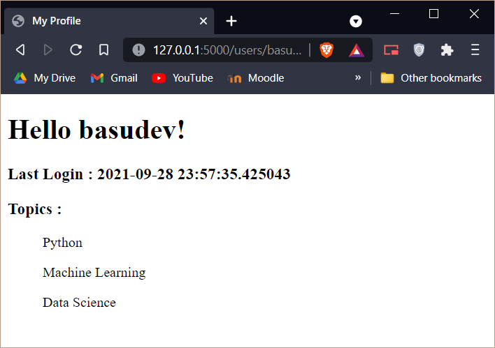<br><br>

## HTTP Methods
&emsp;GET, POST, DELETE and PUT and common HTTP methods used in Flask. Flask can run different code from the same URL dependent on the HTTP method used. For example, in a web-app with accounts, it is most convenient to route the sign in page and the sign in process through the same URL.
<br>&emsp;A GET request, should show the login/signup form, while a POST request (carrying login data) should be processed separately (say open the dashboard/profile page).

    @app.route("/login", methods=["GET"])
    def login_form():
        return "This is the login form"
    @app.route("/login", methods=["POST"])
    def login_auth():
        return "Processing data..."
    @app.route("/login", methods=["DELETE"])
    def delete():
        return "DELETE method"
    @app.route("/login", methods=["PUT"])
    def put():
        return "PUT method"

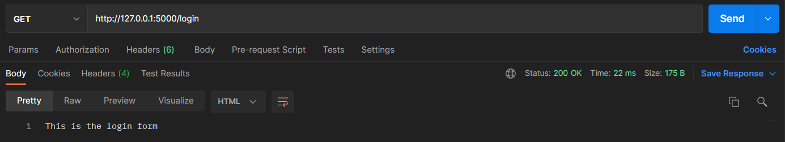<br>
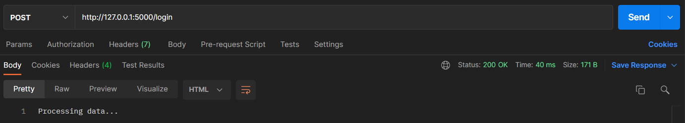<br>
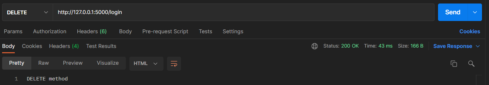<br>
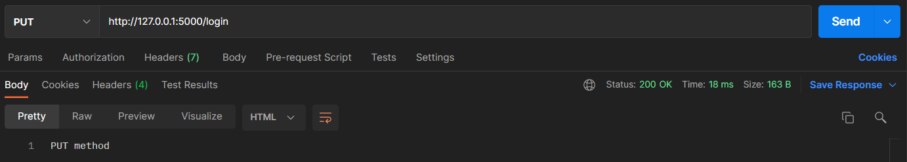<br>

For simplification, we can import the ```request``` package from flask.

    @app.route("/login", methods=["GET", "POST", "DELETE", "PUT"])
    def login():
        if request.method == "DELETE":
            return "DELETE method"
        elif request.method == "PUT":
            return "PUT method"
        elif request.method == "GET":
            return "This is the login form"
        elif request.method == "POST":
            return "Processing your data"
<br>

## The Request Object
The ```request``` object provides information on the request that was made to the route. To utilize this object, it must
be imported from the flask module:

```from flask import request```

Let's create a simple login application to understand the working of ```request``` object.

    from flask import Flask, request, render_template

    app = Flask(__name__)

    @app.route("/", methods=["GET", "POST"])
    def login():
        print(request)
        if request.method == "GET":
            return render_template('login.html')
        elif request.method == "POST":
            print(request.form)
            if request.form['username'] == 'basudevtyagi' and request.form['password'] == 'mysecretpassword':
                return render_template('home.html',username=request.form['username'])
            else:
                return render_template('login.html',message="Error Logging in.")

    if __name__ == '__main__':
        app.run(debug=True)

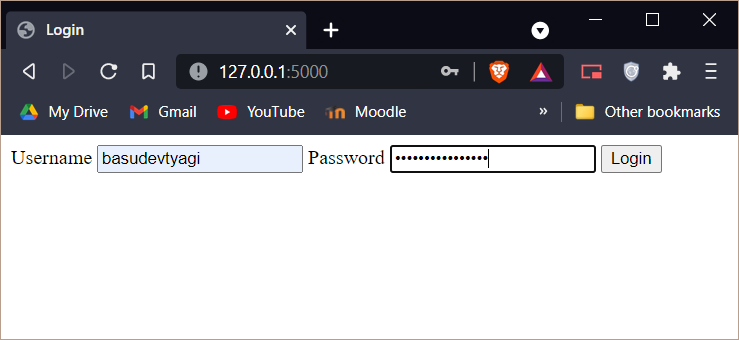<br>
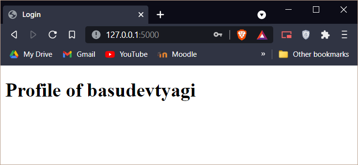<br>

Now incase wrong credientials are passed, the POST request will fail and return back to the Login form:

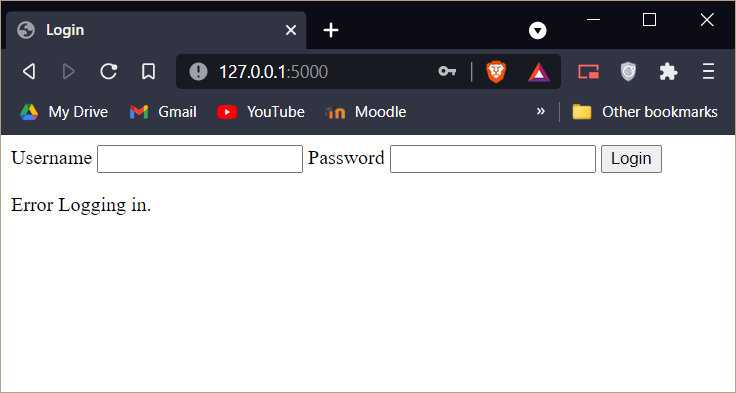<br>

## **Resources refered:**
- [Flask - Official Documentation](https://flask.palletsprojects.com/en/2.0.x/)
- [Flask – (Creating first simple application) - GFG](https://www.geeksforgeeks.org/flask-creating-first-simple-application/)