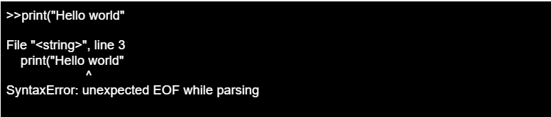
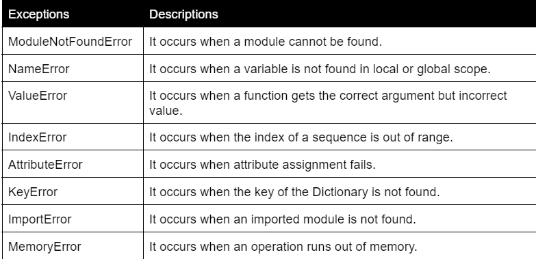

## Python Errors and its Types - Documentation
Outline of Topics covered:
Elaborated the use and code snippets for Errors in Python in this [!Python noteook](Python_Errors.ipynb).

*What are Errors?
*What are the types of Errors?
*What are Syntax Error?
*What are Logical Error?
*Types of Logical Error?

# Summary of Topics Covered
What are Errors?
Python errors are errors in a program due to which the program will not execute.These errors occur because the program is not in the format prescribed.
  

## Python Error-
Python errors are errors in a program due to which the program will not execute.These errors occur because the program is not in the format prescribed.These errors are common in the development process.Programming errors are Inevitable.
  

**What are the types of Errors?** 
Python has many in-built exceptions(errors) which will occur whenever there is a mistake in the code during run-time.
  

## We are going to see some important python errors-
 
**What are Syntax Error?** 
1.Syntax Error
Error causes when proper syntax is not followed are termed as Syntax error.The python interpreter will immediately report the error with its reason.
eg.While printing “Hello World” if we miss the closing parentheses it will throw a syntax error as”EOFError”.
 

  

**What are Logical Error?** 
2.Logical Errors(Exception)
Sometimes even if there is no syntax error the interpreter will throw an exception .Such error is run-time errors which are caused during runtime.These are also called Exceptions.
eg.While dividing a number by zero it will throw run-time error/ZeroDivisionError.
 

  

## Some important in-built exception are-
**Types of Logical Error?**
 

  
