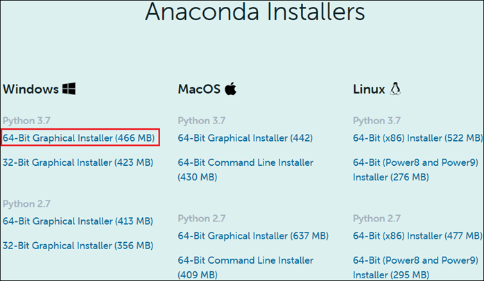
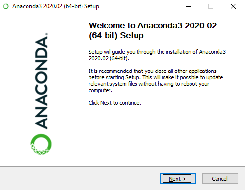
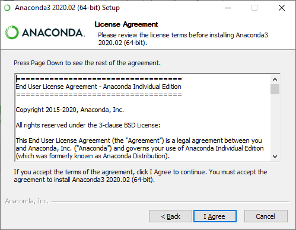
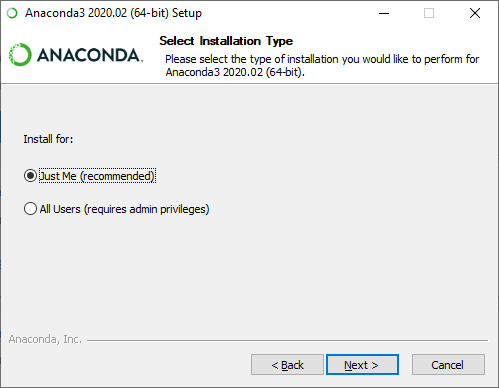
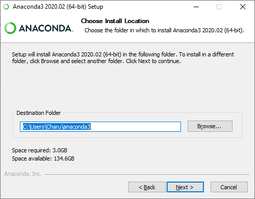
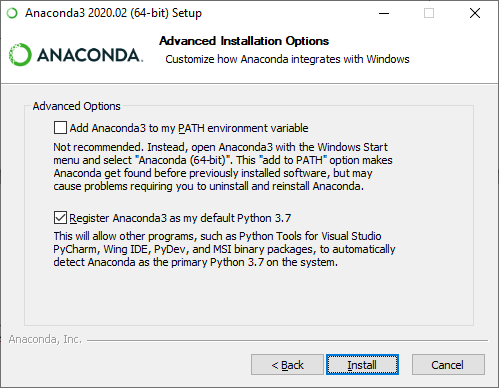
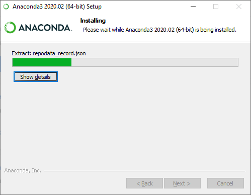
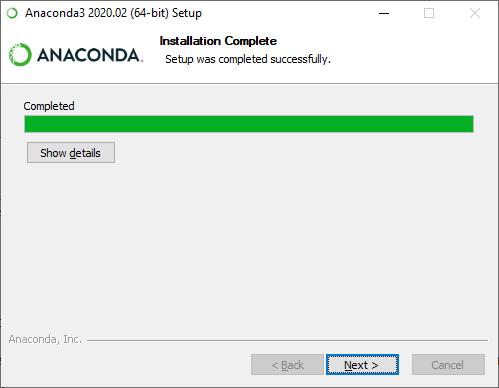
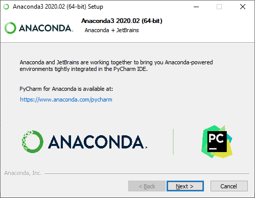
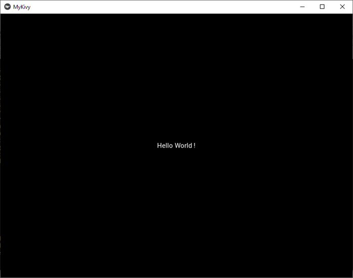

# What is Kivy?
Kivy is an opensource multi-platform GUI development library for Python and can run on iOS, Android, Windows, OS X, and GNU/Linux. It helps develop applications that make use of innovative, multi-touch UI. The fundamental idea behind Kivy is to enable the developer to build an app once and use it across all devices, making the code reusable and deployable, allowing for quick and easy interaction design and rapid prototyping.
# Advantages
Advantages of Kivy is given below –
-	Kivy helps us to design innovative user interfaces with multi-touch functionalities.
-	It can smoothly work with various platforms such as Windows, Android, Linux, iOs, macOS, and Raspberry Pi.
-	It helps us to run code on all supported platforms.
-	It provides well-documented APIs.
-	It offers a better representation of programs, including classes, widget configuration, and inherited classes.
-	It performs better than HTML 5.
# Disadvantages
-	Non-native looking User Interface.
-	Bigger package size (because Python interpreter needs to be included).
-	Lack of community support (Kivy Community isn’t particularly large).
-	Lack of good examples and documentation.
-	Better and more community rich alternates available if only focusing on Mobile Cross-platform devices i.e React Native.
# Kivy Installation on Windows
Considering you have already installed Python on your machine and IDE, if you haven’t just follow the instructions in another file regarding the same in the repository.
We’ll directly head over to installing kivy.
You will have to install Anaconda, Now, follow the below steps to download the Anaconda –
- Click on the below link to install Anaconda https://www.anaconda.com/products/individual
- The following page appears on the screen. Scroll down the window and click on 64-bit Graphical Installer (446 MB) at the bottom of the screen.

    

- You can see that Anaconda Graphical Installer is to started download. Once the file is downloaded, double click on that executable file. The following window appears on the     screen in which click on the Next.
   
   

- A License Agreement window appears on the screen, in which click on the I Agree.

   
   
- In Installer type, select Install for Just Me (recommended).

    
    
- Browse the location where you want to install Anaconda and click on the Next.

    

- An Advanced Installation Options window appears on the screen, tick on Register Anaconda3 as my default Python 3.7. And click on the Install.
    
    

- The below screenshot shows that Anaconda Installation is in progress.
   
   

- Once the Installation process is completed, click on the Next button.
    
    

- The following window appears on the screen in which click on the Next.
    
    

- A completing Anaconda set up window appears on the screen, simply click on the Finish on that window.

# Install Kivy 
There are the following steps to install kivy -
- Go to the Anaconda Prompt.
- Before installing kivy, first update the pip by using the following command.

```python
python -m pip install - -upgrade pip wheel setuptools  
```

- Install the Dependencies
There are the following 3 dependencies that we need to install while installing the Kivy.

```python
Python -m pip install docutils pygments pypiwin32 kivy.deps.sdl2 kivy.deps.glew  
```

```python
python -m pip install kivy.deps.gstreamer  
```

```python
python -m pip install kivy.deps.angle  
```

- Install Kivy
Use the following command to install Kivy.

```python
python -m pip install kivy  
```

# Creating your first GUI application using Kivy
Create a Hello World program in Kivy
There are the following steps to create a Hello World program in Kivy -
- Open any text editor (Notepad or Notepad++)
- Write the following code on the Editor.

```python
import kivy  # import kivy module  
from kivy.app import App # import Kivy App module to create a Kivy interface  
from kivy.uix.label import Label # import Label Module  
    
kivy.require('1.11.1')  # version required to run Kivy Application    
    
 
class MyKivyApp(App): # Create a class MyKivyApp  
        
      
    def build(self):   
            
        return Label(text ="Hello World !") #return a Label with text Hello World ! as a root widget         
    
    
MyKivyApp().run()  # Class MyKivyApp is initialized and run () method is called to run the App.  
```

- Save the file with .py extension for example Javatpoint.py
- Open the Anaconda Prompt and provide the valid path where your kivy program is saved.
- To run program, use the flowing command and press Enter.


```python
python file_name.py (Ex: python javatpoint.py)   
```

When you run the command following output appears on the screen.



# Additional Resources
If you dont wanna stop here learn more on how to create amazing apps using kivy you can the resources below:
-	https://youtube.com/playlist?list=PLCC34OHNcOtpz7PJQ7Tv7hqFBP_xDDjqg
-	 https://youtu.be/l8Imtec4ReQ
-	https://www.geeksforgeeks.org/kivy-tutorial/
-	https://www.javatpoint.com/kivy

