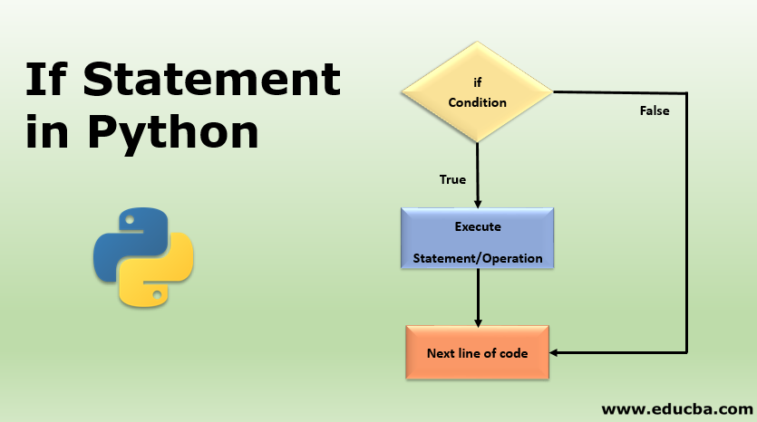
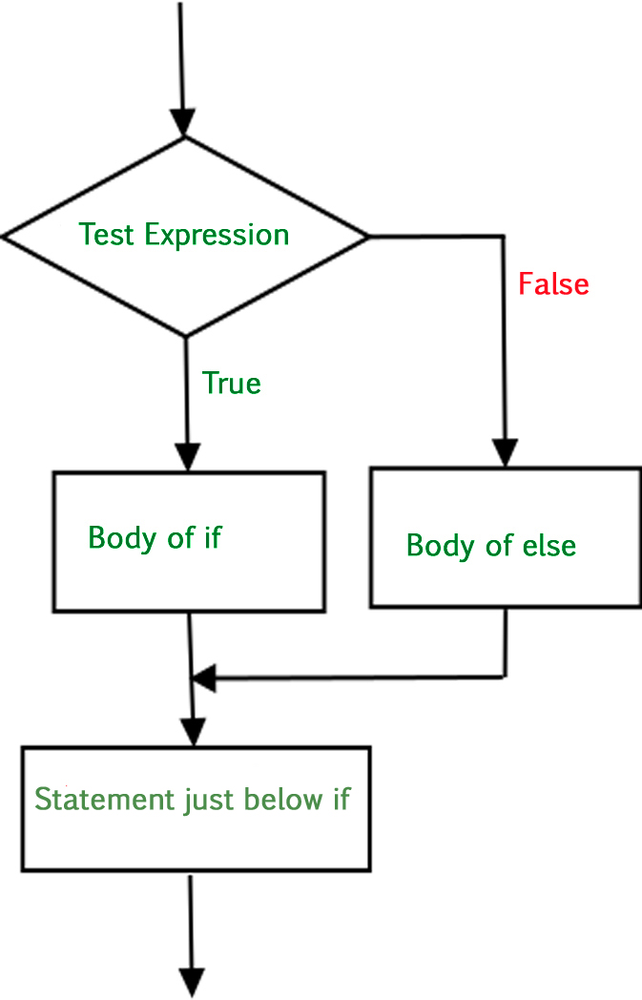

# What is if statement in python

if statement is written using if keyword</br>
if condition is in multiple forms: simple if conditional , if-else conditional and if-elif conditional.<br/>

# Main Purpose
if statement is used for decision making.

# Index

1. [ Types and Method. ](#desc)
2. [ Simple if conditional statement ](#usage)
3. [ if-else conditional statement ](#usage)
4. [ if -elif Conditional Statement ](#usage)
5. [ Nested if Statement ](#usage)
6. [ Advantage ](#usage)
7. [ Resources ](#usage)
8. [ Conclusion ](#usage)
<a name="desc"></a>
<a name="usage"></a>
<a name="usage"></a>
<a name="usage"></a>
<a name="usage"></a>
<a name="usage"></a>
<a name="usage"></a>

# Types and Method
Various types of if statement are :- simple if , if-else , if-elif-else , nested if-else

# Simple if conditional statement


if statement tests a particular condition; if the condition evaluates to true, a course-of-action is followed i.e a statement is executed. if the condition is false, it does nothing. 

```Python
A=int(input("Enter no: "))
if (A>0):
  print(A," is Positive ")
print("if Statement is working") 
```
# Output
Enter no: 9<br/>
9  is Positive <br/>
if Statement is working<br/>

In the above example A is 7 which is a positive number, so if condition will work and 7 is Positive and if Statement is working will be printed.

# if-else conditional statement



It test a condition and if the condition evaluates to true , it carries out statements indented below if and in case condition evaluates to false, it carries out statement indented below else.
```Python
A = int(input("Enter First Number "))
B = int(input("Enter Second Number "))
if (A>B):
  print("A is greater than B")
else:
  print("B is greater than A")
 ```
# Output
Enter First Number 3<br/>
Enter Second Number 7<br/>
B is greater than A <br/>

In the above example b is greater than A, So if will not work and only else will work, so B is greater than A will be printed.  

# if -elif Conditional Statement
<p align="left">
  
</p>

Sometime we want to check a condition when control reaches else . i.e condition test in the form of else if. To serve the conditions, Python provides if-elif and if-elif-else statement.

```Python
A= int(input("Enter First Number "))
B= int(input("Enter Second Number "))
C= int(input("Enter Third Number "))
if (A>B and A>C):
  print("A is greater than B and C")
elif (B>C):
  print("B is greater than A and C")
else:
  print("C is greater than A and B")  
```
# Output
Enter First Number 2<br/>
Enter Second Number 9<br/>
Enter Third Number 5<br/>
B is greater than A and C<br/>

In the above example B is greater than A and C, if will not work and elif will work and else will not work, So B is greater than A and C will be printed.

# Nested if Statement

<p align="left">
  
</p>

Sometimes we need to test additional statement. For such situations, Python also supports nested-if form of if. A nested if is an if that has another if in its if's body or in elif's body or in its else's body.

```Python
i = 100
if (i == 100):
    if (i < 150):
        print ("i is smaller than 150" )
    if (i < 120):
        print ("i is smaller than 120 ")
    else:
        print ("i is greater than 150 ")
  ```
# Output
i is smaller than 150<br/>
i is smaller than 120 <br/>

In the above example i = 100 and first if condition will work and then second if condition will work i is smaller than 150 and i is smaller than 120 will be printed.     
# Advantage
1. It makes a program robust by allowing few portion of program to run

# Resource
https://www.programiz.com/python-programming/if-elif-else<br/>
https://www.w3schools.com/python/python_conditions.asp<br/>

# Conclusion
if Statement is a condition statement and is used to check a condition and evaluate result on basis of it.
 
