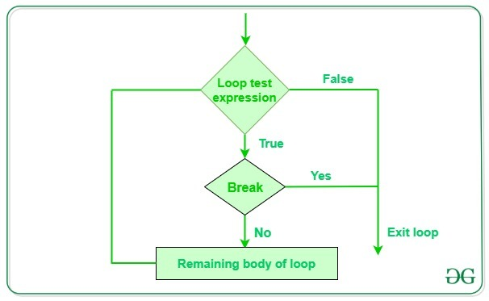

# What is Break in Python

Break statement is a loop control statement. It controls the sequence of loop. 
Break statement terminates the very loop it lies within. 
Execution remains at the statement immediately following the body of the terminated statement. 

# Main Purpose   
Break statement is to stop the excution when a special condition is met.  

# Flowchart of Break

In the Above Diagram there is a loop test expression, if the loop test expression is true then it will come to break statement else it will go out of loop. When break occurs if the condition in break is true then it will exit the loop, else the loop will be exceuted.

# Sample Code
<pre>
for i in "What is break in Python": 
  if (i == "b"): 
    break 
  print(i) 
</pre>  

# Output 
W 
h 
a 
t 
  
i 
s 

In the above example the loop is iterating the string "What is break in Python" and as soon as it encounter the character "b", the if condition becomes true and it encounter break statement and the flow of execution is brought out of loop.

# Nested loops
In Nested loops, a break statement will terminate the very loop it appears in.That is , if break statement is inside the inner loop then only the inner loop will terminate and outer loop will continue. If however, the break statement is in outer loop, the outer loop will terminate.

# Sample Code
<pre>
for a in range(3): 
    for b in range(4):           
        if b==3:     
            break 
        print("The number is ",a,b); 
</pre>        

# Output  
The number is  0 0 
The number is  0 1 
The number is  0 2 
The number is  1 0 
The number is  1 1 
The number is  1 2 
The number is  2 0 
The number is  2 1 
The number is  2 2 

In the above example numbers from 0 to 2 (2 D aarray) will be printed as when the break statement encounter with 3 it will come out of loop.

# Advantages of Break in Python
1. Break skips unncessary iterations of loop. 
2. Break helps to come out of the block of code without exceuting the remaining block of code. 

# Resources:-
1. https://www.geeksforgeeks.org/python-break-statement/ 
2. https://www.tutorialspoint.com/python/python_break_statement.htm  